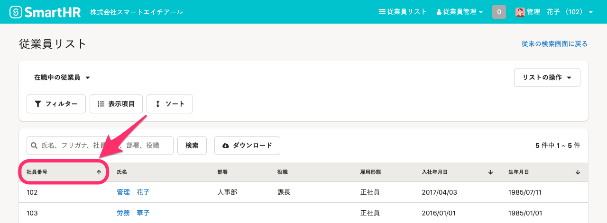

従業員リストでは、条件を設定して従業員を絞り込んで表示できるほか、項目を選んで従業員情報をダウンロードもできます。

:::tips
従業員リスト画面で利用できる機能は、アカウントの権限によって異なります。
詳しくは、[手続きや機能の閲覧・作成・更新・削除の権限を設定する](https://knowledge.smarthr.jp/hc/ja/articles/360041268873)を参照してください。
:::

# 従業員リストを閲覧する

:::tips
過去の日付を指定して従業員リストを閲覧したい場合は、下記を参照してください。
[過去の日付を指定して従業員リストを表示する](https://knowledge.smarthr.jp/hc/ja/articles/5950434616089)
:::

## 表示項目を設定する

従業員リストに表示する項目を設定したい場合は、 **［表示項目］** をクリックして表示項目を設定します。

 **［表示項目の設定］** 画面で、表示させたい項目を **［表示項目］** に表示させます。

表示させたい項目を［ **すべての項目］** から選び **［>］** をクリックし、非表示にしたい項目を **［表示項目］** から選び **［<］** をクリックします。

 **［表示項目］** の順序を入れ替えたい項目を選択し、画面右側にある矢印をクリックして、項目を並べ替えます。

設定が完了したら **［適用］** をクリックします。

:::tips
表示項目の設定に表示されるのは、**操作するアカウントが閲覧権限を持つ項目**です。
[従業員関連の閲覧・作成・更新・削除の権限を設定する](https://knowledge.smarthr.jp/hc/ja/articles/1500001368101)
:::
:::alert
 **［社員番号］**  と  **［氏名］**  は並べ替えられません。
:::

## 昇順降順を設定する

表示される従業員の順番を変えたい場合は、 **［ソート］** をクリックすると、項目を選んで昇順または降順を適用できます。

また、一覧のヘッダー（社員番号や、入社年月日などの日付に関連する項目）をクリックすると、昇順と降順を切り替えられます。

# 従業員リストにカスタムリストを適用する

従業員検索画面にて、自由にフィルターを設定して従業員の絞り込みや表示項目の設定ができ、適用された条件を **カスタムリスト** として保存できます。

## カスタムリストを作成する

任意のリストを選び、 **［フィルター］** をクリックすると、 **［フィルター設定］** 画面が表示されます。

フィルターを設定して、 **［適用］** をクリックします。

:::tips
フィルター機能を使った条件抽出では、さまざまなことができます。詳しくは、下記のページをご覧ください。
[フィルター機能を使って、条件に合致する従業員リストを表示させる](https://knowledge.smarthr.jp/hc/ja/articles/360040965373)
:::

## カスタムリストを保存する

 **［新しい設定として保存］**  をクリックすると、リスト名の設定画面が表示されます。

リスト名を入力して  **［作成］** をクリックすると、作成したリストを保存できます。

従業員リスト画面の左上にあるプルダウンを開くと、追加されたカスタムリストを確認できます。

## リストの操作

従業員リスト画面の右側に表示される  **［リストの操作］**  をクリックすると、 **［リストの並べ替え］ ［リスト名を変更］ ［リストをコピー］ ［リストを削除］**  が表示され、リストごとに操作できます。

## リストの上書き保存

あらためてフィルターや表示項目を設定して  **［現在の設定に上書き保存］**  をクリックすると、リストの条件を上書きできます。

 **［リストの上書き保存］** のダイアログが表示されるので、 **［上書き保存］**  をクリックして保存してください。

:::tips
デフォルトの  **［在職中の従業員］ ［休職中の従業員］ ［退職済みの従業員］**  の3つのリストは、上書きや削除はできません（リストの並べ替え・コピーはできます）。

:::

# 従業員情報をダウンロードする

画面中央の **［ダウンロード］** ボタンから、従業員情報をダウンロードできます。

以下のページを参考に、操作してください。

:::related
[従業員情報、家族情報の登録データをダウンロードする](https://knowledge.smarthr.jp/hc/ja/articles/360026106394)
:::
