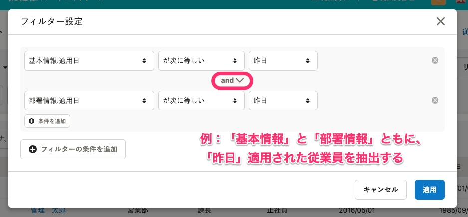

従業員検索画面のフィルタ機能を使って従業員を絞り込む方法と、フィルタの条件を設定・保存する方法を説明します。

# フィルタの設定方法

## 1\. 画面左上にある［フィルタ］をクリック

従業員検索画面の左上にある  **［フィルタ］** をクリックすると、条件の追加・編集ができるフィルタ設定画面が表示されます。

## 2\. フィルタに適用する条件を追加・削除する

フィルタの条件を追加するには、フィルタ設定画面の **［条件を追加］** をクリックしてください。

追加できる条件は、合計10個までです。

条件を削除する場合は、条件の横にある **［x］** ボタンをクリックしてください。

## 3\. 条件を指定する

フィルタ設定で指定できる条件は、SmartHRで保有している従業員項目（カスタム項目を含む）に対して、入力内容と等しい／等しくない、項目が入力されている／空である、などです。

フィルタ設定画面での条件の設定は以下のとおりです。

条件を追加する際は、従業員項目のうち、検索対象にしたい項目をプルダウンから選びます。

次に、「〜が次に等しい」「〜が空である」といった条件を指定する内容をプルダウンリストから選び、指定します。（検索対象にする従業員項目によって指定できる内容は異なるため、システムが自動で利用可能なものを表示します）

最後に、対象となる項目で参照する従業員情報の、数値、名称などを入力します。（日付の場合はカレンダーが表示され、部署名や所属事業所は従業員情報に登録されているものがプルダウンで表示されます。複数選択もできます）

たとえば、特定の部署に所属する従業員を絞り込む場合、検索対象にする従業員項目を「部署」とし、指定条件を「〜が次に等しい」とします。範囲条件に部署名を設定します。

## ・［and］検索と［or］検索について

2つ以上の条件が追加されると、条件同士の関係を定義できる「and」と「or」を選択するプルダウンが表示されます。

 **［and］**  を設定すると、追加された複数の条件、すべてを満たす従業員が表示されます。

 **［or］**  を設定すると、追加された複数の条件のうち、いずれかを満たす従業員が表示されます。

## ・複数の条件グループの組み合わせたフィルタ作成

複数の条件グループを組み合わせると、より複雑な検索フィルタを作成できます。

 **［フィルタの条件を追加］**  をクリックすると、新しい条件グループが追加されます。

条件グループを組み合わせて、 **［and］**  と  **［or］**  を使って検索できます。

## 4\. ［適用］をクリック

条件を設定後、画面右下にある  **［適用］** をクリックすると、フィルタに該当する従業員を抽出したリストが表示されます。

# 検索対象にできる項目と従業員情報の対応表

フィルタの検索対象となる「基本情報.適用日」「入退社情報.適用日」といった項目は、従業員情報の項目に含まれる情報と対応しています。カスタム従業員項目も反映されます。

以下は、それぞれの検索条件に対してどの従業員情報が参照されるか、システム標準項目の従業員情報との対応表です。

| 項目グループ名 | 項目名 |
| --- | --- |
| 基本情報 | 氏名、氏名（ヨミガナ）、ビジネスネーム、ビジネスネーム（ヨミガナ）、生年月日、戸籍上の性別、本人確認書類1、本人確認書類2、メールアドレス、マイナンバー |
| 入退社情報 | 在籍状況、入社年月日、退職年月日、退職事由 |
| 業務情報 | 社員番号、役職、業務内容、雇用形態、給与支給形態 |
| 住所と連絡先 | 現住所、現住所（ヨミガナ）、現住所を確認できる書類、電話番号、世帯主 |
| 通勤手当 | 通勤経路、通勤手当1の定期券代、通勤手当2の定期券代 |
| 在留資格 | 氏名（ローマ字）、在留カード番号、国籍、在留資格、在留期日、資格外活動許可の有無、派遣・請負就労区分 |
| 雇用保険 | 雇用保険の被保険者番号、雇用保険の資格取得年月日、雇用保険の資格喪失年月日 |
| 社会保険 | 健康保険の被保険者整理番号（年金整理番号）、基礎年金番号、厚生年金にはじめて加入する、報酬月額（通貨）、うち通勤手当、報酬月額（現物）、健康保険の標準報酬月額、厚生年金の標準報酬月額、標準報酬の月額改定年月日、社会保険の資格取得年月日、社会保険の資格喪失年月日 |
| 配偶者情報 | 配偶者の有無、配偶者の年収 |
| 所得税・住民税 |  障害者区分、障害者手帳の種類、障害者手帳の交付年月日、寡婦（夫）区分、寡婦（夫）備考、勤労学生：学校名、勤労学生：入学年月日、勤労学生：所得の見積額、勤労学生：所得の種類、児童扶養手当証書番号、生計を一にする児童の氏名、対象児童の年間所得の見積額、異動月日及び事由 |
| 給与振込口座 | 銀行名、預金種別、名義（カタカナ）、支店名、口座番号 |

:::alert
過去の日付を指定して従業員リストを表示したい場合は、下記を参照してください。
[過去の日付を指定して従業員リストを表示する](https://knowledge.smarthr.jp/hc/ja/articles/5950434616089)
これまで提供していた、旧従業員リストで過去の情報を閲覧する機能（時点表示機能）は、2022年6月末の提供終了を予定しています。提供終了予定日については、下記を参照してください。
[従業員リストに過去の日付を指定して閲覧できる機能を追加し、従来の従業員リストを提供終了します](https://smarthr.jp/update/35050)
:::

# フィルタ設定で作成した条件を保存する方法

作成したフィルタで抽出した従業員リストのことを **カスタムリスト**といいます。

カスタムリストとして保存した設定は、従業員リスト左上のプルダウンから選択できます。

保存方法を説明します。

## 1\. フィルタ設定を［適用］し、［新しい設定として保存］をクリック

フィルタ設定が済んだら、 **［適用］** をクリックします。

従業員リストに適用される条件が変更され、フィルタで抽出した従業員リストが表示されたことを確認し、 **［新しい設定として保存］** をクリックします。

フィルタで抽出された従業員リストに名前をつけて保存する画面が表示されます。

## 2\. 名前を入力し、［作成］をクリック

 **［現在のリスト条件を別名で保存］**  の画面が表示されたら、フィルタで抽出した従業員リストの名前を入力し、 右下にある **［作成］** をクリックしてください。

リストが登録され、従業員リスト画面の左にあるプルダウンリストに追加されます。

## ・保存した条件を削除する

保存した条件を削除するには、従業員リスト画面の左にあるプルダウンリストからリストを表示させ、右上の **［リストの操作］>［リストを削除］** をクリックしてください。

## ・保存した条件の内容を変更する

一度作成したフィルタの条件を変更するには、プルダウンリストをクリックし、保存した従業員リストを呼び出します。

 **［フィルタ］** をクリックし、フィルタ設定画面から条件を変更したら、 **［適用］** をクリックしてください。

更新した内容でリストが抽出されます。リスト名が間違っていないかを確認のうえ、 **［現在の設定に上書き保存］** をクリックします。（別名で保存したい場合は、 **［新しい設定として保存］** をクリックします）

:::tips
システム標準フィルタリスト（在職中の従業員、休職中の従業員、退職済みの従業員）は、リストの削除はできません。

:::
