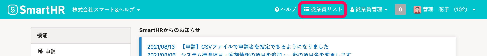
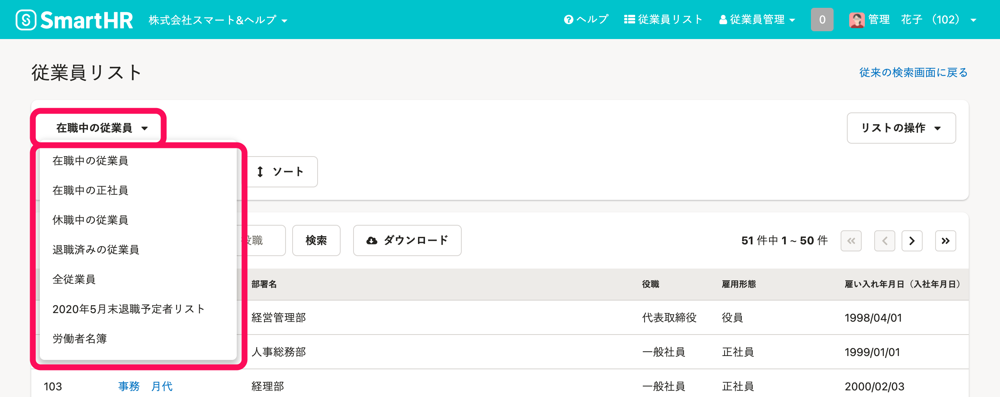
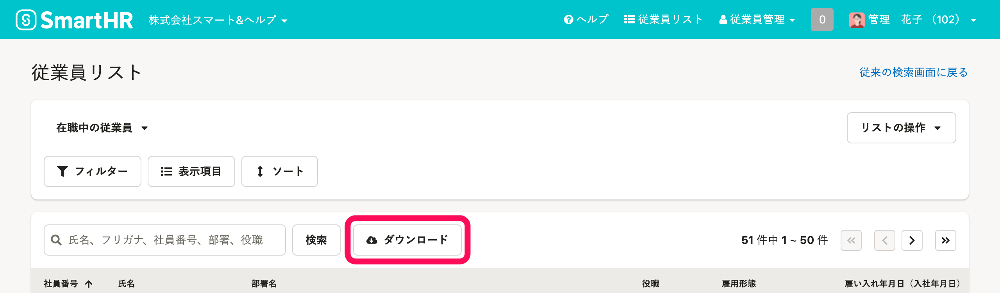
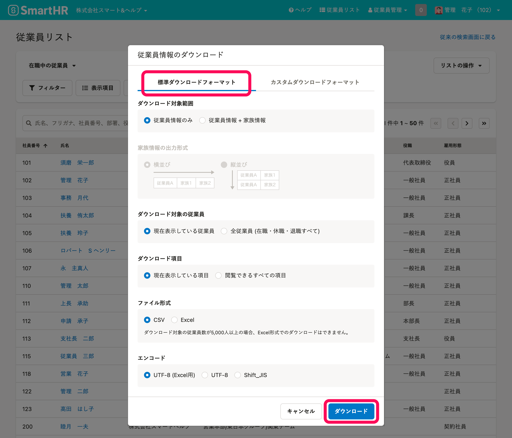
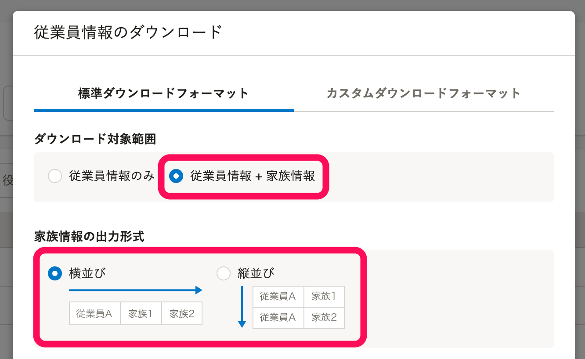
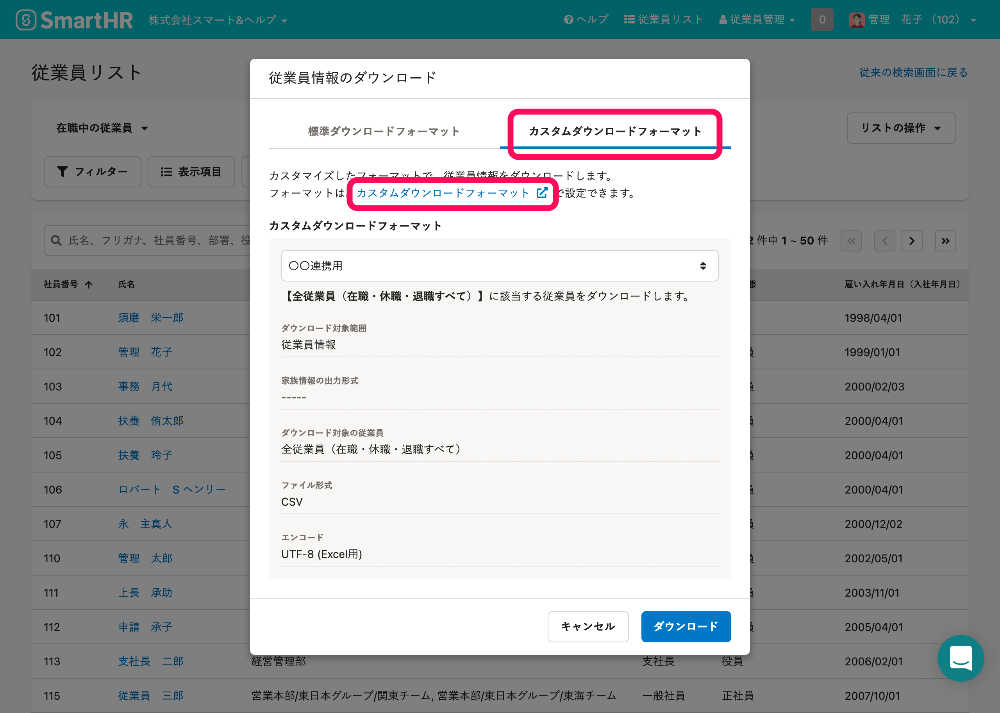
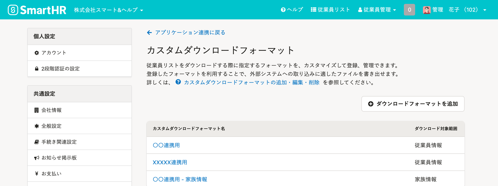
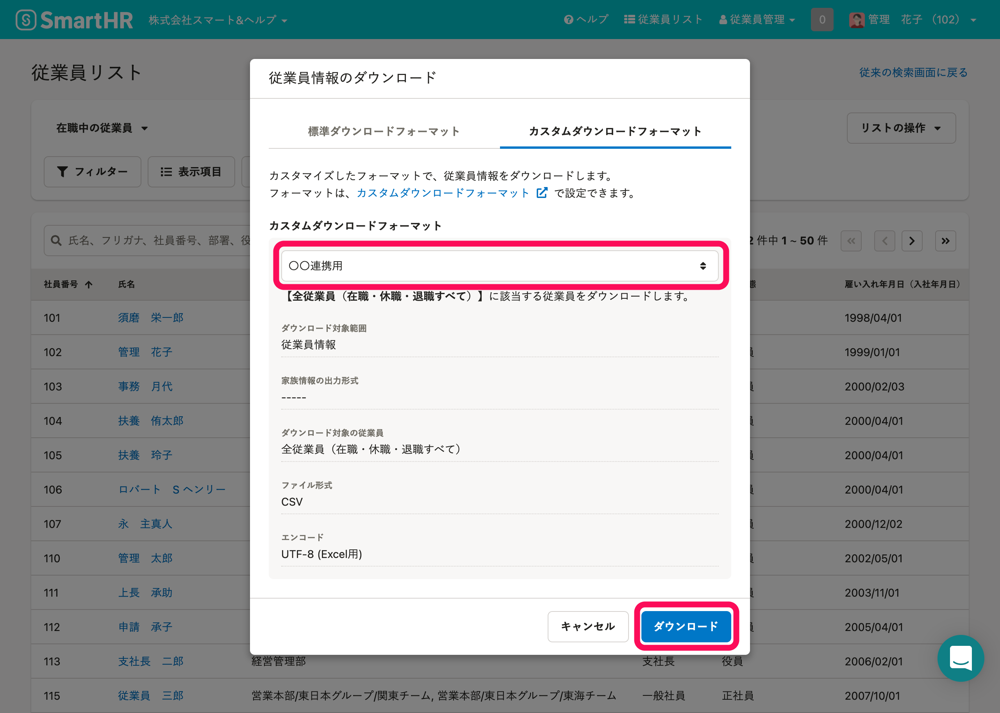

従業員情報・家族情報に登録されているデータを、Excel (.xlsx) またはCSV形式でダウンロードできます。

:::tips
[カスタムダウンロードフォーマットを利用する](https://knowledge.smarthr.jp/hc/ja/articles/360026106394/#toc--7)と、**外部システムへの取り込みに適した**ファイルをダウンロードできます。
項目名を変更したり、一部の項目を結合したりして、従業員情報をダウンロードできます。
カスタムダウンロードフォーマットは、スタンダードプラン以上でご利用いただけます。
スタンダードプランのご利用料金については、[スタンダードプランお見積り](https://smarthr.jp/pricing/quote_standard)からお問い合わせください。
:::
:::alert
2021年10月12日より、ダウンロードできる項目が一部変更となりました。
対象の項目については以下のヘルプページから確認できます。
[【一覧】2021年10月12日以降で追加・変更された項目名](https://knowledge.smarthr.jp/hc/ja/articles/4406354011545)
:::

# ［従業員リスト］画面に移動する

画面右上にある **［従業員リスト］** をクリックすると、 **［従業員リスト］画面** が表示されます。

# 標準ダウンロードフォーマットでダウンロードする

## 1\. ダウンロードしたいリストを指定

画面左上の **［在籍中の従業員▼］** をクリックし、ダウンロードしたいリストを指定します。

:::tips
プルダウンリストには、［ **在職中の従業員］［休職中の従業員］［退職済みの従業員］［全従業員］** と、**登録済みのカスタムリスト**が表示されます。
カスタムリストは、任意の条件で抽出した従業員リストを保存する機能です。
詳しくは、[従業員リストの使い方](https://knowledge.smarthr.jp/hc/ja/articles/360043824473)を参照ください。
:::

## 2.［ダウンロード］をクリック

画面中央の  **［ダウンロード］** をクリックすると、 **［**  **従業員情報のダウンロード］** ダイアログが表示されます。

## 3.［標準ダウンロードフォーマット］をクリックし、［ダウンロード］をクリック

 **［標準ダウンロードフォーマット］** をクリックし、ダウンロードするデータの対象範囲や項目を指定します。

 **［ダウンロード］** をクリックするとバックグラウンド処理が開始されます。

:::tips
スタンダードプラン以上をご利用の場合、 **［ダウンロード対象範囲］** で **［従業員情報＋家族情報］** を選択すると **［家族情報の出力形式］** を指定できるようになります。

ファイルのダウンロード後、**SmartHRで家族情報の一括登録・更新を予定している場合は「横並び」を指定**してください。
SmartHRの仕様上、縦並びのファイルでは家族情報を一括更新できません。
家族情報の出力形式の違いには、[家族情報の出力形式（横並び・縦並び）とは](https://knowledge.smarthr.jp/hc/ja/articles/900006277623)をご覧ください。
:::

## 4.［バックグラウンド処理］画面からデータをダウンロードする

バックグラウンド処理が終了すると、管理者宛に通知が届きます。

 **［バックグラウンド処理］** 画面から、ファイルをダウンロードしてくだい。

:::related
[バックグラウンド処理後にデータをダウンロードする](https://knowledge.smarthr.jp/hc/ja/articles/360026105494)
:::

# カスタマイズしたフォーマットでダウンロードする

## 1.［ダウンロード］をクリック

画面中央の  **［ダウンロード］** をクリックすると、 **［**  **従業員情報のダウンロード］** ダイアログが表示されます。

## 2.［カスタムダウンロードフォーマット］を登録

 **［カスタムダウンロードフォーマット］** をクリックすると、 **［カスタムダウンロードフォーマット］** 画面が表示されます。

以下の記事を参考に、 **［カスタムダウンロードフォーマット］** を登録してください。

[カスタムダウンロードフォーマットの追加・編集・削除](https://knowledge.smarthr.jp/hc/ja/articles/4404850299289/#toc--4)

## 3.［カスタムダウンロードフォーマット］を指定し、［ダウンロード］をクリック

手順2で登録した **［カスタムダウンロードフォーマット］** を指定し、 **［ダウンロード］** をクリックするとバックグラウンド処理が開始されます。

:::alert
ダウンロードされるのは、**画面に表示されている従業員ではありません。**
ダウンロード対象の従業員は、 **［カスタムダウンロードフォーマット］** 画面で指定します。
|   | ダウンロード対象の従業員 |
| --- | --- |
| 標準ダウンロードフォーマット |  **［従業員情報のダウンロード］** ダイアログで指定 （ **［現在表示している従業員］** か **［全従業員（在職・休職・退職すべて）］** ） |
| カスタムダウンロードフォーマット |  **［カスタムダウンロードフォーマット］** 画面で指定 （指定方法は、[ダウンロード設定を編集する](https://knowledge.smarthr.jp/hc/ja/articles/4404850299289/#toc--6)を参照） |
:::

## 4.［バックグラウンド処理］一覧からデータをダウンロードする

バックグラウンド処理が終了すると、管理者宛に通知が届きます。

 **［バックグラウンド処理］** 画面から、ファイルをダウンロードしてくだい。

:::related
[バックグラウンド処理後にデータをダウンロードする](https://knowledge.smarthr.jp/hc/ja/articles/360026105494)
:::

# 従業員情報、家族情報のダウンロードに関する注意点

- 閲覧権限の無い項目は、ダウンロードファイルに含まれません。
- 対象の従業員数が5,000人以上の場合、Excel形式でダウンロードできません。
