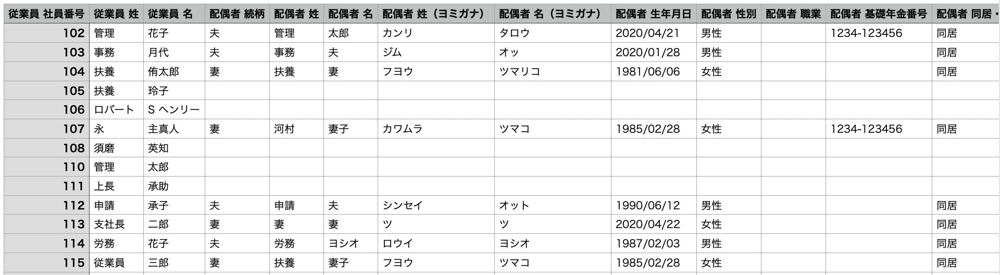
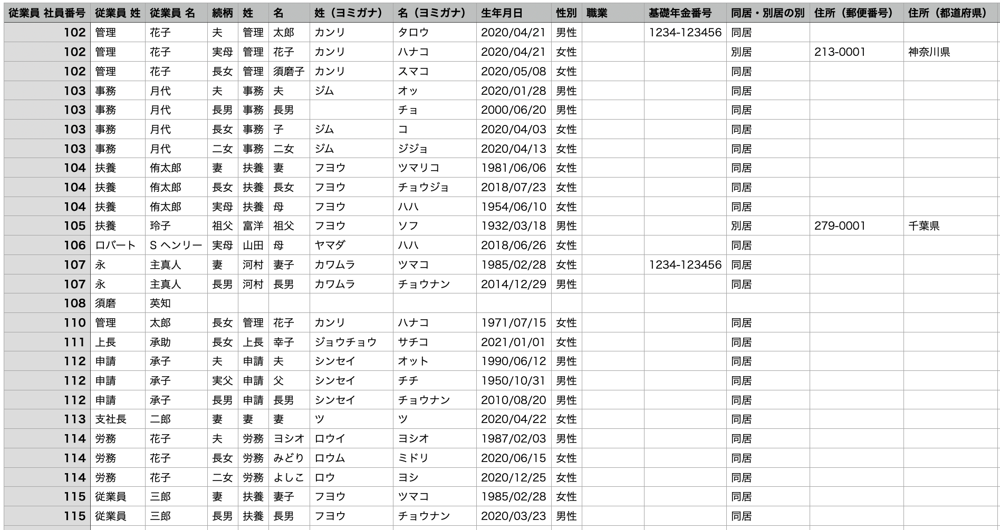

従業員リストから家族情報をダウンロードする際に指定できる **［家族情報の出力形式］** について、横並び・縦並びをそれぞれ選択した場合の出力形式の違いを説明します。

# 家族情報の出力形式はどこで指定できる？

 **［従業員リスト］** で **［一覧のダウンロード］** をクリックすると表示される **［従業員情報のダウンロード］** ダイアログで指定できます。

 **［ダウンロード対象範囲］** 項目で「従業員情報＋家族情報」を選択すると、 **［家族情報の出力形式］** が指定できるようになります。

# 横並びを選択した場合

横並びを指定すると、1名の従業員にまつわる情報を1行で記載します。

:::tips
SmartHRでは、ダウンロード時の出力形式を指定できないファイルは、横並びで出力します。
:::

# 縦並びを選択した場合

縦並びを指定すると、1名の従業員にまつわる情報を、家族情報として登録されている人数と同じ行数で記載します。

例：従業員に扶養家族が3名いた場合、1従業員につき3行で情報を記載

:::alert
**ファイルのダウンロード後、SmartHRで「家族情報の一括更新」を予定している場合の注意点**
SmartHRの仕様上、縦並びのファイルでは家族情報の一括更新ができません。
家族情報の一括更新が必要な場合は、家族情報の出力形式が横並びのファイルをご利用ください。
家族情報を一括登録する際に使用するCSVファイルの項目については、以下のヘルプページをご覧ください。
[【一覧】家族情報CSV凡例](https://knowledge.smarthr.jp/hc/ja/articles/4406454806937/)
:::
