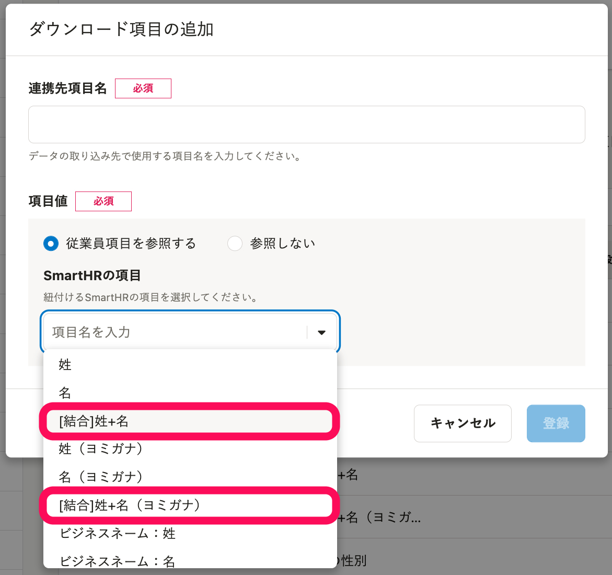

**従業員情報・家族情報のうち一部の項目**は、結合・分割してダウンロードできます。

# 従業員情報・家族情報の項目を、結合・分割してダウンロードする手順

カスタムダウンロードフォーマットを利用すると、従業員情報・家族情報の項目を結合・分割してダウンロードできます。

## 1\. カスタムダウンロードフォーマットを作成

以下のヘルプページを参考に、カスタムダウンロードフォーマットを作成します。

[カスタムダウンロードフォーマットの追加・編集・削除](https://knowledge.smarthr.jp/hc/ja/articles/4404850299289)

## 2\. 結合・分割したい項目を指定

ダウンロード項目を追加・編集する際、 **［SmartHRの項目］** で結合・分割したい項目を指定します。

## 3\. カスタムダウンロードフォーマットで、従業員情報・家族情報をダウンロード

以下のヘルプページの「カスタマイズしたフォーマットでダウンロードする」の項目を参考に、従業員情報・家族情報をダウンロードしてください。

[従業員情報、家族情報の登録データをダウンロードする](https://knowledge.smarthr.jp/hc/ja/articles/360026106394)

# 結合してダウンロードできる項目

## 従業員情報

| システム標準項目 | 結合後の項目 |
| --- | --- |
| 姓 | 姓＋名 |
| 名 |
| 姓（ヨミガナ） | 姓＋名（ヨミガナ） |
| 名（ヨミガナ） |
| ビジネスネーム：姓 | ビジネスネーム：姓＋名 |
| ビジネスネーム：名 |
| ビジネスネーム：姓（ヨミガナ） | ビジネスネーム：姓＋名（ヨミガナ） |
| ビジネスネーム：名（ヨミガナ） |
| 住所（都道府県） |   - 住所（都道府県＋市区町村） - 住所（都道府県＋市区町村＋丁目・番地） - 住所（都道府県＋市区町村＋丁目・番地＋建物名・部屋番号） - 住所（市区町村＋丁目・番地＋建物名・部屋番号）   |
| 住所（市区町村） |
| 住所（丁目・番地） |
| 住所（建物名・部屋番号） |
| 緊急連絡先の姓 | 緊急連絡先（姓＋名） |
| 緊急連絡先の名 |
| 緊急連絡先の姓（ヨミガナ） | 緊急連絡先（姓＋名）（ヨミガナ） |
| 緊急連絡先の名（ヨミガナ） |
| 緊急連絡先の住所（都道府県） |   - 緊急連絡先の住所（都道府県＋市区町村） - 緊急連絡先の住所（都道府県＋市区町村＋丁目・番地） - 緊急連絡先の住所（都道府県＋市区町村＋丁目・番地＋建物名・部屋番号） - 緊急連絡先の住所（市区町村＋丁目・番地＋建物名・部屋番号）   |
| 緊急連絡先の住所（市区町村） |
| 緊急連絡先の住所（丁目・番地） |
| 緊急連絡先の住所（建物名・部屋番号） |
| 住民票住所（都道府県） |   - 住民票住所（都道府県＋市区町村） - 住民票住所（都道府県＋市区町村＋丁目・番地） - 住民票住所（都道府県＋市区町村＋丁目・番地＋建物名・部屋番号） - 住民票住所（市区町村＋丁目・番地＋建物名・部屋番号）   |
| 住民票住所（市区町村） |
| 住民票住所（丁目・番地） |
| 住民票住所（建物名・部屋番号） |
| 在留資格認定証明書：姓 | 在留資格認定証明書：姓＋ミドルネーム＋名 |
| 在留資格認定証明書：名 |
| 在留資格認定証明書：ミドルネーム |

## 家族情報

| システム標準項目 | 結合後の項目 |
| --- | --- |
| 姓 | 姓＋名 |
| 名 |
| 姓（ヨミガナ） | 姓＋名（ヨミガナ） |
| 名（ヨミガナ） |
| 住所（都道府県） |   - 住所（都道府県＋市区町村） - 住所（都道府県＋市区町村＋丁目・番地） - 住所（都道府県＋市区町村＋丁目・番地＋建物名・部屋番号） - 住所（市区町村＋丁目・番地＋建物名・部屋番号）   |
| 住所（市区町村） |
| 住所（丁目・番地） |
| 住所（建物名・部屋番号） |

# 分割してダウンロードできる項目

## 従業員情報

| システム標準項目 | 分割後の項目 |
| --- | --- |
| 電話番号（例：03-1234-5678） | ［上桁］電話番号（例：03） |
| ［中桁］電話番号（例：1234） |
| ［下桁］電話番号（例：5678） |
| 現住所（郵便番号） | ［上3桁］現住所（郵便番号） |
| ［下4桁］現住所（郵便番号） |
| 緊急連絡先の電話番号（例：03-1234-5678） | ［上桁］緊急連絡先の電話番号（例：03） |
| ［中桁］緊急連絡先の電話番号（例：1234） |
| ［下桁］緊急連絡先の電話番号（例：5678） |
| 緊急連絡先の住所（郵便番号） | ［上3桁］緊急連絡先の住所（郵便番号） |
| ［下4桁］緊急連絡先の住所（郵便番号） |
| 住民票住所（郵便番号） | ［上3桁］住民票住所（郵便番号） |
| ［下4桁］住民票住所（郵便番号） |
| 雇用保険の被保険者番号 | ［上4桁］雇用保険の被保険者番号 |
| ［中9桁］雇用保険の被保険者番号 |
| ［下1桁］雇用保険の被保険者番号 |
| 基礎年金番号 | ［上4桁］基礎年金番号 |
| ［下6桁］基礎年金番号 |

## 家族情報

| システム標準項目 | 分割後の項目 |
| --- | --- |
| 基礎年金番号 | ［上4桁］基礎年金番号 |
| ［下6桁］基礎年金番号 |
| 住所（郵便番号） | ［上3桁］住所（郵便番号） |
| ［下4桁］住所（郵便番号） |
| 電話番号（例：03-1234-5678） | ［上桁］電話番号（例：03） |
| ［中桁］電話番号（例：1234） |
| ［下桁］電話番号（例：5678） |
