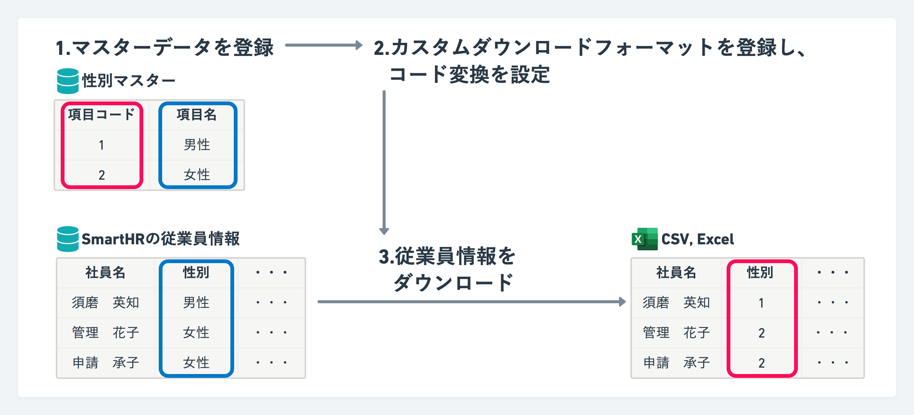
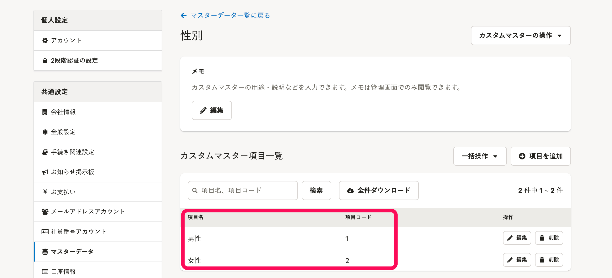
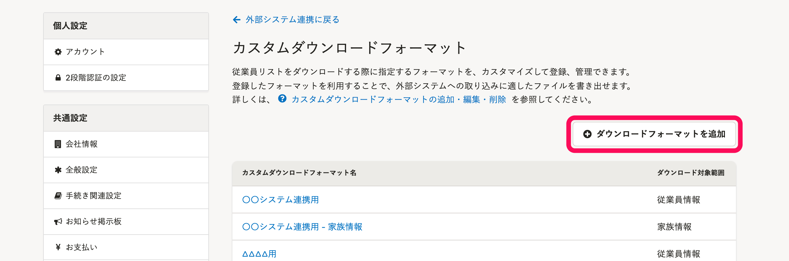
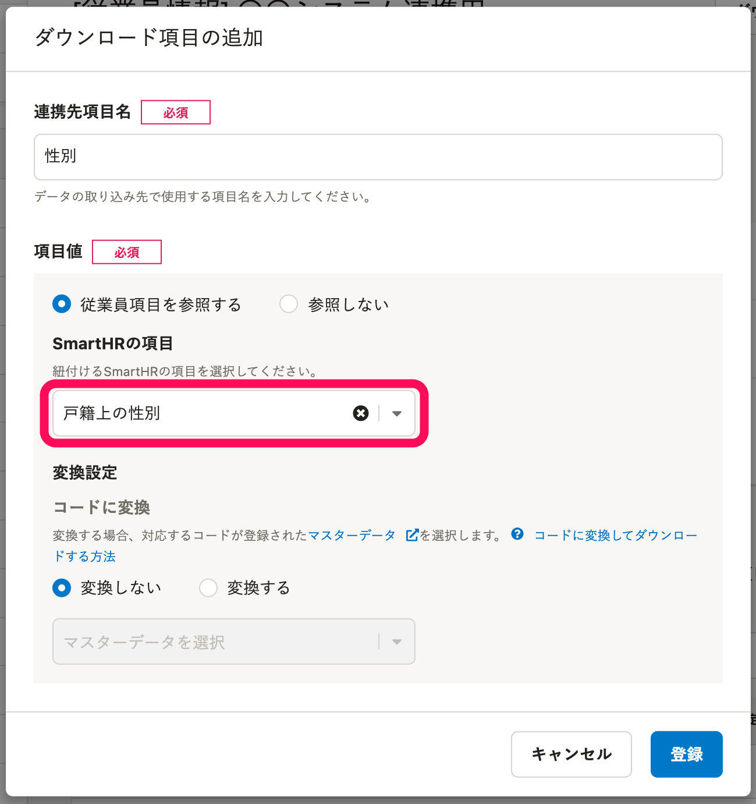
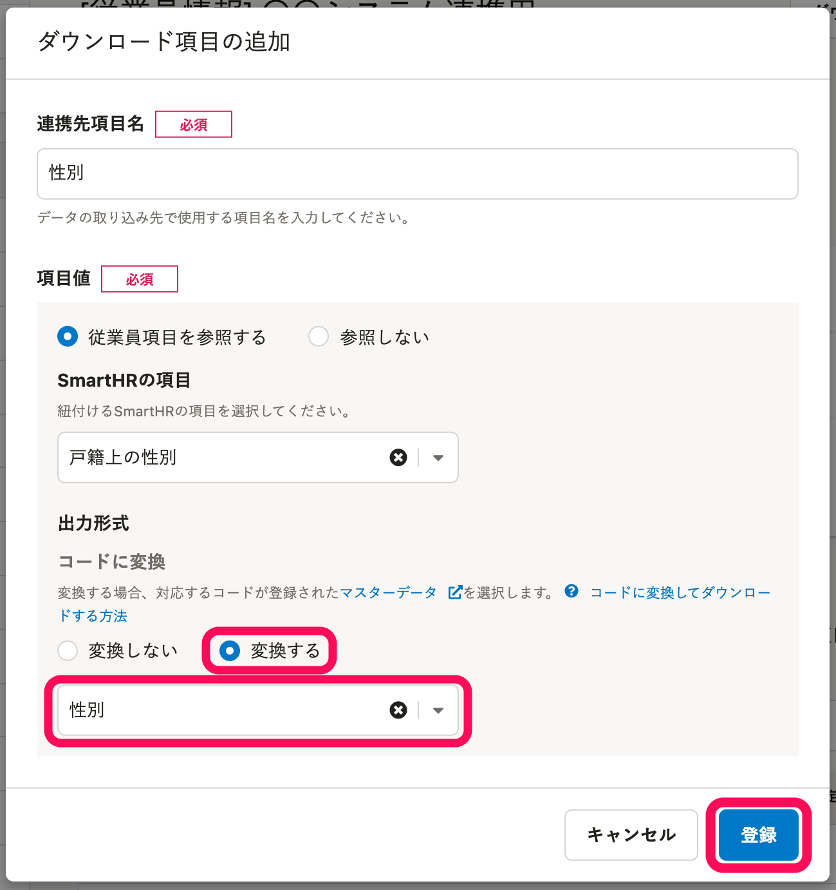
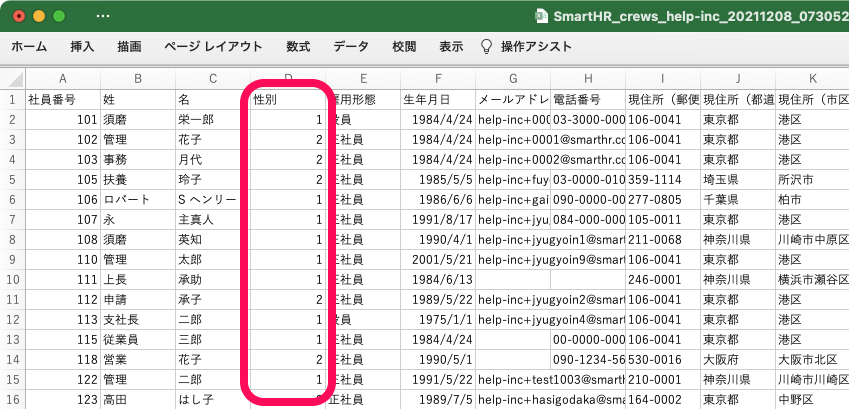

**マスターデータを登録**し、**コード変換を設定**すると、SmartHRの従業員情報をコードに変換してダウンロードできます。

# 1\. （事前準備）マスターデータを登録

事前準備として、**従業員情報・家族情報に紐づけるコード**を、**マスターデータ**に登録します。

詳しい登録方法は、[マスターデータの管理とは](https://knowledge.smarthr.jp/hc/ja/articles/4408180124953/)を参照してください。

:::tips
例えば、以下のようにマスターデータを登録します。
 **［雇用形態］** 役員：1、正社員：2、契約社員：3 ......
 **［部署］** 〇〇部：1000、△△部：1001、□□部：1002 ......
 **［性別］** 男性：1、女性：2 ......

:::

# 2\. カスタムダウンロードフォーマットを登録し、コード変換を設定

コードを変換して従業員情報をダウンロードする際に利用する**カスタムダウンロードフォーマット**を登録します。

詳しい登録方法は、[カスタムダウンロードフォーマットの追加・編集・削除](https://knowledge.smarthr.jp/hc/ja/articles/4404850299289)を参照してください。

この際、**コードに変換したい従業員情報・家族情報**と、**手順1で登録したマスターデータ**を紐づけます。

具体的には、 **［ダウンロード項目の追加］** 画面の **［SmartHRの項目］** で、コードに変換したい項目を選択します。

次に、 **［出力形式］>［コード変換］** で **［変換する］** を指定し、**手順1で登録したマスターデータ**を選択して、 **［登録］** をクリックしてください。

:::tips
従業員情報・家族情報のうち、**コードに変換できる項目**は以下のページを参照してください。
[【一覧】ダウンロードの際に出力形式を変更できる従業員情報・家族情報の項目](https://knowledge.smarthr.jp/hc/ja/articles/4412174492825)
:::

# 3\. 従業員情報をダウンロード

手順2-1で登録したカスタムダウンロードフォーマットを利用して、従業員情報をダウンロードします。

 **［SmartHRの項目］** がコードに変換された状態でダウンロードされます。

ダウンロードの手順は、以下のページの **「カスタマイズしたフォーマットでダウンロードする」** を参照してください。

[従業員情報、家族情報の登録データをダウンロードする](https://knowledge.smarthr.jp/hc/ja/articles/360026106394)

