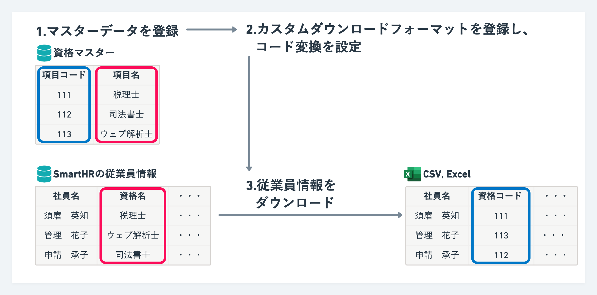
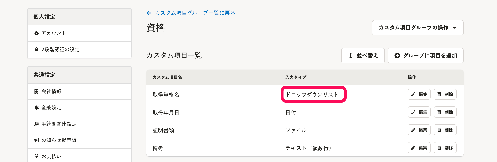
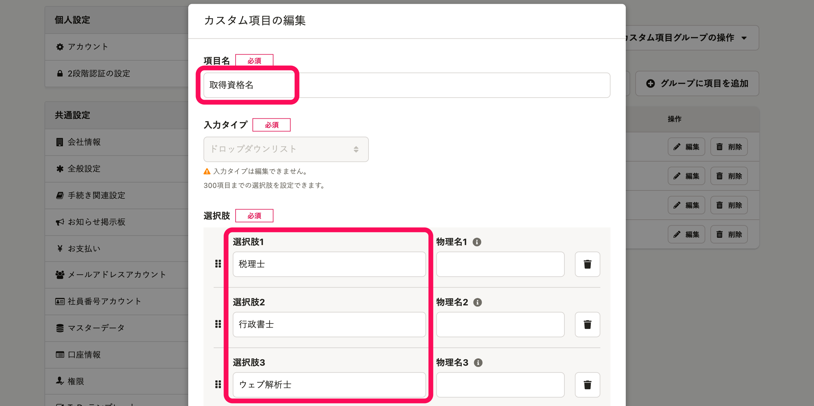
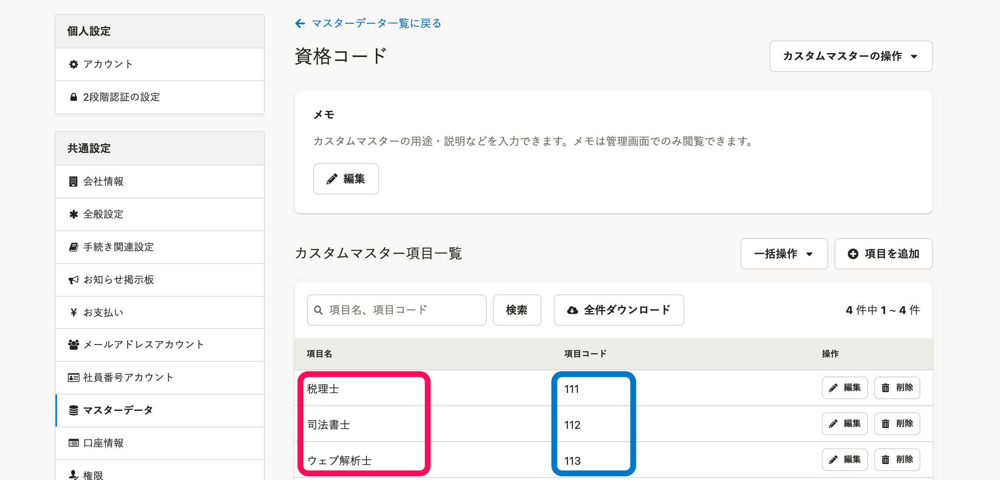
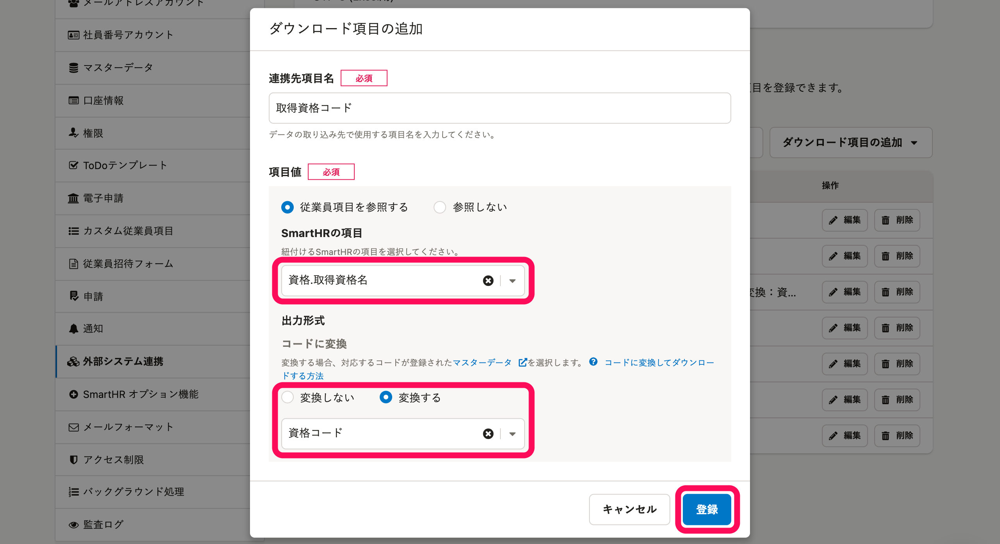
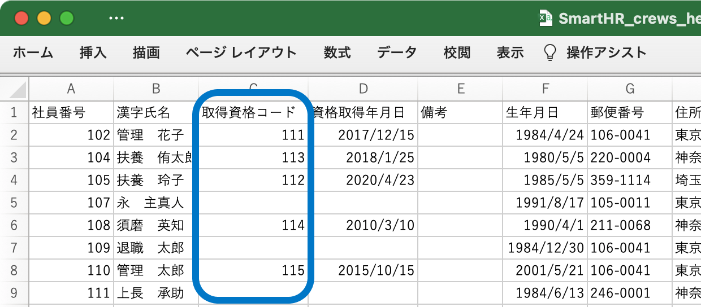

カスタム項目を外部システムに取り込みやすいコードに変換して、従業員情報をダウンロードできます。

あらかじめマスターデータを登録し、従業員項目をコードに変換する設定をしてから、従業員情報をダウンロードしてください。

# 前提

カスタム項目のうち **［入力タイプ］** が **［ドロップダウンリスト］** の項目のみ、コードに変換してダウンロードできます。

カスタム項目の登録方法は、[カスタム従業員項目を追加する](https://knowledge.smarthr.jp/hc/ja/articles/360026265513)を参照してください。

このページでは、例として「資格名」というカスタム項目をコードに変換する手順を説明します。

例：「資格名」というカスタム項目と、「税理士」「司法書士」「ウェブ解析士」という選択肢が登録されている

:::alert
カスタム項目の各選択肢には、コードを登録できません。
:::

# 1\. マスターデータを登録

以下の通り、変換したいコードに関する情報を**マスターデータ**として登録します。

 **［項目名］** ：カスタム項目のドロップダウンリストと同じ内容を登録します。

 **［項目コード］** ：変換したいコードを登録します。

詳しい登録方法は、[カスタムマスター（β版）を管理する](https://knowledge.smarthr.jp/hc/ja/articles/4408888193305/)を参照してください。

:::alert
 **［項目名］** は、ドロップダウンリストの内容と完全に一致させてください。
両者が異なる場合は、コードに変換できずエラーになります。
:::

# 2\. カスタムダウンロードフォーマットを登録し、コード変換を設定

コードを変換して従業員情報をダウンロードする際に利用する**カスタムダウンロードフォーマット**を登録します。

詳しい登録方法は、[カスタムダウンロードフォーマットの追加・編集・削除](https://knowledge.smarthr.jp/hc/ja/articles/4404850299289)を参照してください。

この際、コードに変換したい**カスタム項目**と、手順1で登録した**マスターデータ**を紐づけます。

具体的には、 **［ダウンロード項目の追加］** 画面の **［SmartHRの項目］** で、コードに変換したい**カスタム項目**を選択します。

次に、 **［コードに変換］** で **［変換する］** を指定し、**手順1で登録したマスターデータ**を選択して、 **［登録］** をクリックしてください。

# 3\. 従業員情報をダウンロード

手順2で作成したカスタムダウンロードフォーマットを利用して従業員情報をダウンロードすると、**カスタム項目がコードに変換された状態**でダウンロードできます。

ダウンロードの手順は、以下のページの「カスタマイズしたフォーマットでダウンロードする」を参照してください。

[従業員情報、家族情報の登録データをダウンロードする](https://knowledge.smarthr.jp/hc/ja/articles/360026106394)

