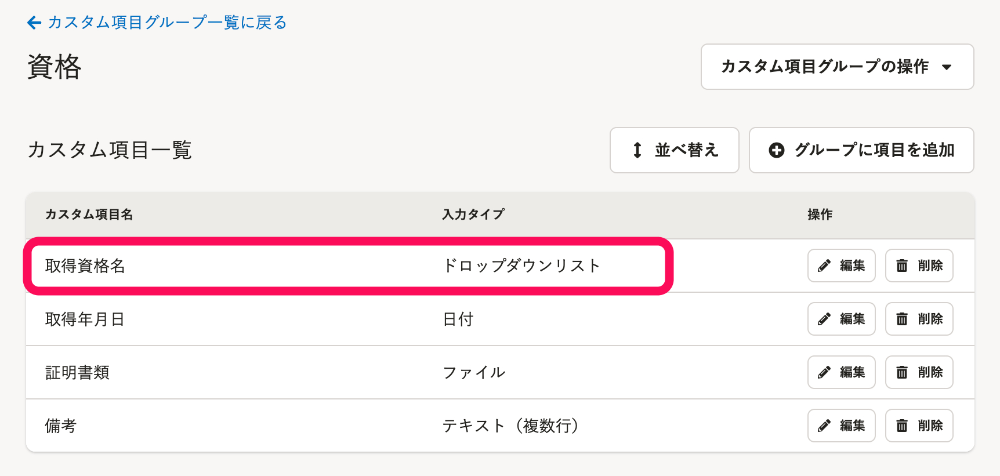
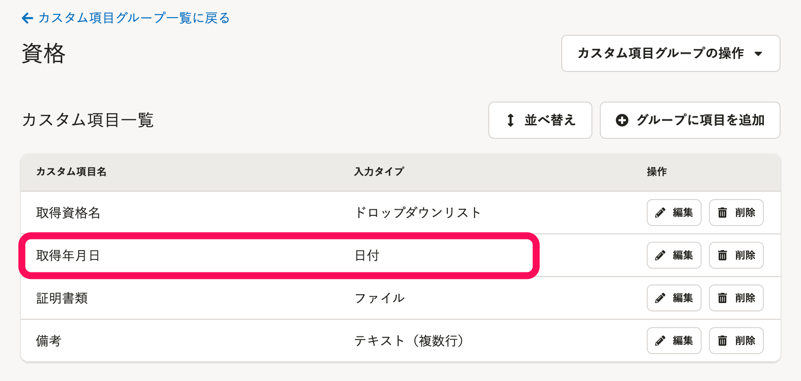

従業員情報・家族情報をダウンロードする際、カスタムダウンロードフォーマットを利用することで、一部の項目の出力形式を変更できます。

:::related
[カスタムダウンロードフォーマットの追加・編集・削除](https://knowledge.smarthr.jp/hc/ja/articles/4404850299289)
[従業員情報、家族情報の登録データをダウンロードする](https://knowledge.smarthr.jp/hc/ja/articles/360026106394)
:::
:::tips
項目を結合・分割してダウンロードしたい場合は、以下のヘルプページを参照ください。
[従業員情報・家族情報の項目を、結合・分割してダウンロードするには？](https://knowledge.smarthr.jp/hc/ja/articles/4492483701913)
:::

# コードに変換して出力できる項目

カスタムダウンロードフォーマットを利用すると、従業員情報、家族情報のうち**選択式の項目**は、コードに変換して出力できます。

詳しい操作方法は[従業員情報・家族情報の項目を、コードに変換してダウンロードするには？](https://knowledge.smarthr.jp/hc/ja/articles/4407091112345)を参照してください。

## 従業員情報

| 基本情報 | 戸籍上の性別 |
| --- | --- |
| 入退社情報 | 在籍情報 |
| 業務情報 | 事業所 |
| 雇用形態 |
| 役職 |
| 給与支給形態 |
| 部署情報 | 部署 |
| 現住所と連絡先 | 住所（都道府県） |
| 住民票住所 | 住所（都道府県） |
| 緊急連絡先 | 住所（都道府県） |
| 通勤手当 | 通勤手当1の期間 |
| 通勤手当2の期間 |
| 口座情報 | 給与振込口座 預金種別 |
| 雇用契約情報 | 契約種別 |
| 契約更新の有無 |
| 在留資格情報 | 在留資格 |
| 資格外活動許可の有無 |
| 派遣・請負就労区分 |
| 配偶者情報 | 配偶者の有無 |
| 所得税 | 課税区分 |
| 障害者区分 |
| 勤労学生フラグ |
| 勤労学生：給与所得フラグ |
| 勤労学生：事業所得フラグ |
| 勤労学生：配当所得フラグ |
| 勤労学生：不動産所得フラグ |
| 寡婦・ひとり親 |
| 寡婦・ひとり親の理由 |

:::alert
以下の項目は、**選択式ではなくテキストの入力が可能**なため、コードに変換できません。
| 現住所と連絡先 | 世帯主の続柄 |
| --- | --- |
| 住民票住所 | 住民票住所の世帯主の続柄 |
| 緊急連絡先 | 緊急連絡先の続柄 |
| 口座情報 | 銀行コード |
| 支店コード |
| 所得税 | 障害者手帳の種類 |
:::
:::tips
カスタム項目のうち**入力タイプが［ドロップダウンリスト］の項目**も、コードに変換して出力できます。

詳しい操作方法は[カスタム項目をコードに変換して、従業員情報をダウンロードするには？](https://knowledge.smarthr.jp/hc/ja/articles/4410660698649)を参照してください。
:::

## 家族情報

| 基本情報 | 続柄 |
| --- | --- |
| 性別 |
| 社会保険の扶養状況 | 社会保険の扶養状況 |
| 社会保険の扶養から削除された理由 |
| 所得税の扶養状況 | 所得税の扶養状況 |
| 税法上の扶養から削除された理由 |
| 住所 | 同居・別居の別 |
| 住所（都道府県） |
| 障害者控除 | 障害者区分 |

:::alert
以下の項目は、**選択式ではなくテキストの入力が可能**なため、コードに変換できません。
| 障害者控除 | 障害者手帳の種類 |
| --- | --- |
:::

# 「ハイフンなし」で出力できる項目

標準ダウンロードフォーマットでダウンロードすると、以下の項目はハイフンが出力されます。

カスタムダウンロードフォーマットを利用すると、「ハイフンなし」で出力できます。

## 従業員情報

| 現住所と連絡先 | 住所（郵便番号） |
| --- | --- |
| 電話番号 |
| 緊急連絡先 | 住所（郵便番号） |
| 緊急連絡先の電話番号 |
| 雇用保険 | 雇用保険の被保険者番号 |
| 社会保険 | 基礎年金番号 |

## 家族情報

| 基本情報 | 基礎年金番号 |
| --- | --- |
| 電話番号 |
| 住所 | 住所（郵便番号） |

:::tips
上記の項目は、ハイフンの前後で分割して出力することもできます。
[従業員情報・家族情報の項目を、結合・分割してダウンロードするには？](https://knowledge.smarthr.jp/hc/ja/articles/4492483701913)
:::

# 「半角カナ」で出力できる項目

標準ダウンロードフォーマットでダウンロードすると、カタカナの項目は全角カナで出力されます。

カスタムダウンロードフォーマットを利用すると、「半角カナ」で出力できます。

## 従業員情報

| 基本情報 | 姓（ヨミガナ） |
| --- | --- |
| 名（ヨミガナ） |
| ビジネスネーム：姓（ヨミガナ） |
| ビジネスネーム：名（ヨミガナ） |
| 現住所と連絡先 | 現住所（ヨミガナ） |
| 緊急連絡先 | 緊急連絡先の姓（ヨミガナ） |
| 緊急連絡先の名（ヨミガナ） |
| 緊急連絡先の住所（ヨミガナ） |
| 住民票住所 | 住民票住所（ヨミガナ） |
| 口座情報 | 給与振込口座 名義（カタカナ） |

## 家族情報

| 住所 | 住所（ヨミガナ） |
| --- | --- |

# 日付形式を指定して出力できる項目

標準ダウンロードフォーマットでダウンロードすると、日付形式の項目は **「YYYY/MM/DD（例：2020/01/01）」** で出力されます。

カスタムダウンロードフォーマットを利用すると、 **「YYYYMMDD」「YYYY-MM-DD」「YYYY年MM月DD日」「YYYY/MM」** の中から形式を指定して出力できます。

## 従業員情報

| 基本情報 | 生年月日 |
| --- | --- |
| 入退社情報 | 入社年月日 |
| 退職年月日 |
| 雇用契約情報 | 契約開始日 |
| 契約終了日 |
| 在留資格情報 | 在留期日 |
| 雇用保険 | 雇用保険の資格取得年月日 |
| 雇用保険の資格喪失年月日 |
| 社会保険 | 社会保険の資格取得年月日 |
| 社会保険の資格喪失年月日 |
| 標準報酬月額の改定年月日 |
| 所得税 | 障害者手帳の交付年月日 |
| 勤労学生>入学年月日 |

:::tips
カスタム項目のうち**入力タイプが［日付］の項目**も、日付形式を指定して出力できます。

:::

## 家族情報

| 基本情報 | 生年月日 |
| --- | --- |
| 障害者手帳の交付年月日 |
| 社会保険の扶養状況 | 社会保険の被扶養者になった日 |
| 社会保険の被扶養者でなくなった日 |
| 所得税の扶養状況 | 税法上の被扶養者になった日 |
| 税法上の被扶養者でなくなった日 |

:::tips
#### ダウンロードしたファイルが、指定した日付形式で表示されない場合は？
Excelの仕様により、CSVファイルをExcelで開くと、指定した日付形式で表示されない場合があります。
例：「YYYY-MM-DD」を指定してダウンロードしたのに、Excelで開くと「1989/2/16」のようにスラッシュ区切りで表示される
**データは指定した日付形式で出力**されています（CSVファイルをテキストエディタ・メモ帳などで開くと確認できます）。
:::
