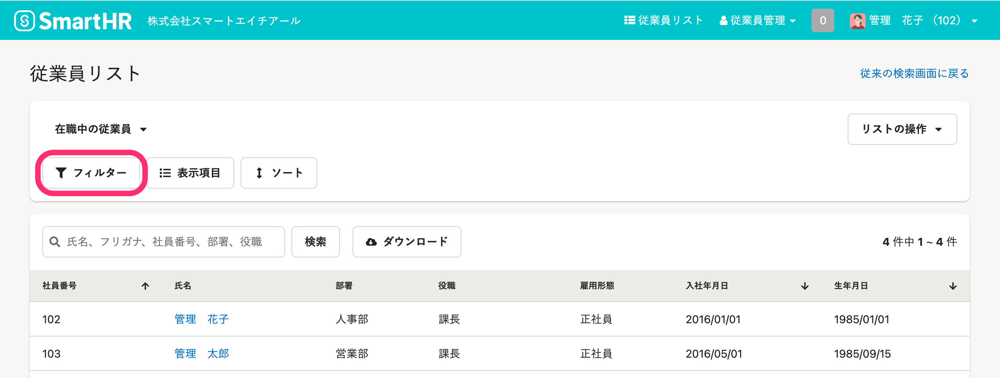
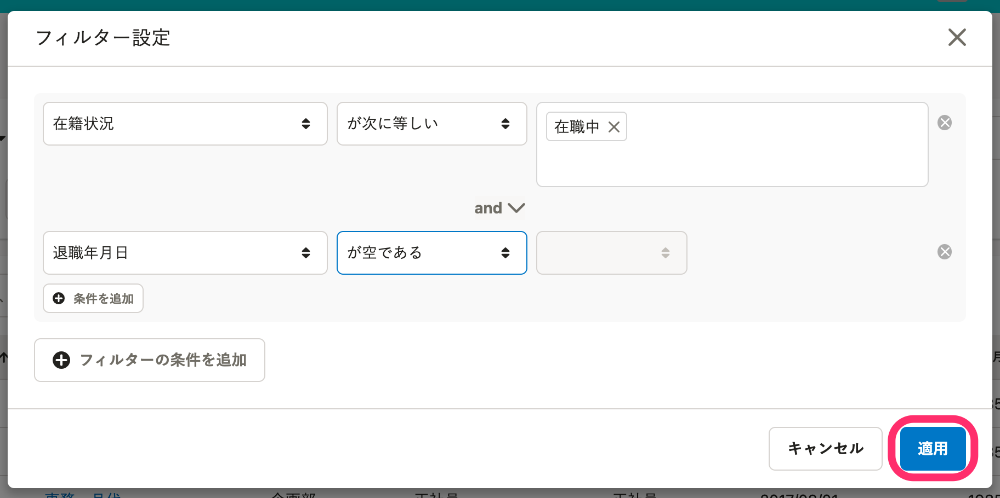
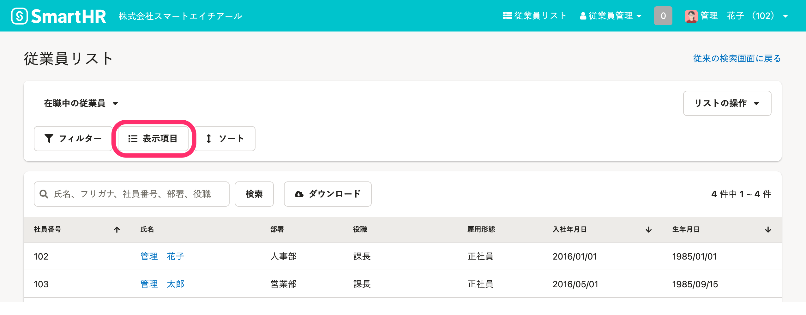
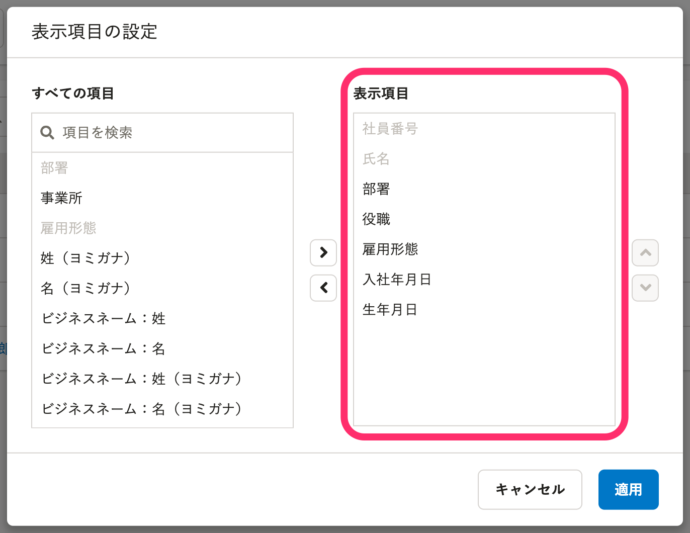
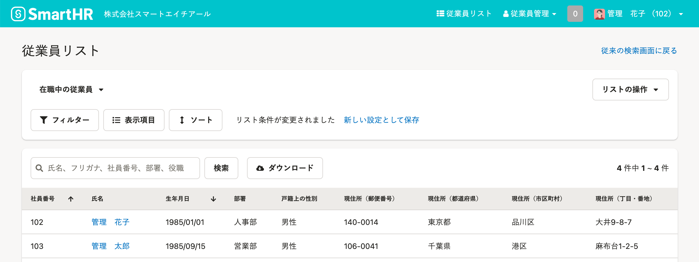
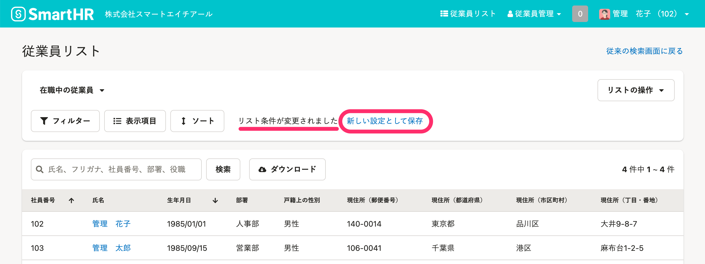
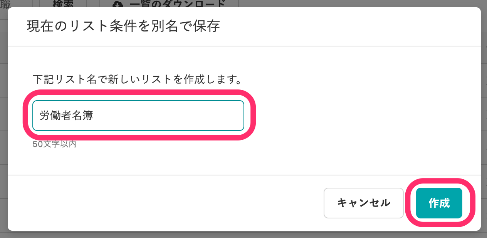
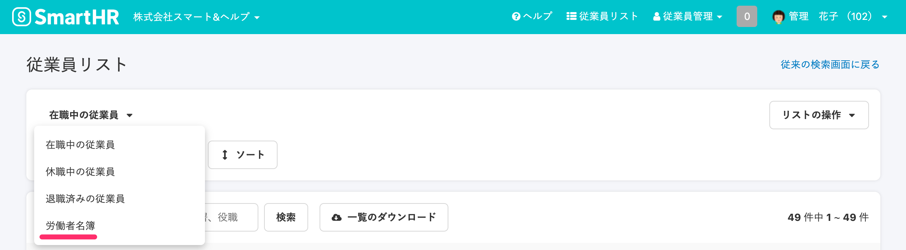

労働基準法で定められている「労働者名簿」は、必須項目が記載されていれば、その様式は限定されていません。

ここでは、SmartHR の従業員リストを「労働者名簿」として利用するためのカスタムリストの使い方を紹介します。

:::related
[【SmartHR流】クラウド時代の「労働者名簿（従業員名簿）」管理方法｜SmartHR ガイド](https://mag.smarthr.jp/guide/case-study/detail/meibo/)
:::

# 「労働者名簿」に必要な項目とSmartHRの従業員情報

「労働者名簿」で記載すべき項目は以下の8項目で、SmartHRではシステム標準項目として設けられています。

| 労働基準法で定められている項目 | SmartHR システム標準項目 |
| --- | --- |
| 氏名 | 氏名 |
| 生年月日 | 生年月日 |
| 履歴 | 項目グループごと履歴一覧画面 |
| 性別 | 戸籍上の性別 |
| 住所 | 現住所 |
| 従事する業務の書類 | 業務内容 |
| 雇入の年月日 | 入社年月日 |
| 退職の年月日およびその原因 | 退職年月日、退職事由 |

従業員リストでは、履歴以外の「労働者名簿」の必須項目を抽出したカスタムリストを作成・保存することで、「労働者名簿」として利用できます。

履歴は、従業員情報の画面で［業務情報］、［部署情報］などの項目グループごとに変更履歴を確認できます。

:::related
[従業員情報の変更履歴を閲覧する](https://knowledge.smarthr.jp/hc/ja/articles/360026262633)
:::

# 「労働者名簿」として利用できるカスタムリストを作成する

## 1\. 画面左上にある［フィルタ］をクリック

従業員検索画面の左上にある  **［フィルタ］**  をクリックすると、条件の追加・編集ができるフィルタ設定画面が表示されます。

## 2\. 在職中の従業員のみが表示される条件を設定する

以下の条件を追加して  **［適用］**  をクリックすると、「労働者名簿」の対象となる従業員が表示されます。

［在籍状況］［が次に等しい］［在職中］

and

［退職年月日］［が空である］

## 3\. 表示項目を設定する

 **［表示項目］**  をクリックすると、［表示項目の設定］画面が表示されます。

［表示項目の設定］画面の［表示項目］を、「労働者名簿」に必要な以下の項目に変更します。

社員番号と氏名は、従業員リストで必ず表示される項目なので、変更できません。

- 生年月日
- 現住所
- 業務内容
- 入社年月日
- 退職年月日
- 退職事由

 **［適用］**  をクリックすると、設定した項目が表示されます。

## 4\. カスタムリストを保存する

 **［新しい設定として保存］**  をクリックすると、リスト名の設定画面が表示されます。

「労働者名簿」などリスト名を入力し、 **［作成］**  をクリックすると、カスタムリストが保存されます。

カスタムリストは、従業員リスト画面の左にあるプルダウンリストに追加されています。

:::tips
カスタムリストは企業アカウントごとに保存されます。
 **［カスタム従業員リスト］** の **［閲覧］** 権限があるアカウントであれば、他のアカウントが作成したカスタムリストを閲覧できます。
詳しくは、[従業員関連の閲覧・作成・更新・削除の権限を設定する](https://knowledge.smarthr.jp/hc/ja/articles/1500001368101)の「カスタム従業員リスト」項目をご覧ください。
:::
