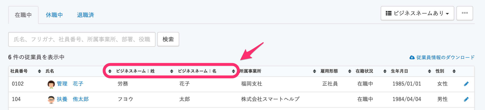
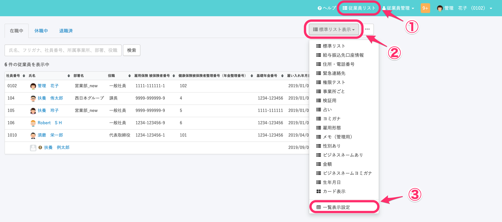
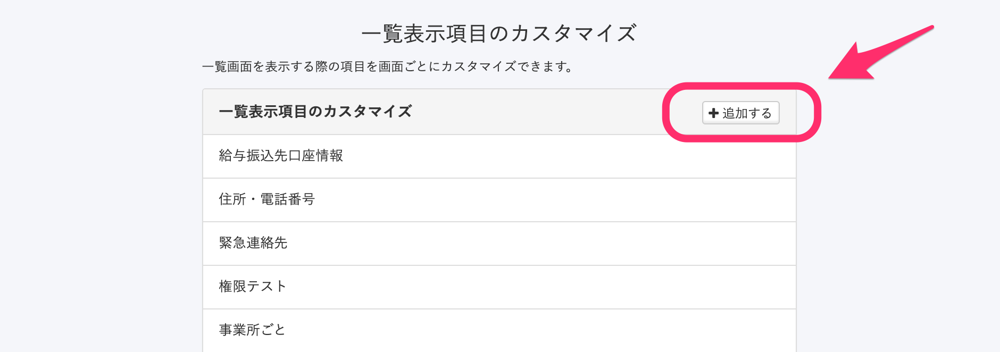
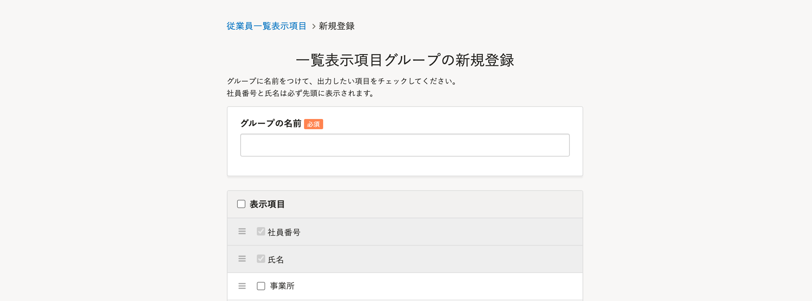
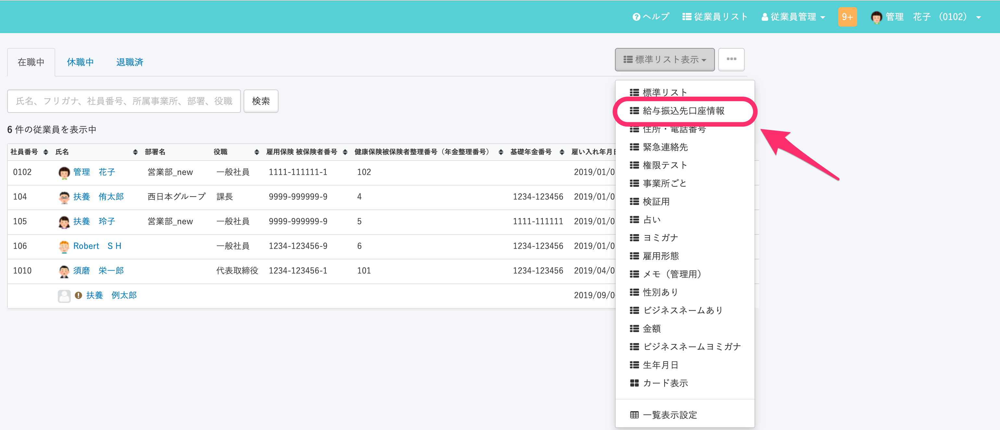
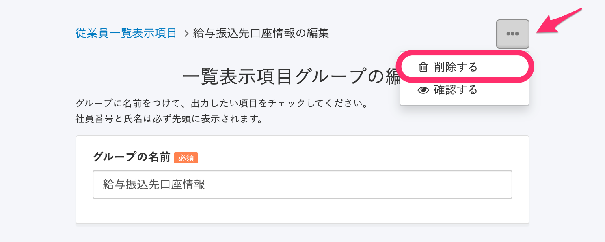
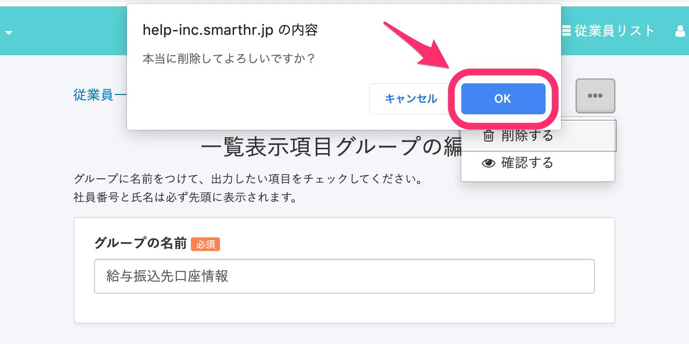

:::alert
2020年7月に従業員リストの画面をリニューアルしました。
当ページで案内しているのは、管理者権限のアカウントのみがアクセスできる、リニューアル以前の従業員リストページの操作方法です。
現在の従業員リスト画面の操作を確認したい場合は、下記のページをご覧ください。
[従業員リストの使い方](https://knowledge.smarthr.jp/hc/ja/articles/360043824473)
:::

従業員リストに表示される項目をあらかじめ設定しておくと、ドロップダウンリストで表示を切り替えられます。

よく閲覧する項目などを設定しておくと便利です。

# 設定方法

## 1\. ［従業員リスト］ > ［標準リスト表示］ > ［一覧表示設定］をクリック

画面右上にある **［従業員リスト］** をクリックし、 **［標準リスト表示］>［一覧表示設定］**  をクリックします。

## 2\. ［追加する］ をクリック

 **［一覧表示項目のカスタマイズ］** 項目の右に表示される、 **［追加する］**  をクリックします。

## 3\. ［追加する］をクリック

 **［グループの名前］** を入力し、表示させたい項目にチェックを入れたら  **［登録する］** をクリックします。

:::tips
 **［社員番号］** と **［氏名］** はシステム標準項目として指定されています（除外できません）。
ドラッグアンドドロップで表示する順番を変更できます（上から並び替えた順番で従業員リストでは左から順に表示されます）。
:::

# 表示方法

## 1\. 従業員リスト >［標準リスト表示］で任意のグループ名をクリック

 **［従業員リスト］>［標準リスト表示］** で任意のグループ名をクリックすると、従業員リストの項目が切り替わります。

# 削除方法

## 1\. ［一覧表示設定］でグループ名をクリック

 **［一覧表示設定］** にて、任意のグループ名をクリックします。

## 2\. ［…］メニュー > ［削除する］をクリック

グループ名をクリックすると右上に表示される **［...］メニュー** の **［削除する］**  をクリックしてください。

## 3\. メッセージを確認し、［OK］をクリック

メッセージを確認し、 **［OK］**  をクリックします。

:::alert
「従業員リストの表示項目」と「従業員リストをダウンロードした際に表示される項目」は異なります。
ダウンロードする項目の設定方法は、下記のページをご覧ください。
[旧従業員リストでダウンロードする項目を絞り込む](https://knowledge.smarthr.jp/hc/ja/articles/360026265273)
:::
