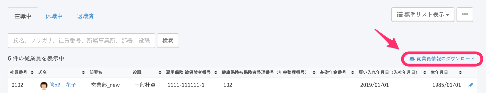
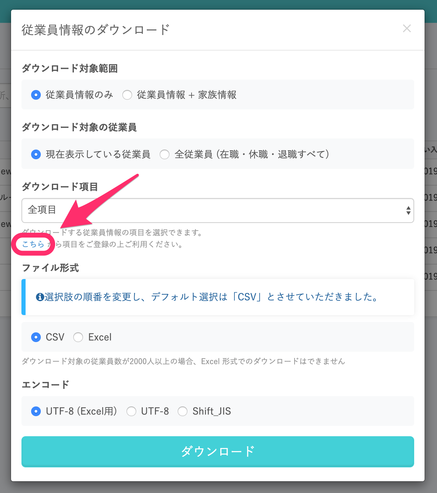
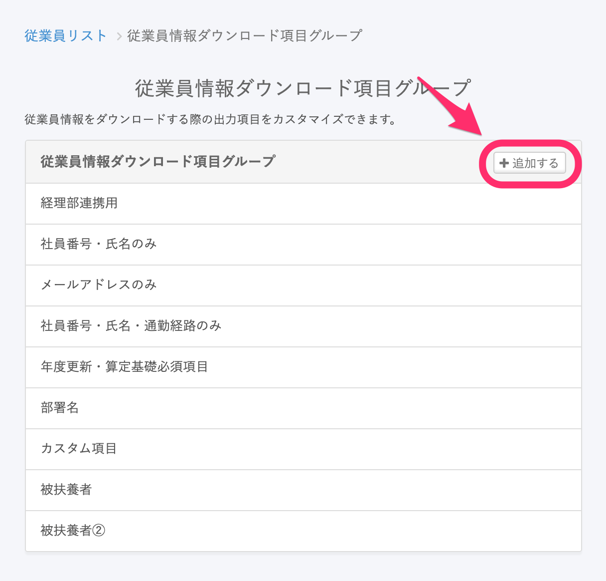
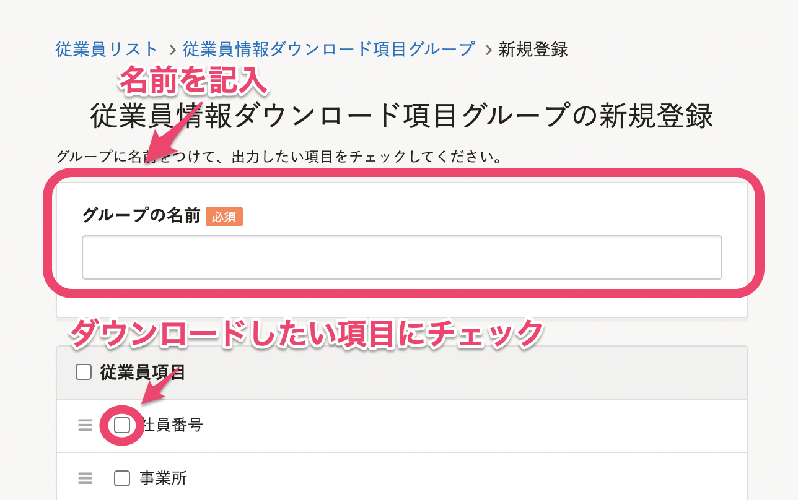
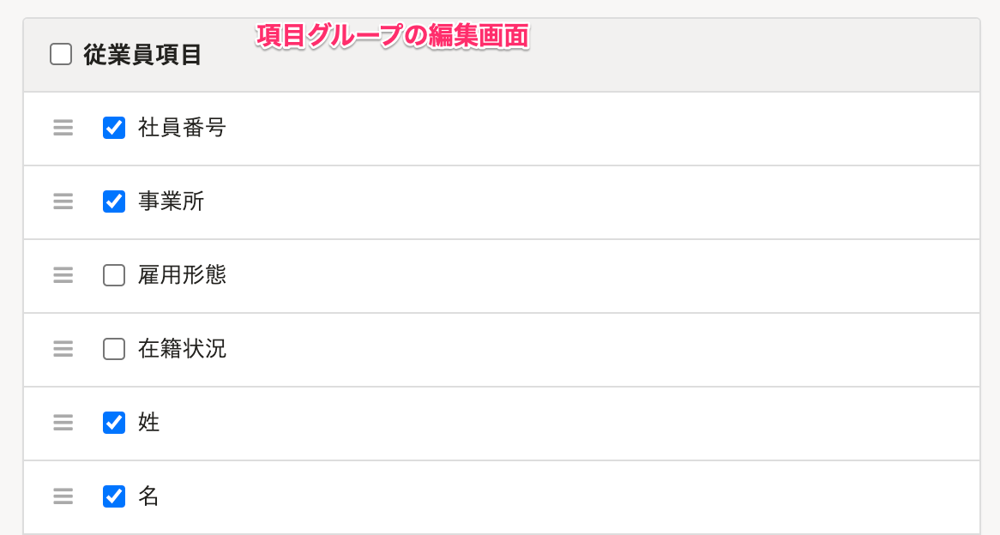
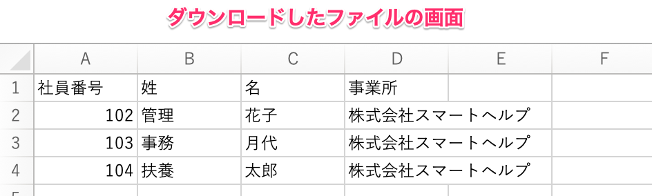

:::alert
2020年7月に従業員リストの画面をリニューアルしました。
当ページで案内しているのは、管理者権限のアカウントのみがアクセスできる、リニューアル以前の従業員リストページの操作方法です。
現在の従業員リスト画面の操作を確認したい場合は、詳しくは以下のヘルプページをご覧ください。
[従業員リストの使い方](https://knowledge.smarthr.jp/hc/ja/articles/360043824473)
:::

# 旧従業員リストで項目を絞り込むには、［ダウンロード項目グループ］を登録が必要

旧従業員リストで従業員情報をダウンロードする際に、ダウンロードする項目を選択するには、項目群を  **［ダウンロード項目グループ］**  として登録する必要があります。

:::alert
ダウンロードする条件の指定は項目単位となります。
ダウンロードする従業員の条件を指定することはできません。ダウンロードしたデータをExcel等で編集いただけますようお願いいたします。
例：「雇用形態がアルバイトになっている方」のみをダウンロードしたい
:::

## 1\. 旧従業員リスト画面で、［従業員情報のダウンロード］リンクをクリック

 **［従業員情報のダウンロード］**  リンクをクリックします。

## 2\. ［こちら］をクリック

 **［従業員情報のダウンロード］**  という画面が表示されますので、 **［こちら］**  をクリックします。

## 3\. ［+追加する］ > ［グループの名前］を入力し、［登録する］をクリック

 **［＋追加する］ > ［グループの名前］** に任意のグループ名を入力し、ダウンロードしたい項目にチェックをつけてから **［登録する］**  をクリックします。

:::tips
ドラッグアンドドロップで項目の順番を入れ替えられます。
ダウンロードしたファイルでも、画面上で並び替えた順番になります。

:::
