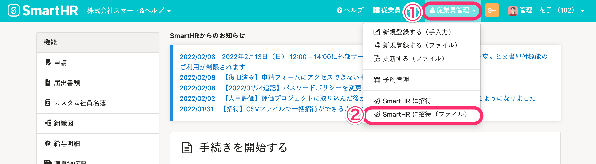
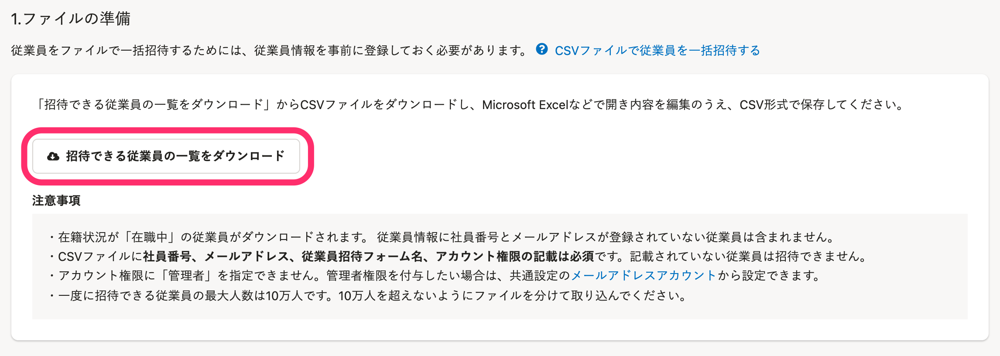
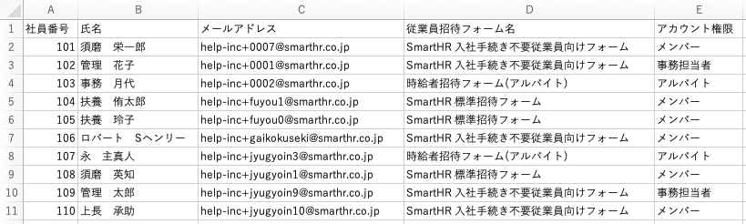
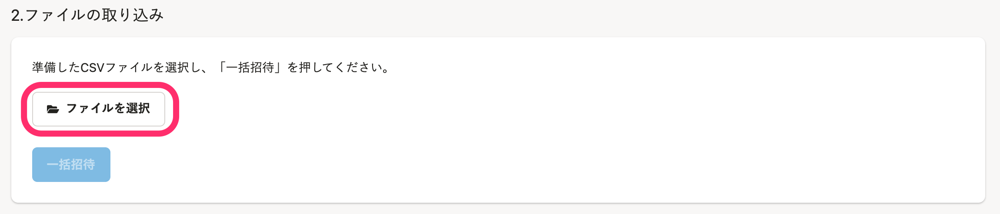
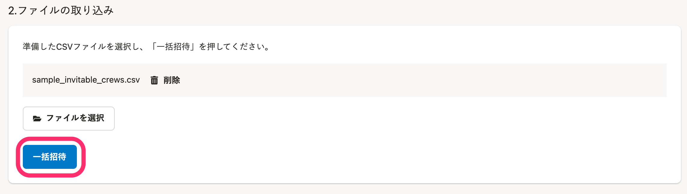
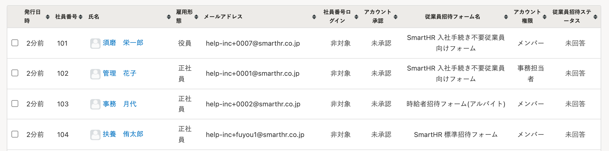
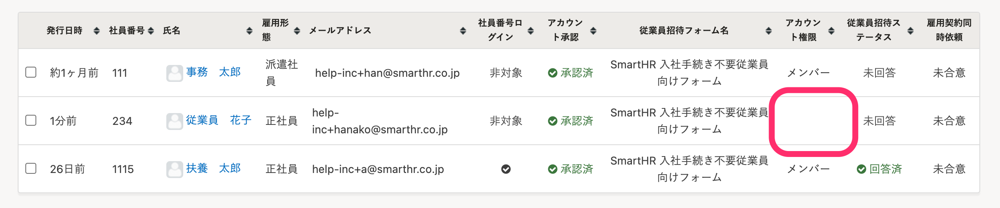
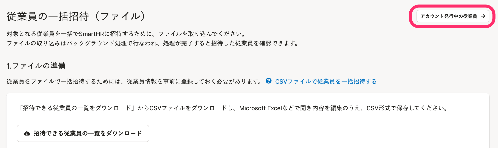

入社の手続きが不要な従業員をSmartHRに招待します。

CSVファイルを取り込むことで、複数の従業員の招待フォームとアカウント権限を柔軟に指定できます。

# 事前に準備しておくこと

招待するためには、事前に招待したい従業員の情報を登録する必要があります。

詳しくは、[従業員情報を追加・登録する](https://knowledge.smarthr.jp/hc/ja/articles/360026266493)を確認してください。

# 1\. ［従業員管理］>［SmartHR に招待（ファイル）］をクリックする

トップページ上部の **［従業員管理］** メニューにある **［SmartHR に招待（ファイル）］** をクリックすると、 **［従業員の一括招待（ファイル）］** 画面が表示されます。

# 2\. CSVファイルをダウンロードする

 **［招待できる従業員の一覧をダウンロード］** をクリックすると、バックグラウンド処理が予約されます。

ダウンロードしたCSVファイルには、従業員情報に社員番号とメールアドレスを登録済みで、在籍中の従業員が含まれます。

CSVファイルをダウンロードする方法は、[バックグラウンド処理後にデータをダウンロードする](https://knowledge.smarthr.jp/hc/ja/articles/360026105494)を確認してください。

:::tips
ダウンロードしたCSVファイルには、権限を持って操作できる従業員のみが含まれます。
詳しくは、[従業員関連の閲覧・作成・更新・削除の権限を設定する](https://knowledge.smarthr.jp/hc/ja/articles/1500001368101)を確認してください。
:::

# 3\. CSVファイルを編集する

ダウンロードしたCSVファイルをもとに、アカウント権限や従業員招待フォームを編集し、一括招待のファイルを準備します。

:::tips
招待フォームを設定しない場合は、 **［従業員招待フォーム名］** 欄に「**なし**」と入力して取り込みを行なってください。
「なし」を選択した場合、従業員に送付されるメールは**標準招待メール**です。そのほかのメールフォーマットは選択できません。
:::

# 4\. CSVファイルを取り込む

 **［従業員の一括招待（ファイル）］** 画面の **［ファイルを選択］** をクリックして、CSVファイルを取り込みます。

CSVファイルが選択されたことを確認して、 **［一括招待］** をクリックします。

従業員一括招待のバックグラウンド処理の予約が開始し、 **［アカウント発行中の従業員］** 画面が表示されます。

# 5\. 招待結果を確認する

バックグラウンド処理が完了すると、 **［アカウント発行中の従業員］** 画面に招待済みの従業員が反映されます。

バックグラウンド処理の状況は、 **［共通設定］** \> **［バックグラウンド処理一覧］** から確認できます。

:::tips
マルチログインアカウントの場合、 **［アカウント発行中の従業員］** 画面の **［アカウント権限］** は空欄になります。

[マルチログインアカウントとは](https://knowledge.smarthr.jp/hc/ja/articles/360026262853)
:::

# アカウント発行中の従業員ページを閲覧する方法

 **［アカウント発行中の従業員→］** をクリックすると、 **［アカウント発行中の従業員］** 画面が表示されます。

:::alert
90日以上経っても従業員からの承認がないメールアドレスアカウントは、自動的に削除されます。
:::
