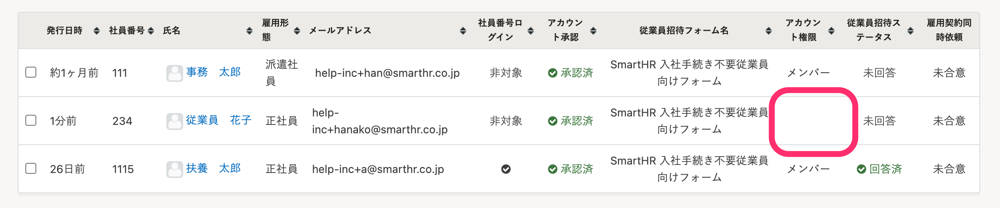

入社の手続きが不要な従業員をSmartHRに招待する方法です。

招待するためには、事前に招待したい従業員の情報を登録する必要があります。詳しくは、[従業員情報を追加・登録する](https://knowledge.smarthr.jp/hc/ja/articles/360026266493)を確認してください。

CSVファイルで従業員を招待する場合は、[CSVファイルで従業員をSmartHRに一括招待する](https://knowledge.smarthr.jp/hc/ja/articles/4414946514329)を確認してください。

# 1\. ［従業員管理］>［SmartHR に招待］をクリック

トップページ上部の **［従業員管理］** メニューにある **［SmartHR に招待］** をクリックすると、従業員の招待画面が表示されます。

# 2\. 招待する従業員を選択

SmartHR に招待したい従業員にチェックを入れ **［フォームを選択して一括選択する］** をクリックすると、招待フォームと権限を選択するダイアログが表示されます。

# 3\. ［招待メールを一括送信する］をクリック

 **［従業員招待フォーム］** と **［アカウント権限］** をドロップダウンリストからそれぞれ選択し、 **［招待メールを一括送信する］** をクリックしてください。

:::tips
招待フォームを設定しない場合は、 **［従業員招待フォーム］** で **「なし」** を選択してください。
手続きに必要な従業員情報が登録されている従業員のみ、 **「なし」** を選択して招待できます。
登録については、[従業員リストで、名前の横に表示された\[！\]を消す方法](https://knowledge.smarthr.jp/hc/ja/articles/360027003153)を参照してください。
「なし」を選択した場合、従業員に送付されるメールは**標準招待メール**です。そのほかのメールフォーマットは選択できません。
:::

# 4\. バックグラウンド処理を確認

従業員一括招待のバックグラウンド処理の予約が開始し、 **［アカウント発行中の従業員］** の画面が表示されます。

バックグラウンド処理が完了すると **［アカウント発行中の従業員］** に、招待済みの従業員が反映されます。

:::tips
マルチログインアカウントの場合、 **［アカウント権限］** が空欄になります。

[マルチログインアカウントとは](https://knowledge.smarthr.jp/hc/ja/articles/360026262853)
:::

# アカウント発行中の従業員ページを閲覧する方法

 **［従業員管理］>［SmartHR に招待］** をクリックすると表示される **［従業員を招待］** 画面の上部にある **［こちら］** をクリックしてください。

:::tips
 **［従業員を招待］** の一覧には、未招待の従業員のみ表示されます。
招待済みの従業員は **［アカウント発行中の従業員］** の画面をご覧ください。
:::
:::alert
90日以上経っても従業員からの承認がないメールアドレスアカウントは、自動的に削除されます。
:::
