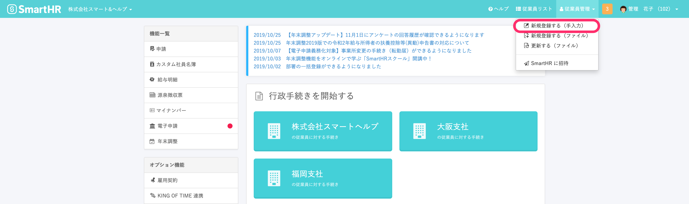
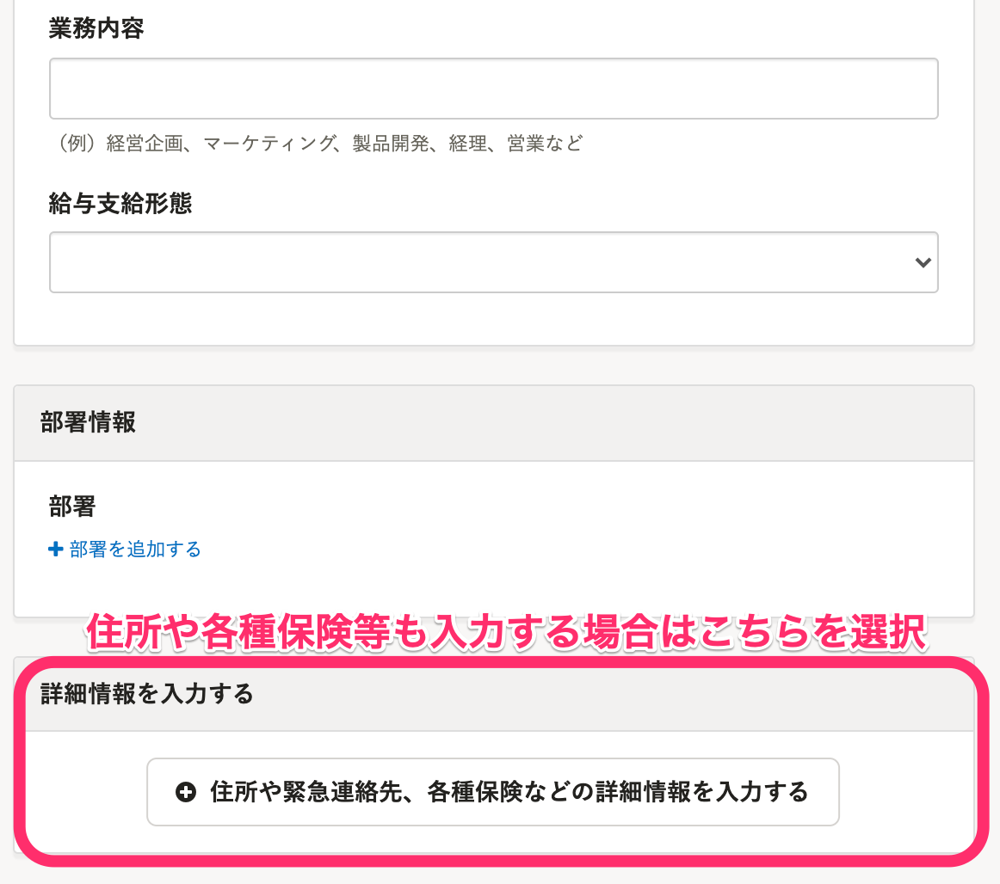

従業員情報を登録する方法です。

複数の従業員情報を一括登録したい場合は、下記のページをご覧ください。

[複数の従業員情報を一括で登録する](https://knowledge.smarthr.jp/hc/ja/articles/360026107234)

# 追加・登録手順

## 1\. ヘッダーメニューから［従業員管理］>［新規登録する（手入力）］をクリック

## 2\. 従業員情報を入力し、［登録する］をクリック 

:::tips
従業員情報の登録画面に表示されるのは、操作するアカウントが閲覧権限を持つ従業員項目のみです。
従業員項目の権限設定について、詳しくは下記のページをご覧ください。
[従業員関連の閲覧・作成・更新・削除の権限を設定する](https://knowledge.smarthr.jp/hc/ja/articles/1500001368101)
:::
