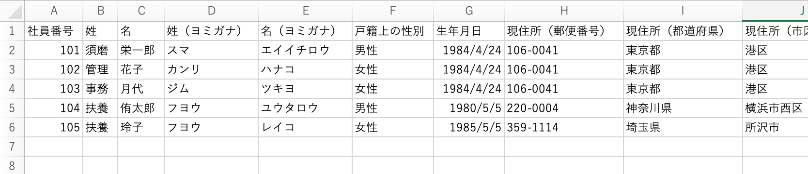
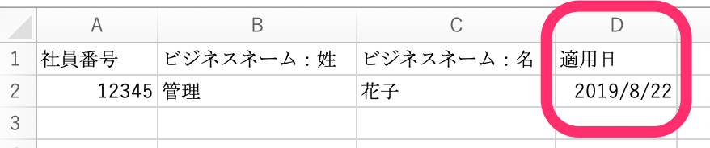
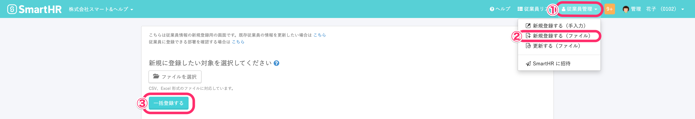
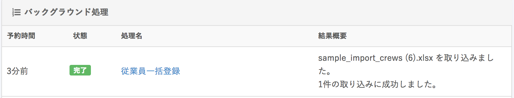

CSVファイルやExcelファイルを利用して、複数の従業員情報を一括で登録できます。

# 1\. 一括登録用の CSV / Excel を作成する

従業員情報を登録する一括登録用ファイルを、CSV形式またはExcel形式で作成します。

## スタンダードプラン以上を利用している場合

適用日を指定して一括登録が可能です。

:::alert
ファイルに部署や雇用形態などのマスターデータや「カスタム項目名」を含む場合は、適用日時点の項目名を入力してください。
適用日時点で存在しない項目名を指定すると、エラーが出て登録ができません。
:::

# 2.［従業員管理］>［新規登録（ファイル）］の画面でファイルを添付する

 **［従業員管理］>［新規登録（ファイル）］** の画面で **［ファイルを選択］**  からファイルを添付し、 **［一括登録する］** をクリックします。

取り込み結果を、画面右上の［ **アカウント名］>［共通］>［バックグラウンド処理］** から確認します。

結果概要に成功と表示されている場合は登録完了です。

:::tips
一括登録できる従業員情報は、操作するアカウントが閲覧権限を持つ項目のみです。
閲覧権限がない項目が一括登録用ファイルに1つでも含まれていた場合はエラーになり、すべての情報が登録されません。
従業員項目の権限設定について、詳しくは下記のページをご覧ください。
[従業員関連の閲覧・作成・更新・削除の権限を設定する](https://knowledge.smarthr.jp/hc/ja/articles/1500001368101)
:::

# ファイルのフォーマットについて

`.csv` 形式と `.xlsx` 形式のファイルに対応しています。

それぞれ、 **［新規登録する（ファイル）］** の画面にサンプルファイルを用意しています。

ダウンロードしたサンプルファイルの内容を編集後 **［ファイルを選択］** をクリックしてファイルを選択してください。

:::alert
2020年11月5日より、ダウンロードファイルの仕様を変更しました。
従業員情報ダウンロードの新しいフォーマットの詳細は以下のファイルから確認できます。
- [従業員情報ダウンロードファイルの仕様変更詳細\_20201105.pdf](./_________________________20201105.pdf)
- [従業員情報ダウンロードファイルの仕様変更詳細\_20201105.xlsx](./_________________________20201105.xlsx)
:::
