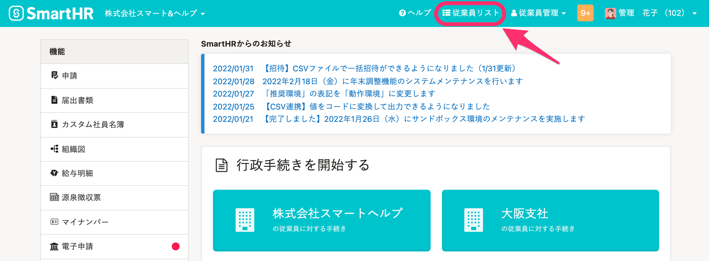
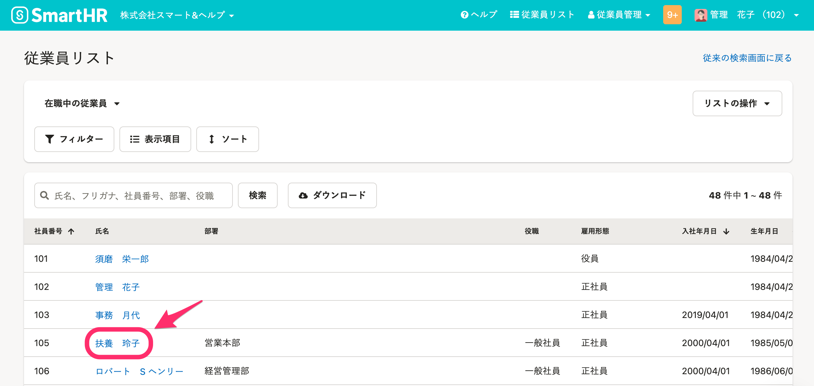
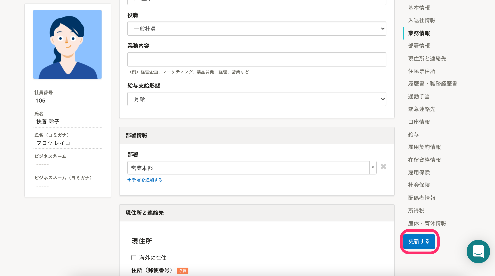

従業員情報は、個別に変更可能です。

CSVまたはExcelファイルを使って従業員情報を一括更新する手順は、以下のヘルプページを参照してください。

[複数の従業員情報・家族情報を一括で更新する](https://knowledge.smarthr.jp/hc/ja/articles/360026265333)

# 1.［従業員リスト］をクリック

トップページ上部にある **［従業員リスト］** をクリックすると、 **［従業員リスト］** の一覧画面が表示されます。

# 2\. 情報を更新する従業員を選択

リストから更新したい従業員をクリックすると、従業員情報の確認画面が表示されます。

# 3\. 従業員情報画面の右上にある［編集］をクリック

従業員情報画面の右上にある **［編集］** をクリックすると、編集画面が表示されます。

# 4\. 情報を変更し、［更新する］をクリック

編集画面で従業員情報の変更後、画面右下の **［更新する］** をクリックすると変更が反映されます。

:::tips
従業員情報の編集画面に表示されるのは、操作するアカウントが閲覧権限を持つ従業員項目のみです。
従業員項目の権限設定について、詳しくは下記のヘルプページを参照してください。
[従業員関連の閲覧・作成・更新・削除の権限を設定する](https://knowledge.smarthr.jp/hc/ja/articles/1500001368101)
:::
