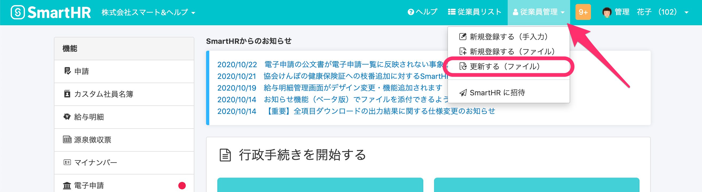
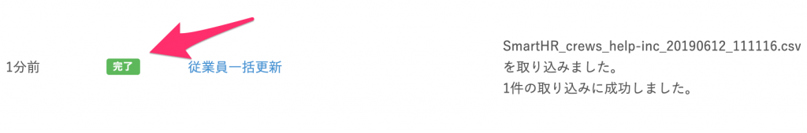
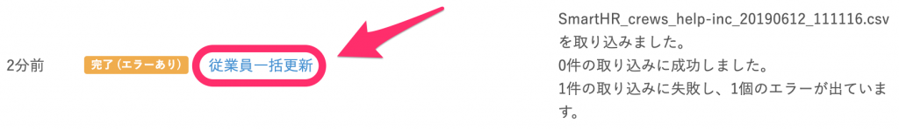

CSVファイルやExcelファイルを使って、複数の従業員情報や家族情報を一括で更新できます。

# 従業員を一括で更新する

## 1\. 更新に使う従業員情報ファイル（CSVまたはExcel形式）を用意

従業員情報ファイルの雛形は、従業員リスト画面からダウンロードできます。

詳しくは、以下のページをご覧ください。

:::related
[従業員リスト・家族情報をダウンロードする](https://knowledge.smarthr.jp/hc/ja/articles/360026106394)
:::

更新が必要でない項目と従業員については、項目の列ごと／従業員の行ごと削除してください。

対象従業員ごとの、**社員番号**と**更新したい情報**が記載されたファイルで更新できます。

:::alert
従業員情報に項目があり、その項目の列の情報が空欄になっているファイルで更新した場合、従業員情報は空欄として上書きされます。
例：「業務内容」という項目があるファイルを使って更新する際、「業務内容」が空欄になっていると、既存の情報が空欄で上書きされます。

:::
:::tips
スタンダードプラン以上をご利用いただいている場合は、適用日を指定した履歴の一括更新もできます。
[Q. 適用日を指定して従業員情報を一括更新すると履歴はどうなる？](https://knowledge.smarthr.jp/hc/ja/articles/4434037370905)
適用日を指定する場合、部署や雇用形態などのマスターデータは、適用日時点で存在するものを指定してください。
適用日時点で存在するマスターデータがわからない場合は、個別に適用日を指定して、従業員情報を更新してください。
[適用日を指定して従業員情報を登録する](https://knowledge.smarthr.jp/hc/ja/articles/360026262253)
:::

## 2\. ヘッダーメニューから \[従業員管理\] > \[更新する（ファイル）\] を選択

画面右上の **\[従業員管理\]** から **\[更新する（ファイル）\]** をクリックすると、従業員情報の一括更新画面がひらきます。

## 3\. 対象を \[従業員\] とし、ファイルを選択して \[一括更新\] をクリック

更新したい対象を **\[従業員\]** とし、1.で用意したファイルを選択して **\[一括更新\]** をクリックします。

:::tips
一括更新できる従業員情報は、操作するアカウントが更新権限を持つ項目のみです。
更新権限がない項目が一括更新用ファイルに1つでも含まれていた場合はエラーになり、すべての情報が更新されません。
従業員項目の権限設定について、詳しくは下記のページをご覧ください。
[従業員関連の閲覧・作成・更新・削除の権限を設定する](https://knowledge.smarthr.jp/hc/ja/articles/1500001368101)
:::

初期設定では、管理者が従業員情報のインポートを行なっているあいだ、従業員による情報の更新が制限されています。

インポート中も従業員による更新を許可するには、全般設定を変更してください。

設定の変更方法について詳しくは、以下のページをご覧ください。

:::related
[従業員情報をインポートしているときに、従業員によるデータの更新を許可する](https://knowledge.smarthr.jp/hc/ja/articles/360039796053)
:::

## 4\. 結果を確認する

一括更新の結果は、 **\[共通設定\] > \[バックグラウンド処理\]** から確認できます。

**\[状態\]** 欄が緑色の **\[完了\]** ステータスになっていれば、エラーなく一括更新が完了しています。

**\[状態\]** 欄がオレンジの **\[完了（エラーあり）\]** や、赤の **\[失敗\]** になっている場合は、何らかのエラーが発生しています。

処理名の欄をクリックすると、エラーの詳細が確認できますので、エラーの原因を解消してください。

# 家族情報を一括で更新する

## 1\. 更新に使う家族情報ファイル（CSVまたはExcel形式）を用意

家族情報ファイルの雛形は、従業員リスト画面、もしくは従業員情報の一括更新画面からダウンロードできます。

登録済み家族情報が入った雛形が必要な場合は、従業員リスト画面からダウンロードしてください。

詳しくは、以下のページをご覧ください。

:::related
[従業員リスト・家族情報をダウンロードする](https://knowledge.smarthr.jp/hc/ja/articles/360026106394)
:::

登録済み家族情報の入っていない空の雛形が必要な場合は、従業員情報の一括更新画面からダウンロードしてください。

## 2\. ヘッダーメニューから \[従業員管理\] > \[更新する（ファイル）\] を選択

画面右上の **\[従業員管理\]** から **\[更新する（ファイル）\]** をクリックすると、従業員情報の一括更新画面がひらきます。

## 3\. 対象を \[家族\] とし、ファイルを選択して、\[一括更新\] をクリック

更新したい対象を **\[家族\]** とし、1.で用意したファイルを選択して **\[一括更新\]** をクリックします。

:::tips
家族情報の一括更新には、操作するアカウントが家族情報の更新権限を持っている必要があります。
家族情報の更新権限がない場合はエラーになり、すべての家族情報が更新されません。
従業員項目の権限設定について、詳しくは下記のページをご覧ください。
[従業員関連の閲覧・作成・更新・削除の権限を設定する](https://knowledge.smarthr.jp/hc/ja/articles/1500001368101)
:::
:::tips
**社員番号**と**続柄**と**家族の姓・名**が**すべて一致**する家族情報が存在する場合、当該家族の家族情報が**更新**されます。
**社員番号**と**続柄**と**家族の姓・名**の**いずれかが一致しない**場合、家族情報が**新規作成**されます。
また、1人の従業員情報に紐付けて登録できる家族情報は**最大15人**です。
:::

家族情報ファイルの凡例は下記のページをご覧ください。

:::related
[【一覧】家族情報CSV凡例](https://knowledge.smarthr.jp/hc/ja/articles/4406454806937)
:::

## 4\. 結果を確認する

一括更新の結果は、 **\[共通設定\] > \[バックグラウンド処理\]** から確認できます。

**\[状態\]** 欄が緑色の **\[完了\]** ステータスになっていれば、エラーなく一括更新が完了しています。

**\[状態\]** 欄がオレンジの **\[完了（エラーあり）\]** や、赤の **\[失敗\]** になっている場合は、何らかのエラーが発生しています。

処理名の欄をクリックすると、エラーの詳細が確認できますので、エラーの原因を解消してください。
