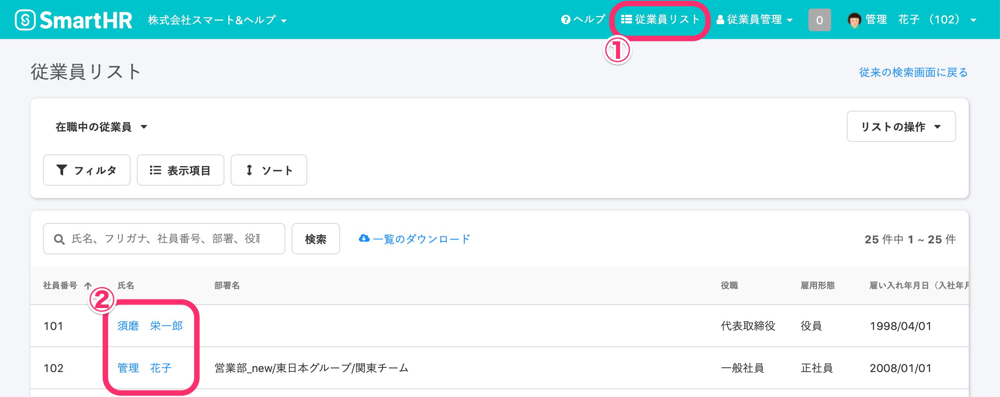
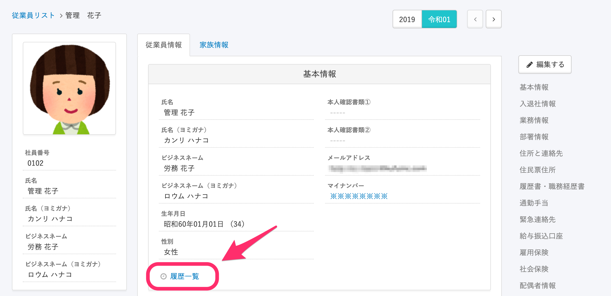
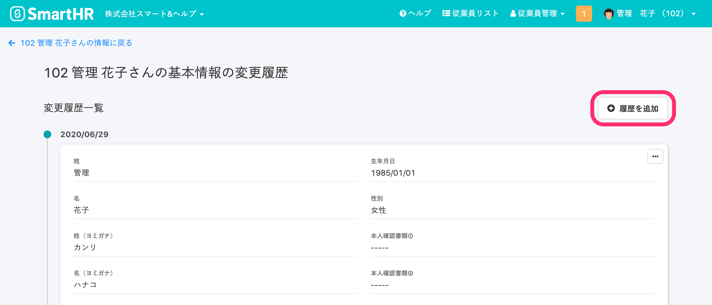
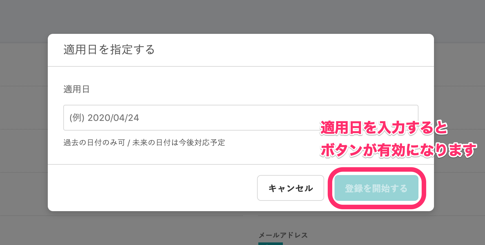
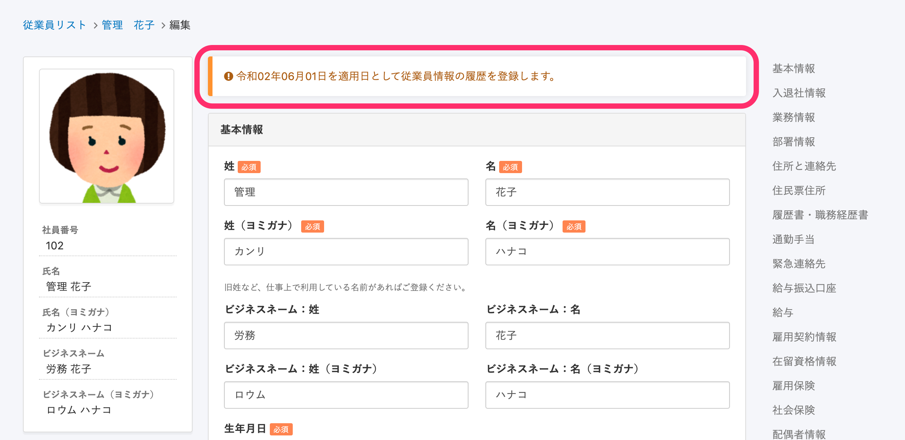
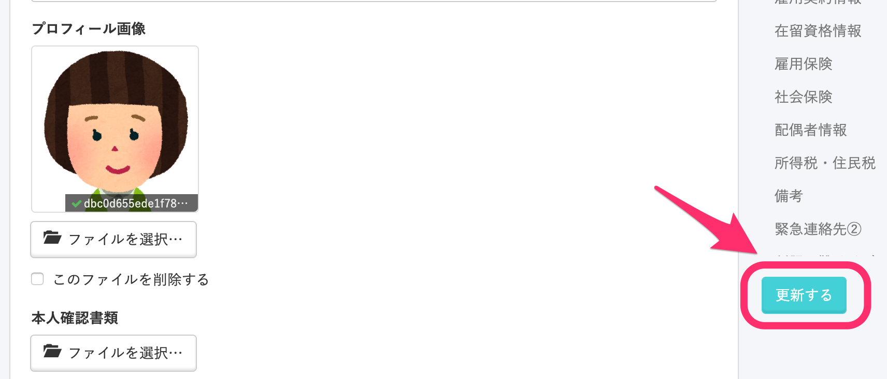
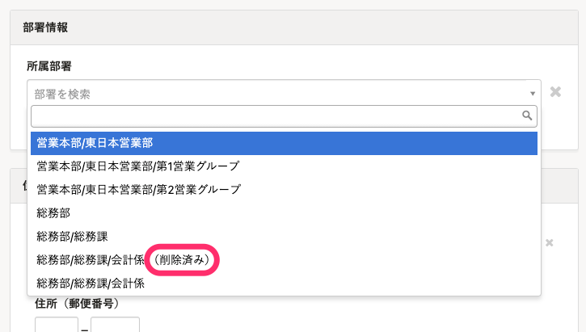

従業員情報を登録する際、適用日を指定できます。

適用日を指定することで、過去の住所や所属部署などを履歴として登録できます。

このページでは、個別の従業員に対して履歴を登録する方法を説明します。

複数の従業員に対して適用日を指定して情報を登録する方法は以下のヘルプページを参照してください。

[複数の従業員情報・家族情報を一括で更新する](https://knowledge.smarthr.jp/hc/ja/articles/360026265333)

# 1.［従業員リスト］> 従業員の名前をクリック

画面右上にある **［従業員リスト］** をクリックすると、従業員が一覧表示されます。

一覧で、適用日を指定して情報を登録したい従業員の名前をクリックしてください。

# 2.［履歴一覧］をクリック

従業員情報の項目下部にある **［履歴一覧］** をクリックすると、変更履歴一覧画面に移ります。

:::tips
履歴一覧へのリンクが表示されるのは、操作するアカウントが「従業員項目の閲覧権限」と「従業員情報履歴の閲覧権限」を持つ場合のみです。
従業員項目の権限設定について、詳しくは下記のページを参照してください。
[従業員関連の閲覧・作成・更新・削除の権限を設定する](https://knowledge.smarthr.jp/hc/ja/articles/1500001368101)
:::

# 3.［+履歴を追加］をクリック

変更履歴一覧画面の右上にある **［**  **+履歴を追加］** をクリックすると、適用日を指定する画面が表示されます。

# 4.［適用日］を入力し、［登録を開始する］をクリック

 **［適用日］** を入力して、 **［登録を開始する］** をクリックします。

 **［登録を開始する］** をクリックすると、従業員情報の編集画面上部に選択した適用日が記載されたメッセージが表示されます。

# 5\. 必要な従業員情報を入力し、［更新する］をクリック

従業員情報の編集画面で必要な情報を入力し、画面右下にある **［更新する］** をクリックしてください。

:::tips
この操作の時点で削除されている部署には、 **（削除済み）** と表示されます。
過去に同じ名前の部署が存在した場合も、現在使われている部署を見分けられます。

:::
:::tips
 **［適用日］と［登録日］の違い** 
■適用日とは？
従業員情報を登録する際に指定できるデータの有効開始日です。
指定しなかった場合は登録日と同日になります。
■登録日とは？
従業員情報を登録した日です。
例：4月1日に、3月1日時点の情報を登録した場合、4月1日が登録日、3月1日が適用日になります。
:::
