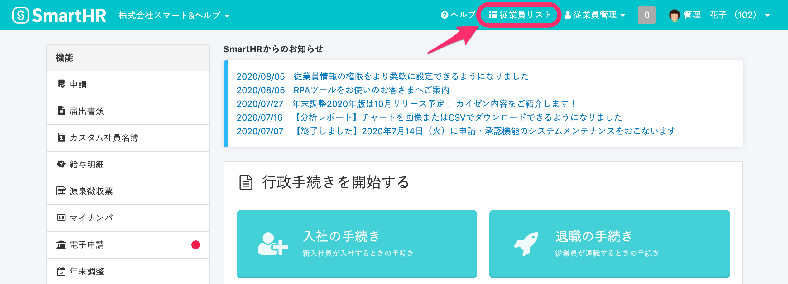
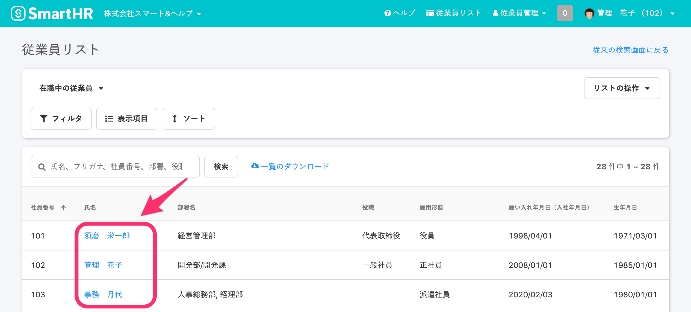
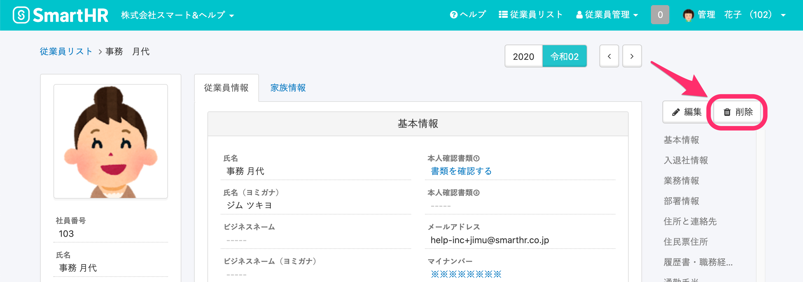
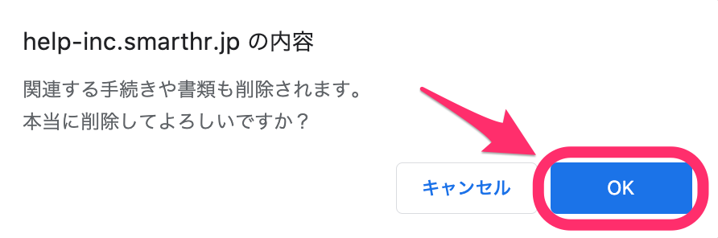
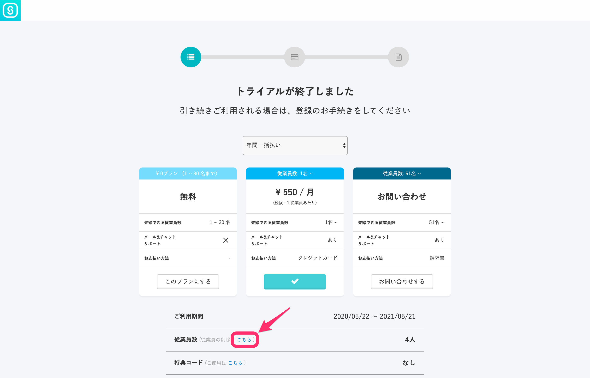
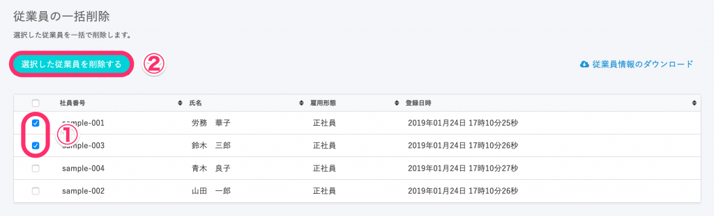

管理者は以下の手順で従業員情報を削除できます。

:::alert
1\. 従業員に紐付いた手続きや書類、給与明細、マイナンバーもすべて消えてしまいますので、ご注意ください。
2\. 一度削除してしまった従業員情報は復活させることができません。
誤って削除してしまった場合は再度従業員の追加を行う必要があります。
:::

# 従業員情報を削除する手順

## 1\. 管理者アカウントでログインし、画面上部の \[従業員リスト\] をクリック

画面上部にある **\[従業員リスト\]** をクリックすると、従業員リストの画面に移ります。

## 2\. 削除したい従業員をクリック

従業員リストから、従業員情報を削除したい従業員名をクリックすると、従業員情報の詳細画面に移ります。

## 3\. 従業員情報右側にある \[削除\] をクリック

従業員情報画面の右側にある **\[削除\]** をクリックすると、確認画面が表示されます。

:::tips
**\[削除\]** ボタンが表示されない場合は、下記ページをご確認ください。
[従業員情報画面で「削除」が表示されないのはなぜ？](https://knowledge.smarthr.jp/hc/ja/articles/360026103534)
:::

## 4\. 確認画面で \[OK\] をクリック

確認画面に表示された **\[OK\]** をクリックすると、従業員情報が削除されます。

※ ご利用のブラウザによって、ダイアログの表示に違いがある場合がございます

# トライアル終了時の削除手順

トライアル期間が終了している状態では、従業員情報の削除方法が異なります。

## 1\. トライアル終了後のプラン選択画面から、従業員情報削除画面へ遷移する

プラン選択画面下部の **\[従業員数\]** 欄にある **\[こちら\]** というリンクをクリックし、従業員の一括削除画面へ遷移します。

## 2\. 従業員の一括削除画面で削除する従業員を選択し、削除をする

削除したい従業員にチェックを入れ、**\[選択した従業員を削除する\]** をクリックします。

