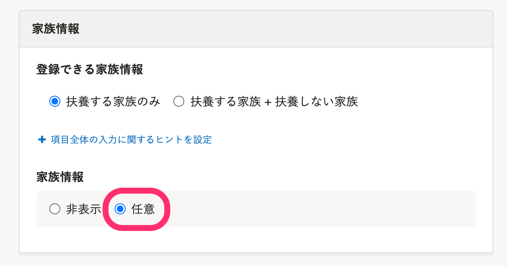
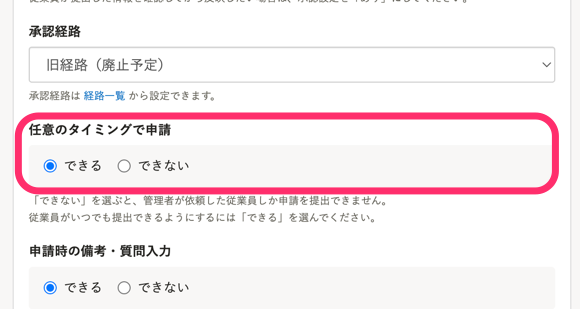

SmartHRで従業員から家族情報を収集する方法には、下記の4つがあります。

| 方法 | 説明・用途 |
| --- | --- |
| 招待と同時に収集する | SmartHRに従業員を招待する際に、招待フォームで家族情報を収集します。 |
| 扶養追加の手続きで収集する |   「扶養追加の手続き」を作成して、扶養する家族の情報を収集します。  行政に提出する書類の作成・電子申請も行なえます。   |
| 申請で収集する |   申請フォームで集める情報を設定して、家族情報を収集します。  SmartHRの手続き機能以外で書類を作成している場合や、扶養しない家族の情報だけを集めたい場合に利用します。   |
| SmartHR以外で情報を収集し、家族情報を直接編集する |   家族情報の更新権限があれば、従業員情報から家族情報を追加・編集・削除できます。  個別／一括いずれでも編集できます。   |

# 招待と同時に収集する

 **［家族情報］** が **［任意］** に設定されている招待フォームで、従業員をSmartHRに招待してください。

招待フォームの設定については、[従業員招待フォームを追加する](https://knowledge.smarthr.jp/hc/ja/articles/360026265233)を参照してください。

 **［登録できる家族情報］** で、扶養する家族情報のみ収集するか、扶養しない家族情報も収集するかを選択できます。

:::related
[招待の際に、扶養しない家族の情報も収集する](https://knowledge.smarthr.jp/hc/ja/articles/360033901014)
:::

:::tips
 **［SmartHR 標準招待フォーム］** は、 **［家族情報］** が「任意」に設定されているので、扶養する家族の情報を収集できます。
[［SmartHR 入社手続き不要従業員向けフォーム］と［SmartHR 標準招待フォーム］について](https://knowledge.smarthr.jp/hc/ja/articles/900004732746)
:::

# 扶養追加の手続きで収集する

招待済みの従業員で、SmartHR上で行政手続き用の書類の作成や電子申請を行ないたい場合は、扶養追加の手続きで家族情報を収集します。

また、手続きの「作成」権限を付与すれば、従業員から扶養追加の手続きを作成できます。

:::related
[扶養追加の手続きをする](https://knowledge.smarthr.jp/hc/ja/articles/360026262033)
[手続きや機能の閲覧・作成・更新・削除の権限を設定する](https://knowledge.smarthr.jp/hc/ja/articles/360041268873)
:::
:::alert
申請機能や従業員情報から家族情報を編集する方法では、行政手続きに必要な書類を作成できません。
書類の作成や電子申請を行なう場合は、扶養追加の手続きを利用してください。
:::

# 申請で収集する

家族情報を収集する申請フォームを作成して、情報を収集します。

扶養しない家族の情報だけ収集する、扶養状況は収集しないなど、収集する情報を制御できます。

申請フォームの設定については、[家族情報を収集する申請フォームの設定例](https://knowledge.smarthr.jp/hc/ja/articles/5108831208985)を参照してください。

また、申請フォームの設定で **［任意のタイミングで申請］** を **［できる］** とすると、従業員から申請を提出できます。

:::related
[Q. 家族情報を申請で集める際の注意点は？](https://knowledge.smarthr.jp/hc/ja/articles/5141240383001)
:::

# 従業員情報から家族情報を編集する

主に管理者が、従業員情報を編集して家族情報を追加・編集・削除する方法です。

家族情報の「更新」権限を付与すれば、従業員が自分の情報を編集できるようになります。

- CSVファイルを使って一括登録・更新する場合は、[複数の家族情報を一括で登録する](https://knowledge.smarthr.jp/hc/ja/articles/360040562554)を参照してください。
- 個別に編集する場合は、[家族情報を追加・編集・削除する](https://knowledge.smarthr.jp/hc/ja/articles/360035423833)を参照してください。

:::related
[従業員自身による情報の閲覧・更新を制限する](https://knowledge.smarthr.jp/hc/ja/articles/360035656314)
:::
:::alert
現在、従業員が家族情報を編集した際に、管理者が通知を受け取る設定はありません。
:::
