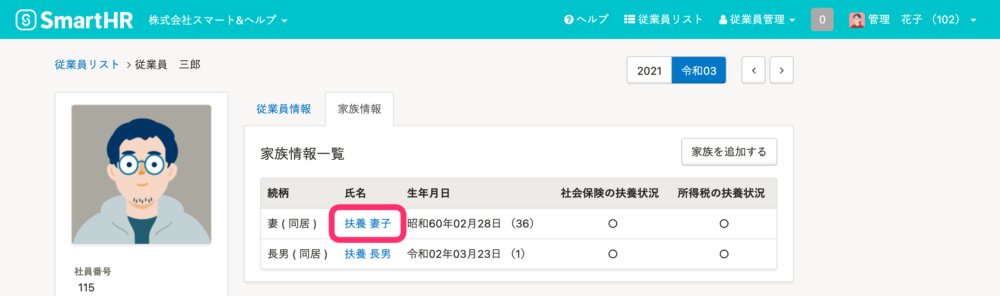

家族情報の更新権限を付与されたアカウントは、従業員情報画面で家族情報を追加・編集・削除できます。

従業員が家族情報の追加・削除をする場合は、トップページの **［扶養追加の手続き］［扶養削除の手続き］** から手続きをしてください。手順は、下記のページを参照してください。

- [従業員から扶養追加の手続きを申請する](https://knowledge.smarthr.jp/hc/ja/articles/360026262113)
- [従業員から扶養削除の手続きを申請する](https://knowledge.smarthr.jp/hc/ja/articles/360026262013)

# 手続きに関する注意点

## 家族情報を追加・削除しても扶養追加・削除の手続きは作成されません

このページで説明する手順で家族情報を追加・削除しても、扶養の追加・削除の手続きは作成されません。

扶養の追加・削除の手続きが必要な場合は、トップページの **［扶養追加の手続き］［扶養削除の手続き］** から手続きをしてください。手順は、下記のページを参照してください。

- [扶養追加の手続きをする](https://knowledge.smarthr.jp/hc/ja/articles/360026262033)
- [扶養削除の手続きをする](https://knowledge.smarthr.jp/hc/ja/articles/360026103454)

## 扶養追加・削除の手続きを作成したあとに家族情報を削除しても、書類には反映できません

手続きを作成したあとに家族情報の削除や、扶養家族情報の削除（扶養しないに変更）をしても、書類に変更内容を反映できません。

手続きを作成し直してください。

書類に反映できるのは、氏名や生年月日などの基本情報の変更のみです。

# 家族情報を追加する

## 1\. 従業員情報画面にある［家族情報］のタブをクリック

 **［従業員情報］** タブの横にある **［家族情報］** をクリックすると、家族情報の一覧画面が表示されます。

## 2.［家族を追加する］をクリック

 **［家族を追加する］** をクリックすると、家族情報の入力画面が表示されます。

## 3\. 家族情報を入力して［登録する］をクリック

続柄や氏名など、追加したい家族の情報を入力し、最下部にある **［登録する］** をクリックすると、家族が追加されます。

:::tips
家族コードは、管理者のみ追加・編集できます。
外部システムと連携させる場合に、利用してください。

:::
:::tips
 **［社会保険の扶養状況］** と **［所得税の扶養状況］** を **［扶養する］** として家族情報を登録すると、扶養追加の手続きを作成できません。
 **［扶養する］** として登録した家族の扶養追加の手続きを作成するには、いったん **［扶養しない］** に変更して、 **［扶養追加の手続き］** の作成画面にて家族を選択してください。
詳しくは、下記のページを参照してください。
[登録済み被扶養者の「扶養追加の手続き」を作成したい場合は？](https://knowledge.smarthr.jp/hc/ja/articles/360048479373)
:::

# 家族情報を編集する

## 1\. 従業員情報画面にある［家族情報］のタブをクリック

 **［従業員情報］** タブの横にある **［家族情報］** をクリックすると、家族情報の一覧画面が表示されます。

## 2\. 家族の氏名をクリック

情報を編集したい家族の氏名をクリックすると、家族情報の詳細画面が表示されます。

## 3\. 画面右上の［編集］をクリック

家族情報の詳細画面右上にある **［編集］** をクリックすると、編集画面が表示されます。

## 4\. 家族情報を編集して［更新する］をクリック

必要な情報を編集し、最下部にある **［更新する］** をクリックすると、変更内容が保存されます。

# 家族情報を削除する

## 1\. 従業員情報画面にある［家族情報］のタブをクリック

 **［従業員情報］** タブの横にある **［家族情報］** をクリックすると、家族情報の一覧画面が表示されます。

## 2\. 家族の氏名をクリック

情報を削除したい家族の氏名をクリックすると、家族情報の詳細画面が表示されます。

## 3\. 画面右上の［削除］をクリック

家族情報の詳細画面右上にある **［削除］** をクリックすると、確認のダイアログが表示されます。

:::tips
社会保険の扶養、あるいは税法上の扶養の対象となっている家族は、家族情報の詳細画面では**削除できません**。

削除するには、トップページの **［扶養削除の手続き］** で削除するか、家族情報の扶養状況を **［扶養しない］** にしてから削除してください。
:::

## 4\. ダイアログに表示された［削除する］をクリック

間違いがないことを確認し、 **［削除する］** をクリックすると、家族情報が削除されます。

:::alert
削除した家族情報は、元に戻せません。
:::

# 家族情報を一括で登録・更新する

家族情報を一括で登録・更新する場合は、下記のページを参照してください。

[複数の従業員情報・家族情報を一括で更新する](https://knowledge.smarthr.jp/hc/ja/articles/360026265333)

:::tips
家族情報は、一括削除できません。
一件ずつ削除してください。
:::
