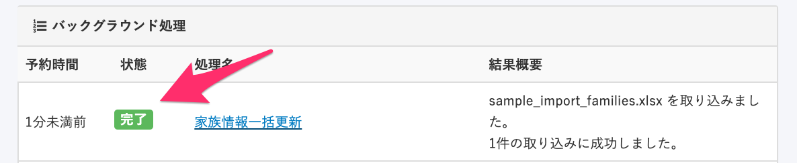

複数の家族情報を登録するには、家族情報の更新に使うファイルに「家族1 \[項目名\] 」「家族2 \[項目名\] 」「家族3 \[項目名\] 」とヘッダを追加して、登録したい情報を入力してアップロードします。

# 1\. \[従業員管理\] > \[更新する（ファイル）\] をクリック

ヘッダメニューから **\[従業員管理\] > \[更新する（ファイル）\]** をクリックすると、一括更新画面に移動します。

:::tips
\[**更新する**（ファイル）\] と表記されていますが、新規で家族情報を一括登録する場合もこの画面から行います。
:::

# 2\. 更新したい対象を \[家族\] に設定して、ファイルを選択

更新したい対象をドロップダウンリストで **\[家族\]** に設定し、家族情報の登録に使うファイルを選択します。

:::tips
更新したい対象で **\[家族\]** を選択すると、家族情報ファイルの雛形をダウンロードできます。

## 家族情報の列を追加して情報を入力
「家族2 姓」「家族3 姓」などのヘッダを追加して、登録したい情報を入力してください。

必須項目は以下のページをご覧ください。
[【一覧】家族情報CSV凡例](https://knowledge.smarthr.jp/hc/ja/articles/4406454806937/)
:::

# 3\. \[一括更新する\] をクリック

 **\[一括更新する\]** ボタンをクリックして家族情報ファイルをアップロードします。

# 4\. 結果を確認する

 **\[一括更新する\]** をクリックした後に表示される画面の **\[バックグラウンド処理一覧\]** をクリックするか、画面右上の **\[アカウント名\]** > **\[共通設定\]** > **\[バックグラウンド処理一覧\]** から確認できます。

**\[状態\]** 欄が緑色の **\[完了\]** ステータスになっていれば、エラーなく一括登録が完了しています。

**\[状態\]** 欄がオレンジの **\[完了（エラーあり）\]** や、赤の **\[失敗\]** になっている場合は、何らかのエラーが発生しています。

処理名の欄をクリックすると、エラーの詳細が確認できますので、エラーの原因を解消してください。

よくあるエラーの対応方法は以下のページをご覧ください。

[エラーが出たり、処理に失敗した場合は？](https://knowledge.smarthr.jp/hc/ja/articles/360033711133)
