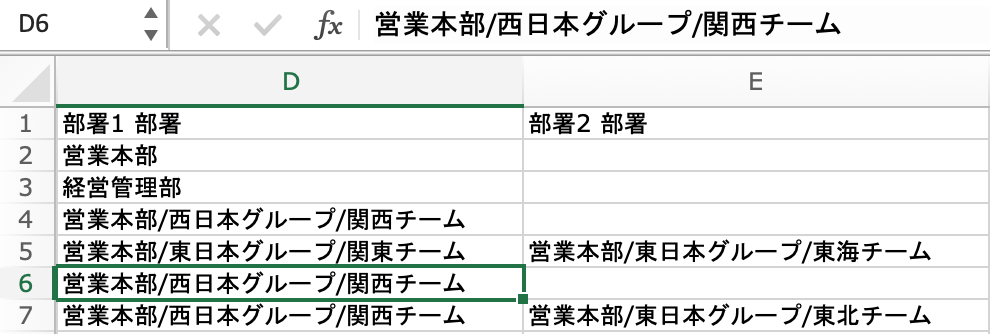

:::tips
部署情報の登録には、部署項目の更新権限が必要です。
従業員関連の権限設定について、詳しくは下記のページをご覧ください。
[従業員関連の閲覧・作成・更新・削除の権限を設定する](https://knowledge.smarthr.jp/hc/ja/articles/1500001368101)
:::

# 従業員情報に部署情報を追加する

## 1\. ［従業員リスト］で対象となる従業員をクリック

従業員リストで部署情報を追加したい従業員の  **［氏名］**  をクリックして、従業員情報ページを表示します。

 **［編集］**  をクリックして、従業員情報の編集画面を開きます。

## 2\. ［部署情報］>［部署］>［ + 部署を追加する］をクリック

 **［部署情報］>［部署］>［+ 部署を追加する］**  をクリックします。

部署は3つまで登録できます。

## 3\. 部署を選択して［更新する］をクリック

プルダウンリストから任意の部署を選択し、従業員情報編集画面の右カラム下の  **［更新する］**  をクリックすると、登録内容が保存されます。

プルダウンリストに部署名を表示させるには、あらかじめ部署のマスターデータへの登録を済ませておく必要があります。

:::related
[［部署］のマスターデータを管理する](https://knowledge.smarthr.jp/hc/ja/articles/360036111074)
:::

## 4\. 登録した部署の表示を確認する

従業員情報ページに登録した部署が表示されたことを確認します。

# 部署情報を一括登録・更新する場合

部署情報をCSVまたはExcelファイルを使って、一括登録および一括更新する場合には、以下の注意点があります。

## 階層部署を一括登録するときは「 **/** 」で区切って入力

従業員情報登録・更新のためのインポート用ファイルを作成する際は、1つの部署ごとに1つのセルを使用します。

複数階層の部署を登録する際は、同一セル内で部署名を階層ごとに「 **/** 」（半角スラッシュ）で区切って入力してください。

部署を兼任している場合は、  **［部署2 部署］** 、  **［部署3 部署］**  へ入力してください。

:::related
[複数の従業員情報を一括で登録する](https://knowledge.smarthr.jp/hc/ja/articles/360026107234)
[複数の従業員情報・家族情報を一括で更新する](https://knowledge.smarthr.jp/hc/ja/articles/360026265333)
:::
