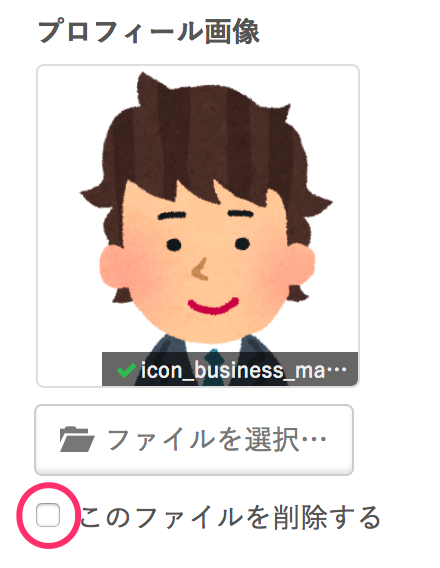

プロフィール画像や確認書類画像など、一度登録した画像を削除する手順をご案内します。

# 画像の削除手順

## 1\. 編集ページを開く

削除したい画像が登録されているページの**編集ページ**を開きます。

## 2\. 削除したい画像が登録されている項目を表示する

削除したい画像が登録されている項目を表示します。

## 3\. \[このファイルを削除する\] にチェックを入れる

画像の下にある **\[このファイルを削除する\]** にチェックを入れます。

## 4\. \[更新する\] をクリックする

**\[更新する\]** をクリックすると、画像が削除されます。
