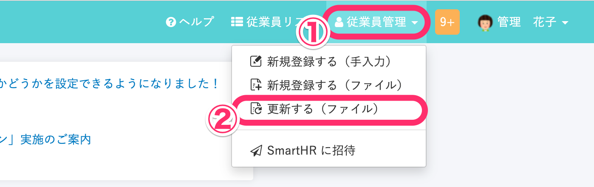

管理者が従業員情報をインポートしている最中に、従業員による従業員情報の更新を許可するには、 **\[全般設定\]** で **\[従業員一括登録・更新時の保護\]** の項目の設定を変更してください。

# 1\. 画面右上のアイコン > \[共通設定\] をクリック

**画面右上のアイコン > \[共通設定\]** をクリックします。

# 2\. \[共通設定\] > \[全般設定\] をクリック

画面左に表示される **\[共通設定\]** メニューにある、 **\[全般設定\]** をクリックしてください。

# 3\. \[従業員一括登録・更新時の保護\] の項目のチェックを外す

**\[従業員一括登録・更新時の保護\]** 項目にある、 「従業員の一括登録・更新時、完了まで管理者以外の変更を制限する」のチェックボックスを外します。

:::tips
初期設定では、「従業員の一括登録・更新時、完了まで管理者以外の変更を制限する」にチェックが入っています。
従業員による変更が制限された状態で、インポート中に従業員が従業員情報の編集を行おうとすると、以下のメッセージが表示されます。

:::

# 4\. \[更新する\] をクリック

チェックを外したら、下にある **\[更新する\]** を押して変更を保存してください。 

# 従業員情報一括更新画面での表示

従業員による従業員情報の更新を許可したか否かで、従業員情報一括更新画面に表示される案内文が異なります。

従業員情報一括更新の画面を確認するには、**\[従業員管理\] > \[更新する（ファイル）\]** をクリックしてください。

なお、従業員情報の一括アップロードを行う方法については以下の記事をご覧ください。

[複数の従業員情報・家族情報を一括で更新する](https://knowledge.smarthr.jp/hc/ja/articles/360026265333)
