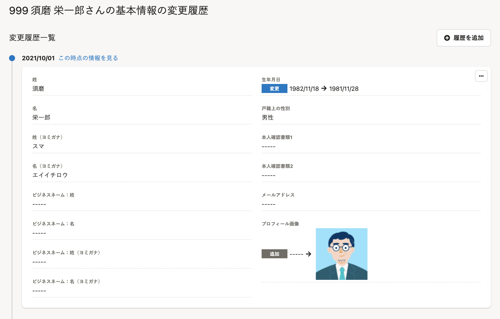

管理者や従業員本人により更新された従業員情報の変更履歴を閲覧・削除できる機能です。
スタンダードプラン以上をご利用の場合、適用日を指定した登録も可能です。

# この機能をご利用いただけるプラン

変更履歴の閲覧および削除はすべてのプランでご利用いただけます。

適用日を指定した登録は、**スタンダードプラン**以上のご契約でご利用いただけます。
プラン変更に関しては[スタンダードプランについてのお問合せ｜SmartHR](https://smarthr.jp/standardplan_contact)よりお問い合わせください。

## 各プランでの利用可能範囲

|   | ¥0プラン | スモールプラン | スタンダードプラン | プロフェッショナルプラン |
| --- | :-: | :-: | :-: | :-: |
| 履歴の閲覧 | ○ | ○ | ○ | ○ |
| 履歴の編集 ※1 | ○ | ○ | ○ | ○ |
| 履歴の削除 | ○ | ○ | ○ | ○ |
|   適用日を指定した 従業員情報の登録    | × | × | ○ | ○ |

※1 2020年10月15日現在、部署情報のみ直接編集ができません。部署情報の履歴の直接編集も対応を予定しておりますが、時期は未定です。

# 今後対応予定の機能

- 被扶養者情報の変更履歴
- マイナンバーの変更履歴
- 履歴変更理由の登録
- 変更履歴の一括削除
