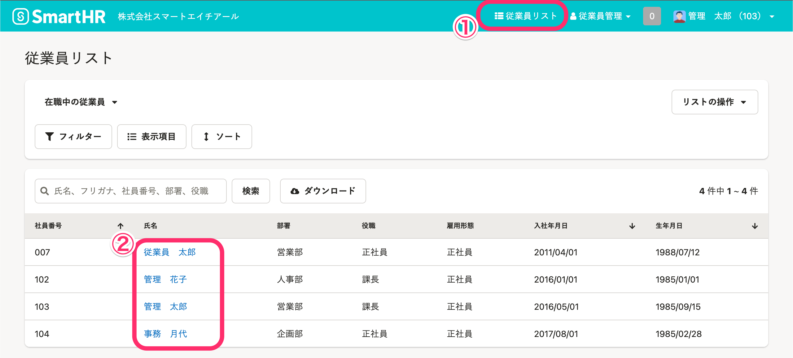
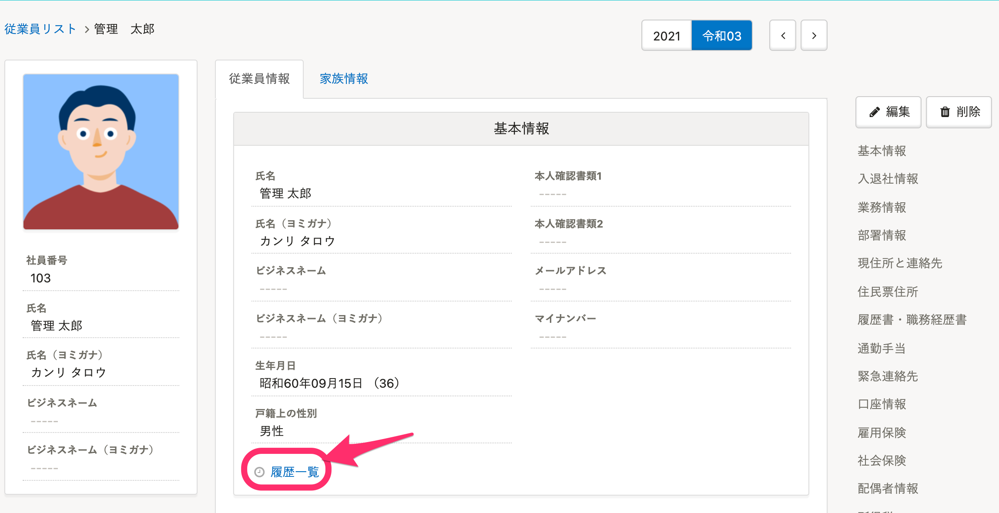
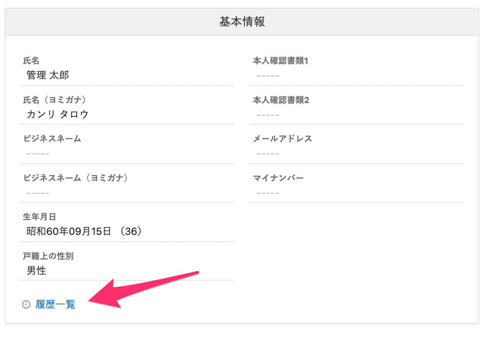
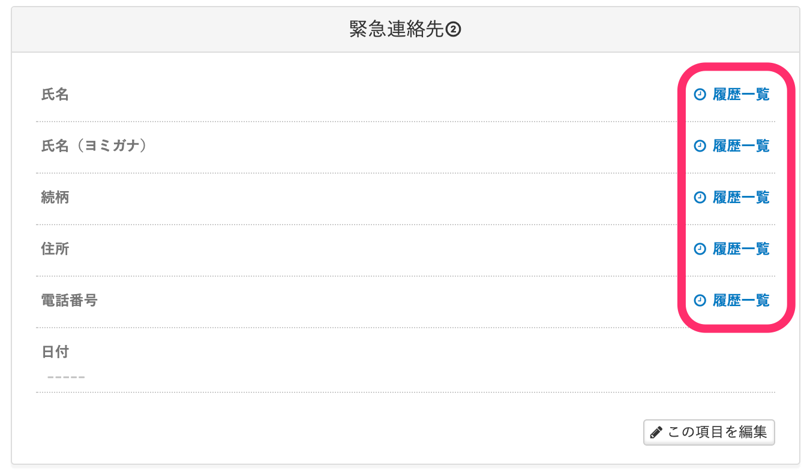
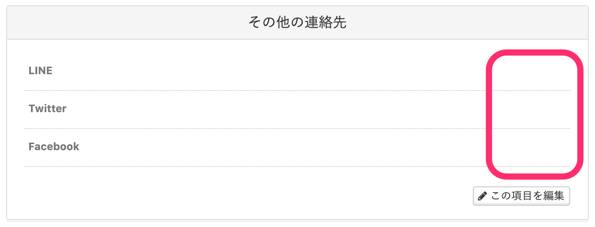
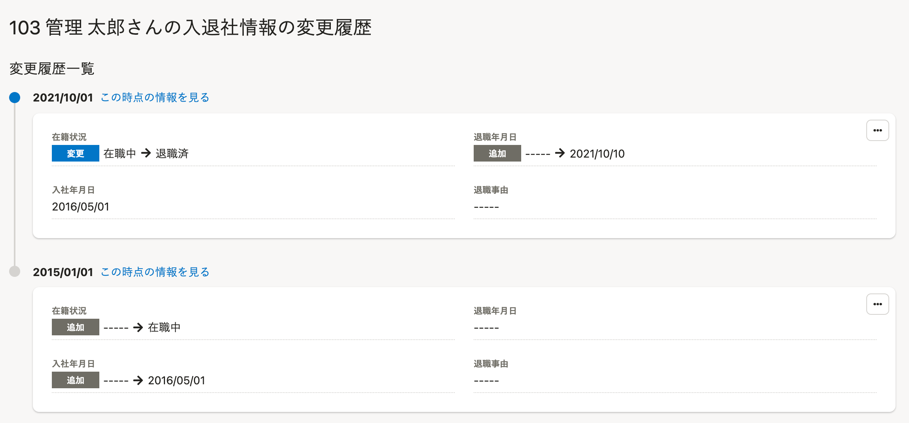

従業員情報が更新されると、自動的に履歴が残ります。ここでは、従業員情報の履歴の閲覧方法を説明します。

従業員情報の閲覧できる権限については下記のページをご覧ください。

[履歴管理機能の権限を変更する](https://knowledge.smarthr.jp/hc/ja/articles/360026262273)

# 1\. ［従業員リスト］> 履歴を閲覧する従業員の名前をクリック

画面右上にある  **［従業員リスト］**  をクリックすると、従業員が一覧表示されます。

リストから履歴を閲覧する従業員の名前をクリックして、従業員情報の詳細画面を表示します。

# 2\. 確認したい項目にある［履歴一覧］をクリック

従業員情報の詳細画面で、確認したい項目の  **［履歴一覧］**  をクリックします。

:::tips
 **［履歴一覧］リンクの表示条件** 
システム標準の従業員項目は、従業員項目グループごとにリンクが表示されます。

ただし、その項目グループの中に1つでも閲覧権限のない項目が含まれている場合、履歴一覧のリンクは表示されません。
従業員項目の権限設定について、詳しくは下記のページをご覧ください。
[従業員関連の閲覧・作成・更新・削除の権限を設定する](https://knowledge.smarthr.jp/hc/ja/articles/1500001368101)
カスタム項目は、従業員項目の詳細項目ごとにリンクが表示されます。

まだ一度も情報が登録されていないカスタム項目には、履歴一覧へのリンクは表示されません。

:::

# 3\. 変更履歴を閲覧する

該当項目の変更履歴一覧がタイムライン形式で表示されます。

:::tips
### 日付を指定して履歴を閲覧する
日付を指定して、過去の従業員リストや従業員情報を確認できます。
[過去の日付を指定して従業員リストを表示する](https://knowledge.smarthr.jp/hc/ja/articles/5950434616089)
:::

# 「適用日」と「登録日」の違い

## 「適用日」とは？

従業員情報を登録する際に指定できるデータの有効開始日です。
指定しなかった場合は登録日と同日になります。

## 「登録日」とは？

従業員情報を登録した日です。

例：4月1日に3月1日時点の情報を登録した場合、4月1日が登録日、3月1日が適用日になります。
