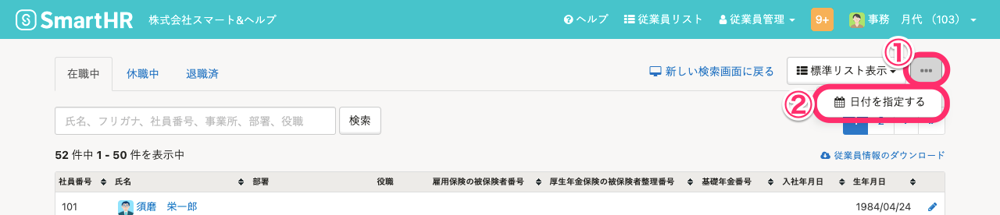
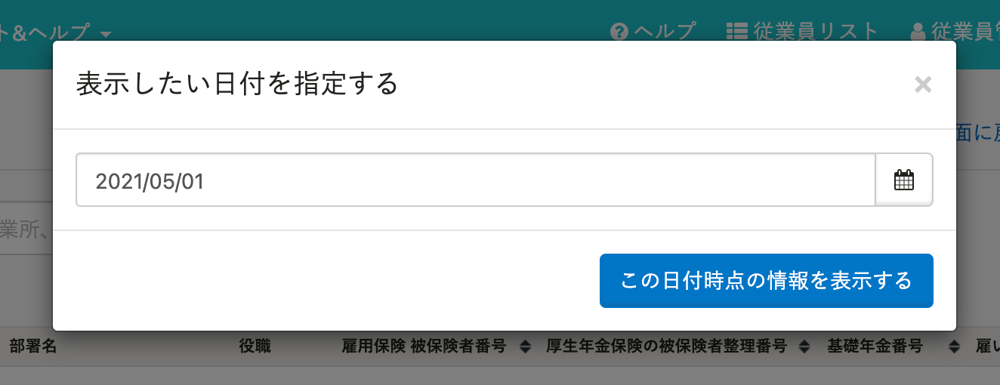
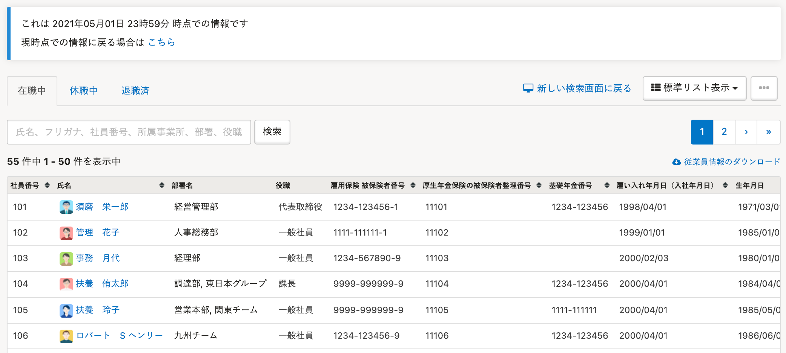
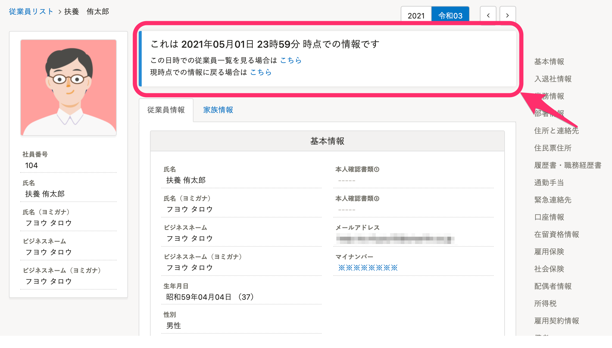
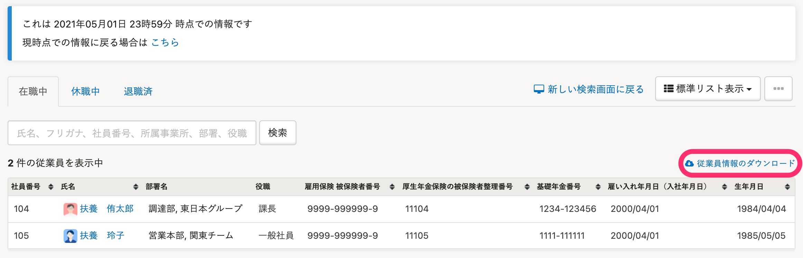

過去の日付を指定して、その日付時点の従業員の一覧や、従業員情報を確認する方法を説明します。

ある日付時点の従業員数を確認したり、従業員リストをダウンロードしたりできます。

:::alert
この機能は2022年6月末の提供終了を予定しており、2022年4月26日より従業員リストで過去の日付を指定して従業員情報を表示できるようになりました。
詳しい操作は、[過去の日付を指定して従業員リストを表示する](https://knowledge.smarthr.jp/hc/ja/articles/5950434616089)を参照してください。
提供終了予定日については、下記を参照してください。
[従業員リストに過去の日付を指定して閲覧できる機能を追加し、従来の従業員リストを提供終了します](https://smarthr.jp/update/35050)
:::

# 1\. ［従業員リスト］>［従来の検索画面に戻る］>［...］メニュー>［日付を指定する］をクリック

従業員リスト画面右上にある **［従来の検索画面に戻る］** をクリックすると、旧従業員リストの検索画面が表示されます。

表示が切り替わったら、 **［…］メニュー>［日付を指定する］** をクリックします。

# 2. ［この日付時点の情報を表示する］をクリック

 **［日付を指定する］** をクリックすると、日付指定のダイアログが表示されます。

閲覧したい時点の日付を指定して、 **［この日付時点の情報を表示する］** をクリックしてください。

指定した日付時点の従業員リストが表示されます。

# 3\. 履歴を閲覧したい従業員の名前をクリック

閲覧したい従業員をクリックします。

手順2で指定した日付時点での従業員情報の詳細を閲覧できます。

※指定した日に複数回の従業員情報の変更があった場合、**一番遅い時間に更新した情報** が表示されます。

:::tips
従業員リストから日付を指定した状態で **［従業員情報のダウンロード］** をクリックすると、指定した日付時点での従業員情報をCSVファイルまたはExcelファイルでダウンロードできます。 
:::
