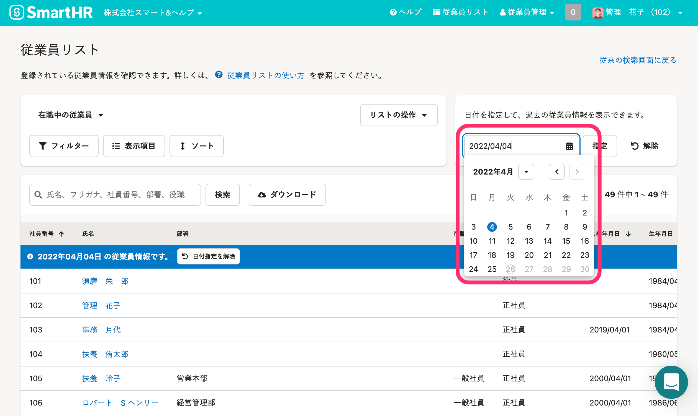
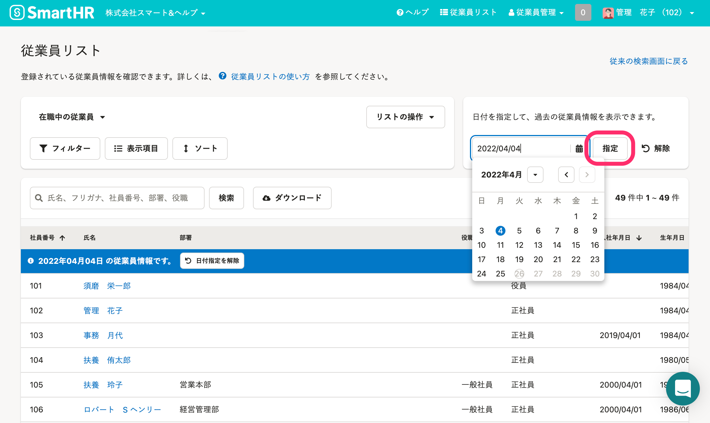
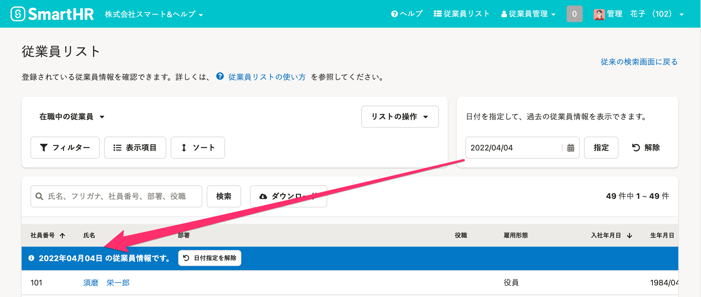
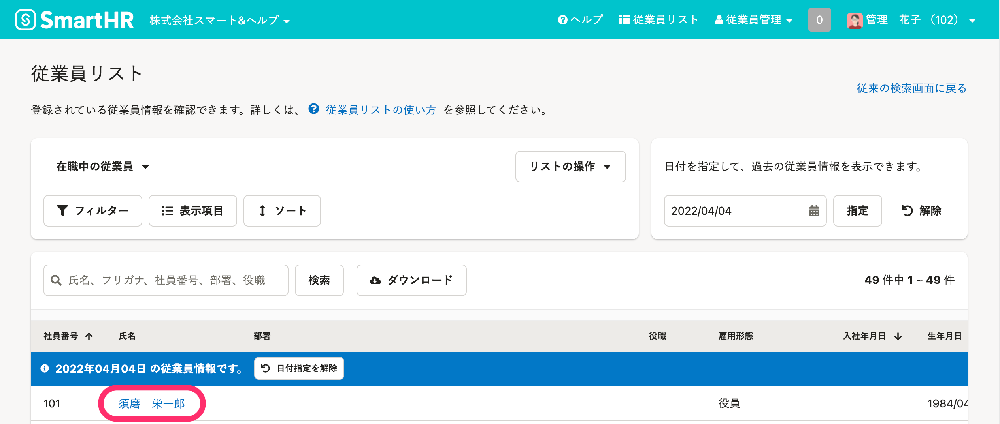
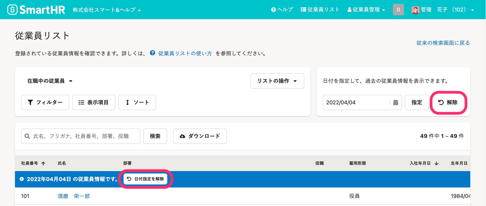

過去の日付を指定して、その日付時点の従業員の一覧や、従業員情報を確認する方法を説明します。

ある日付時点の従業員数を確認したり、従業員リストをダウンロードしたりできます。

:::tips
詳しくは、[従業員リストの使い方](https://knowledge.smarthr.jp/hc/ja/articles/360043824473)を参照してください。
:::

# 1\. 従業員リストで過去の日付を指定する

日付を入力、または、入力欄をクリックして表示されるカレンダーで日付を選択します。

日付の入力欄の右隣にある **［指定］** をクリックします。

指定した日付時点の従業員リストが表示されます。

# 2\. 履歴を閲覧したい従業員の名前をクリック

手順1で指定した日付時点での従業員情報の詳細を閲覧できます。

指定した日に複数回の従業員情報の変更があった場合、**一番遅い時間に更新した情報**が表示されます。

# 3\. 指定した日付を解除する

 **［日付指定を解除］** 、または画面の右上にある **［解除］** をクリックします。

現時点の従業員リストが表示されます。
