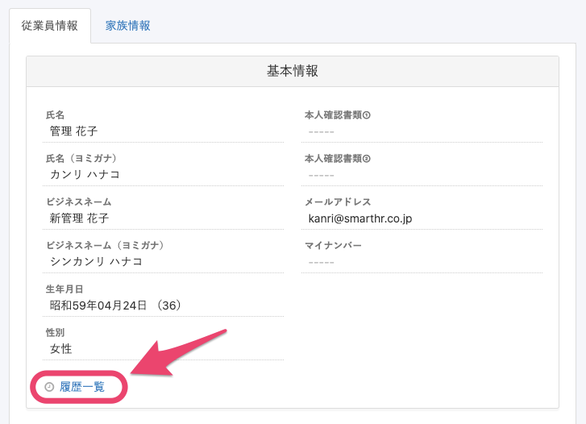
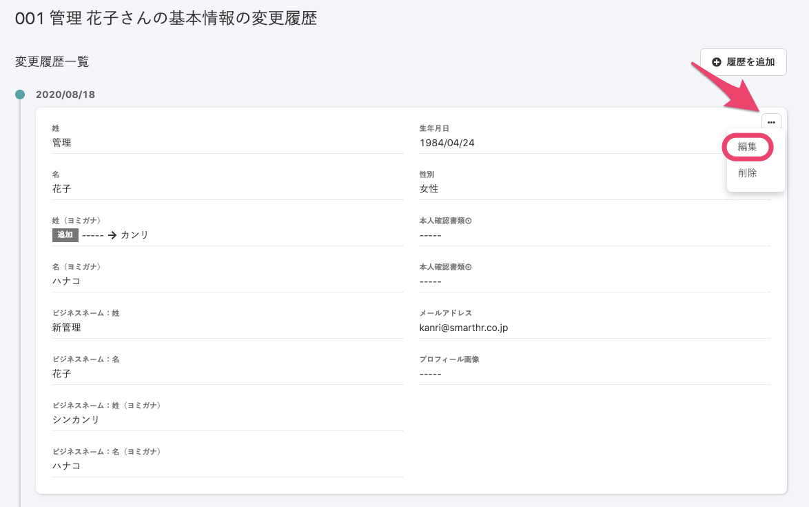
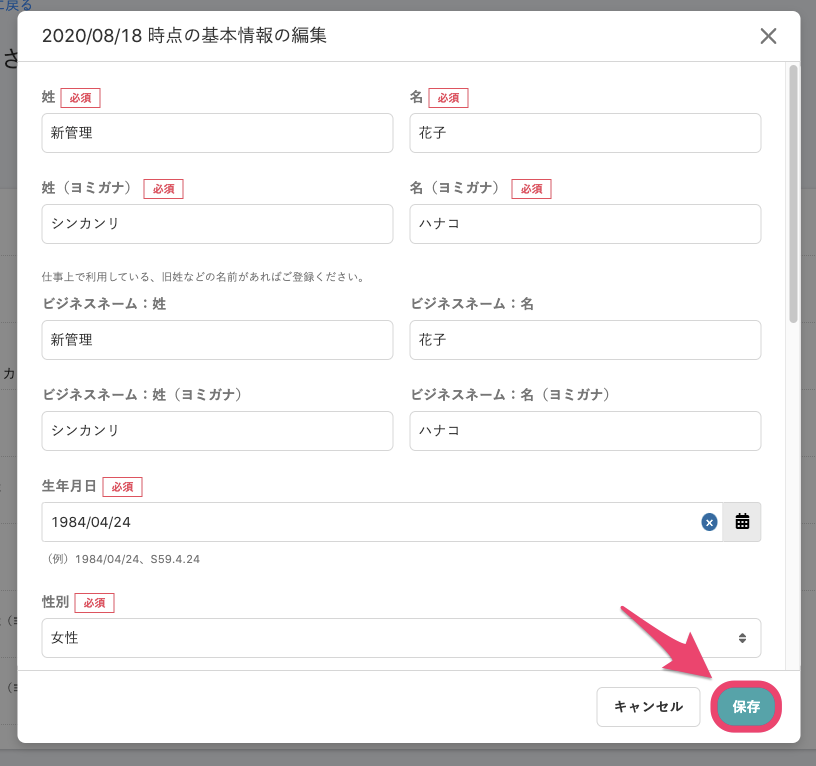

従業員情報の履歴は、変更できます。

ただし、2020年10月15日現在、部署情報のみ直接編集ができません。

部署情報の履歴の直接編集も対応を予定しておりますが、時期は未定です。

# 1\. 従業員情報詳細ページで \[履歴一覧\] をクリック

従業員情報詳細ページで **\[履歴一覧\]** をクリックすると、従業員項目グループ毎の履歴一覧画面が表示されます。

:::tips
**\[履歴一覧\]** のリンクが表示されるのは、操作するアカウントが、従業員項目グループ内のすべての項目の閲覧権限を持っている場合のみです。
従業員項目グループのうち、1つでも閲覧権限がない項目があると、**\[履歴一覧\]** のリンクは表示されません。
従業員項目の権限設定について、詳しくは下記のページをご覧ください。
[従業員関連の閲覧・作成・更新・削除の権限を設定する](https://knowledge.smarthr.jp/hc/ja/articles/1500001368101)
:::

# 2\. 編集したい履歴の右上にある \[編集\] をクリック

従業員情報グループの変更履歴一覧画面で、編集したい日付の履歴の右上の **\[…\] メニュー**にある **\[編集\]** をクリックすると、履歴編集画面が表示されます。

# 3\. 編集内容を入力し、 \[保存\] をクリック

履歴編集画面で内容を編集し、右下にある **\[保存\]** ボタンをクリックすると、変更が反映され、履歴一覧画面に戻ります。

