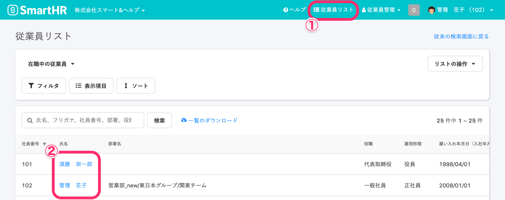

従業員情報の履歴を削除する方法を説明します。

履歴の削除は、権限で管理されています。履歴管理機能の権限については下記のページをご覧ください。

[履歴管理機能の権限を変更する](https://knowledge.smarthr.jp/hc/ja/articles/360026262273)

# 1\. \[従業員リスト\] > \[変更履歴を削除したい従業員の名前\]をクリック

トップ画面右上にある **\[従業員リスト\]** をクリックすると、従業員の名前が一覧表示されます。

変更履歴を削除したい従業員の名前をクリックしてください。

# 2\. \[履歴一覧\]をクリック

変更履歴を削除したい項目の **\[履歴一覧\]** をクリックしてください。

# 3\. 削除したい変更履歴の\[…\]メニュー > \[削除\]をクリック

削除したい変更履歴の **\[削除する\]** をクリックし、一覧から削除されていることを確認してください。

**\[適用日\]** が最も古い履歴は削除できません。

