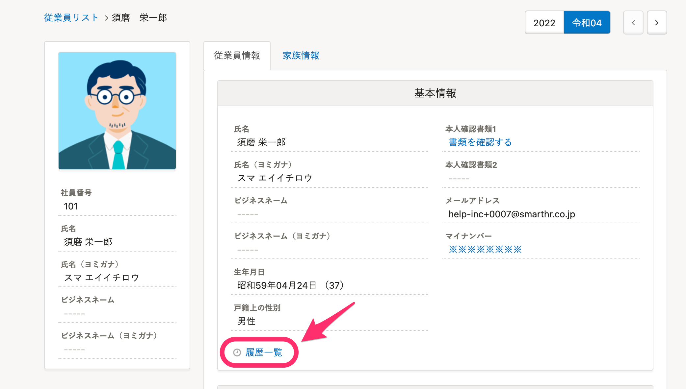
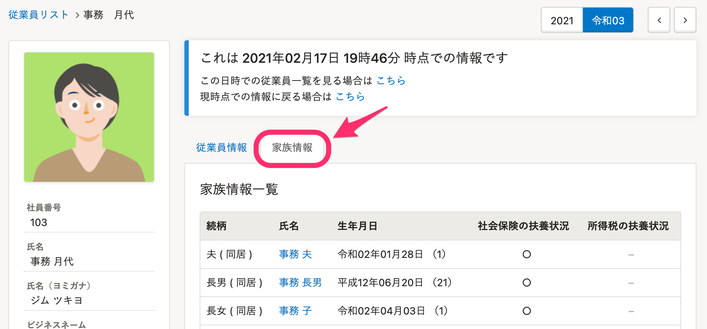

従業員情報の各項目グループ左下の **［履歴一覧］** から確認できる項目について説明します。

:::related
[履歴管理機能とは](https://knowledge.smarthr.jp/hc/ja/articles/360026103774)
:::

# 従業員情報の項目一覧

| **基本情報** | 姓 |
| --- | --- |
| 名 |
| 姓（ヨミガナ） |
| 名（ヨミガナ） |
| ビジネスネーム：姓 |
| ビジネスネーム：名 |
| ビジネスネーム：姓（ヨミガナ） |
| ビジネスネーム：名（ヨミガナ） |
| 生年月日 |
| 戸籍上の性別 |
| メールアドレス |
| プロフィール画像 |
| 本人確認書類 |
| **入退社情報** | 在籍状況 |
| 入社年月日 |
| 退職年月日 |
| 退職事由 |
| **業務情報** | 社員番号 |
| 事業所 |
| 役職 |
| 業務内容 |
| 雇用形態 |
| 給与支給形態 |
| **部署情報** | 部署 |
| **住所連絡先関連** | 現住所 |
| 現住所（ヨミガナ） |
| 現住所を確認できる書類 |
| 電話番号 |
| 世帯主 |
| 住民票住所の住所 |
| 住民票住所の住所（ヨミガナ） |
| 住民票住所の世帯主 |
| 緊急連絡先の住所 |
| 緊急連絡先の住所（ヨミガナ） |
| 緊急連絡先の氏名・続柄 |
| 緊急連絡先の氏名（ヨミガナ） |
| 緊急連絡先の電話番号 |
| **履歴書・職務経歴書** | 履歴書・職務経歴書 |
| **通勤手当** | 通勤経路 |
| 通勤手当1の定期券代 |
| 通勤手当1の期間 |
| 通勤手当1の片道運賃 |
| 通勤手当2の定期券代 |
| 通勤手当2の期間 |
| 通勤手当2の片道運賃 |
| **給与振込口座** | 銀行コード |
| 支店コード |
| 預金種別 |
| 口座番号 |
| 名義（カタカナ） |
| 口座情報を確認できる書類 |
| **在留資格** | 姓（ローマ字） |
| 名（ローマ字） |
| ミドルネーム（ローマ字） |
| 在留カード番号 |
| 在留カード画像 |
| 国籍 |
| 在留資格 |
| 在留資格不明理由 |
| 在留期日 |
| 資格外活動許可の有無 |
| 派遣・請負就労区分 |
| **雇用保険** | 雇用保険の被保険者番号 |
| 雇用保険の被保険者番号の画像 |
| 雇用保険の資格取得年月日 |
| 雇用保険の資格喪失年月日 |
| 雇用保険被保険者番号未記載理由 |
| 雇用保険に加入していた会社名 |
| 在籍開始日 |
| 在籍終了日 |
| **社会保険** | 厚生年金保険の被保険者整理番号 |
| 健康保険の被保険者整理番号 |
| 基礎年金番号 |
| 基礎年金番号を確認できる書類 |
| 基礎年金番号が入力されていない理由 |
| 社会保険の資格取得年月日 |
| 社会保険の資格喪失年月日 |
| 報酬月額（通貨） |
| 報酬月額（現物） |
| 報酬月額の変更年月日 |
| 標準報酬月額の改定年月 |
| 健康保険の標準報酬月額 |
| 厚生年金の標準報酬月額 |
| はじめて厚生年金に加入する |
| 最初に厚生年金へ加入した会社名 |
| 最初に厚生年金へ加入した会社：住所 |
| 最初に厚生年金へ加入した会社：在籍開始日 |
| 最初に厚生年金へ加入した会社：在籍終了日 |
| 最後に厚生年金へ加入した会社名 |
| 最後に厚生年金へ加入した会社：住所 |
| 最後に厚生年金へ加入した会社：在籍開始日 |
| 最後に厚生年金へ加入した会社：在籍終了日 |
| **配偶者情報** | 配偶者の有無 |
| 配偶者の年収 |
| **所得税** | 課税区分 |
| 障害者区分 |
| 障害者手帳の種類 |
| 障害者手帳の交付年月日 |
| 障害者手帳の画像 |
| 寡婦・ひとり親 |
| 寡婦・ひとり親の理由 |
| 寡婦・ひとり親の備考 |
| 勤労学生：学校名 |
| 勤労学生：学生証の画像 |
| 勤労学生：入学年月日 |
| 勤労学生：所得の見積額 |
| 勤労学生：所得の種類 |
| 雇用契約情報 | 契約種別 |
| 契約開始日 |
| 契約終了日 |
| 契約更新の有無 |
| **備考** | メモ（管理用） |
|  **「従業員情報項目」で追加した項目**  | 項目単位で履歴をご確認いただけます |

:::tips
家族情報は履歴管理機能を使用できません。
家族情報の過去の日付時点の情報は、以下のいずれかの方法で確認できます。
- 従業員情報の **［履歴一覧］** から、任意の **［この時点の情報を見る］** をクリックして表示される従業員情報ページで **［家族情報］** タブをクリックすると時点の情報が閲覧できます。
- 過去の日付を指定して従業員リストを表示し、対象の従業員情報ページで **［家族情報］** タブをクリックすると閲覧できます。詳しくは、[過去の日付を指定して従業員リストを表示する](https://knowledge.smarthr.jp/hc/ja/articles/5950434616089)を参照してください。

:::
