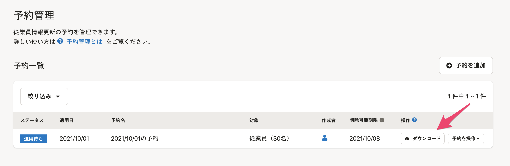

予約の内容は、予約一覧からファイルをダウンロードすると確認できます。

# 内容を確認したい予約の［ダウンロード］をクリック

予約管理画面で、内容を確認したい予約の行にある **［ダウンロード］** をクリックすると、ダウンロードの処理が開始されます。

バックグラウンド処理が完了したら、メールや通知欄でお知らせします。

ファイルをダウンロードして、予約の内容を確認してください。

:::tips
ダウンロードできるのは、閲覧できる範囲の情報だけが含まれる予約です。
予約の中に閲覧権限のない従業員情報が含まれる場合は、ダウンロードできません。
権限について詳しくは下記のページを参照してください。
[予約管理機能とは](https://knowledge.smarthr.jp/hc/ja/articles/4403483379097)
:::
