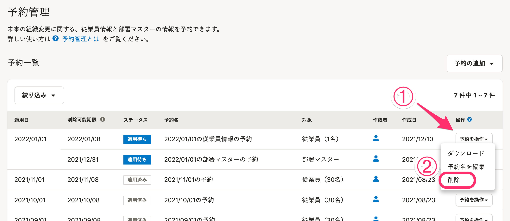

削除可能期限を迎える前の従業員情報や部署マスターの予約は、予約管理画面で削除できます。

# 1\. 削除したい予約の［予約を操作］メニューにある［削除］をクリック

 **［従業員管理］>［予約管理］** をクリックすると、予約一覧が表示されます。

予約一覧に表示されている、削除したい予約の **［予約を操作］** メニューにある **［削除］** をクリックすると、確認画面が表示されます。

:::tips
従業員情報の予約と部署マスターの予約は、削除可能期限の23:59:59まで削除できます。
また、それぞれ以下の場合は、削除可能期限内であっても削除できません。
・更新権限のない項目の情報が含まれている従業員情報の予約
・従業員の予約で参照されている部署マスターの予約
詳しくは下記のページをご覧ください。
[予約管理機能とは](https://knowledge.smarthr.jp/hc/ja/articles/4403483379097)
:::

# 2\. 注意事項を確認し、［削除］をクリック

確認画面に表示される注意事項を確認してください。

 **［削除］** をクリックすると、予約を削除するバックグラウンド処理が開始されます。

バックグラウンド処理が完了すると、予約一覧から予約が削除されます。

予約を削除すると、適用日を迎えても変更は適用されず、従業員情報や部署マスター、履歴に影響はありません。

適用日を迎え、従業員情報に反映された後に予約を削除した場合の動作については下記のページを参照してください。

:::related
[適用済みの予約を削除すると削除される情報](https://knowledge.smarthr.jp/hc/ja/articles/4402938690841)
:::
