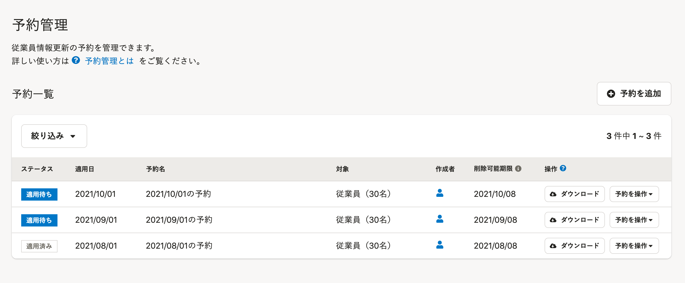
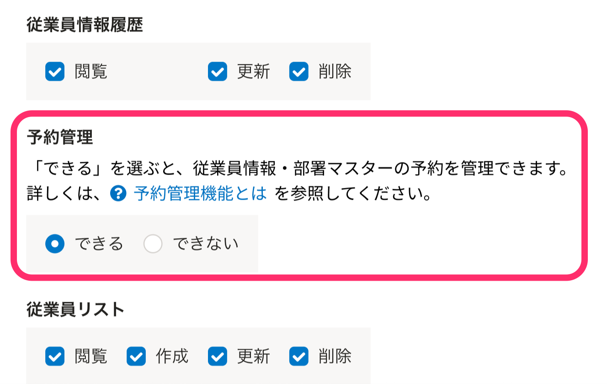

予約管理機能を使うと、異動に備えた未来の日付での従業員情報の更新予約や、部署マスターの追加・更新予約などができます。

予約管理画面は、 **［従業員管理］>［予約管理］** をクリックすると表示されます。

# 予約管理機能でできること

予約管理機能では、未来の日付での従業員情報の更新予約と、部署マスターの追加・更新予約、予約済みの情報の確認・削除ができます。

2021年12月16日現在は、 **［口座情報］以外** の従業員情報の更新予約に対応しています。

:::related
[予約を追加する](https://knowledge.smarthr.jp/hc/ja/articles/4403491370521)
[予約の内容を確認する](https://knowledge.smarthr.jp/hc/ja/articles/4403483367577)
[予約を削除する](https://knowledge.smarthr.jp/hc/ja/articles/4403491360025)
:::

## 今後の開発予定

以下の機能は、2021年12月16日時点で開発中の機能です。

リリース時期は未定ですが、開発を予定しています。

- 従業員情報の **［口座情報］** の更新予約

# 予約管理機能の権限設定

管理者権限以外のアカウントでも予約管理機能を使う場合は、権限の設定が必要です。

 **［権限設定］>［従業員関連］>［予約管理］** が **［できる］** になっていると、予約管理機能にアクセスして、従業員情報と部署マスターの予約を操作できます。

 **［操作できる範囲］** が **［本人］** になっていたり、 **［従業員情報］** の **［更新］** 権限がなかったりすると、 **［予約管理］** の項目は、 **［できない］** に固定されます。

 **［予約管理］** の項目で **［できる］** を選択できない場合は、 **［操作できる範囲］** と **［従業員情報］** の設定を確認してください。

## 従業員情報の予約

予約管理ができる権限であっても、予約の追加や内容確認をするためには、以下の条件をすべて満たしている必要があります。

| 従業員情報の予約の操作 | 操作に必要な権限の条件 |
| --- | --- |
| 予約の追加 |   - 情報更新の対象となる従業員が、操作中のアカウントの **［操作できる範囲］** に含まれる - 操作中のアカウントが、更新する項目の **［更新］** 権限を持っている   |
| 予約した内容の確認 |   - 予約の対象となっている従業員すべてが、操作中のアカウントの **［操作できる範囲］** に含まれる - 操作中のアカウントが、予約されている項目の **［閲覧］** 権限を持っている   |
| 予約の削除 |   - 予約の対象となっている従業員すべてが、操作中のアカウントの **［操作できる範囲］** に含まれる - 操作中のアカウントが、予約されている項目の **［更新］** 権限を持っている   |

たとえば、「更新対象の従業員は **［操作できる範囲］** に含まれているが、 **［閲覧］** 権限がない項目が含まれている予約」の場合、**その予約全体のダウンロードや削除はできません。**

## 部署マスターの予約

予約管理ができる権限であっても、部署マスターの予約の追加や内容確認をするためには、以下の条件を満たしている必要があります。

| 部署マスターの予約の操作 | 操作に必要な権限の条件 |
| --- | --- |
| 予約の追加 |   - 操作中のアカウントが、部署マスターの **［更新］** 権限を持っている   |
| 予約した内容の確認 |   - 操作中のアカウントが、部署マスターの **［閲覧］** 権限を持っている   |
| 予約の削除 |   - 操作中のアカウントが、部署マスターの **［削除］** 権限を持っている   |
