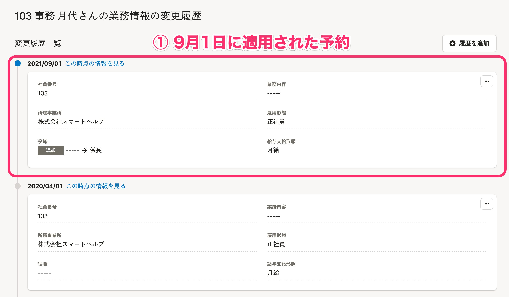

適用済みの従業員情報の予約を削除した場合、予約して適用した情報は履歴ごと削除されます。

ただし、「予約が適用されて履歴が追加された」「履歴が削除された」という監査ログは残ります。

予約適用後に従業員情報や履歴を編集してから予約を削除した場合の詳しい動作は、以下のようになります。

# 従業員情報の予約の削除

## 適用日前に予約を削除した場合

予約は削除され、適用日を迎えても変更は適用されません。

従業員情報や履歴にも影響はありません。

## 適用日後に、従業員情報や履歴を編集せず予約を削除した場合

予約して適用した情報が削除されます。

この際、履歴ごと削除されるため、「変更があった」という履歴も残りません。

## 適用日後に、従業員情報を編集してから予約を削除した場合

予約して適用した情報が履歴ごと削除されます。

ただし、**予約適用後に新たに編集した情報は削除されず**残ります。

たとえば以下の操作をした場合、従業員情報の役職は「部長」のままですが、「係長」であった情報や履歴は削除されます。

- 2021年8月1日に、9月1日を適用日として、役職を「なし」から「係長」にする変更を予約
- 2021年9月1日に、予約が適用され、役職が「係長」になる
- 2021年9月3日に、従業員情報を編集し、役職を「部長」に変更
- 2021年9月4日に、適用日が2021年9月1日の予約を削除

**結果：**最新の従業員情報の役職は「部長」。役職の履歴は「2021年9月3日に、なし→部長」が残る。

## 適用日後に、履歴を直接編集してから予約を削除した場合

**予約して適用した情報と、予約して適用した履歴を直接編集した情報、どちらも削除されます。**

たとえば以下の操作をした場合、「係長」や「課長」であった情報や履歴は削除されます。

- 2021年8月1日に、9月1日を適用日として、役職を「なし」から「係長」にする変更を予約
- 2021年9月1日に、予約が適用され、役職が「係長」になる ※①
- 2021年9月2日に、履歴の直接編集画面で、「なし→係長」となっている履歴を「なし→課長」に変更 ※②
- 2021年9月4日に、適用日が2021年9月1日の予約を削除 ※③

**結果：**最新の従業員情報の役職は「なし」。

# 部署マスターの予約の削除

部署マスターの予約は、適用日後は削除できません。

## 適用日前に予約を削除した場合

予約は削除され、適用日を迎えても従業員情報や部署マスター、履歴に影響はありません。

部署の階層を変更する場合など、インポートファイルに記入された部署だけでなく、その配下の部署にも変更が及ぶことがありますが、予約を削除した場合には、同様に配下の部署への変更も取り消されます。

1.  「営業部/関西営業チーム」という部署が登録されている
2.  2021/08/01に、2021/09/01を適用日として、「営業部」を「事業管理本部」の配下に変更する
    →この際、「営業部」から「事業管理本部/営業部」への変更に伴い、「営業部/関西営業チーム」も「事業管理本部/営業部/関西営業チーム」に変更される
3.  2021/08/02に、2021/09/01の部署マスターの予約を削除する
    →この際、「事業管理本部/営業部/関西営業チーム」となる予定だった変更も、あわせて取り消される

:::tips
部署マスターの履歴の閲覧は、現在未対応です。
対応時期は未定ですが、今後開発予定となっております。
:::
