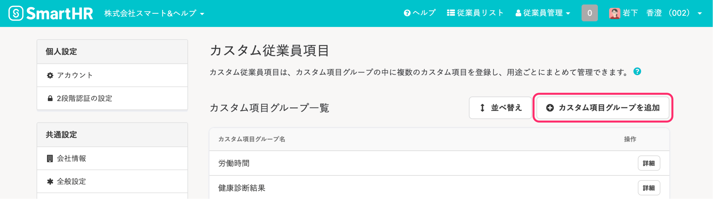
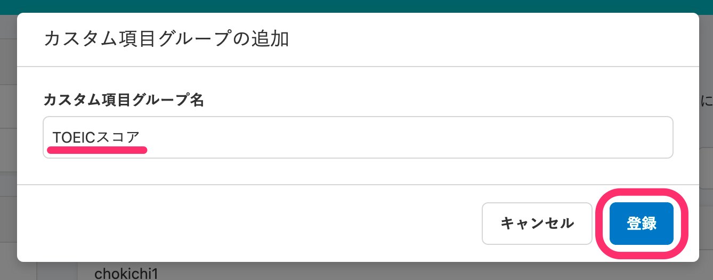
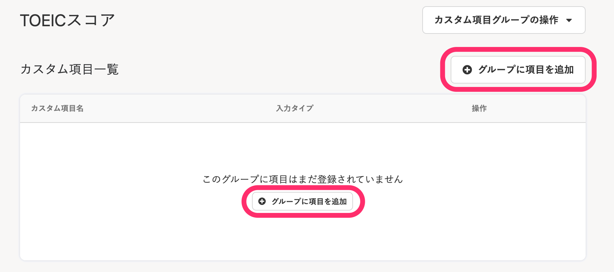
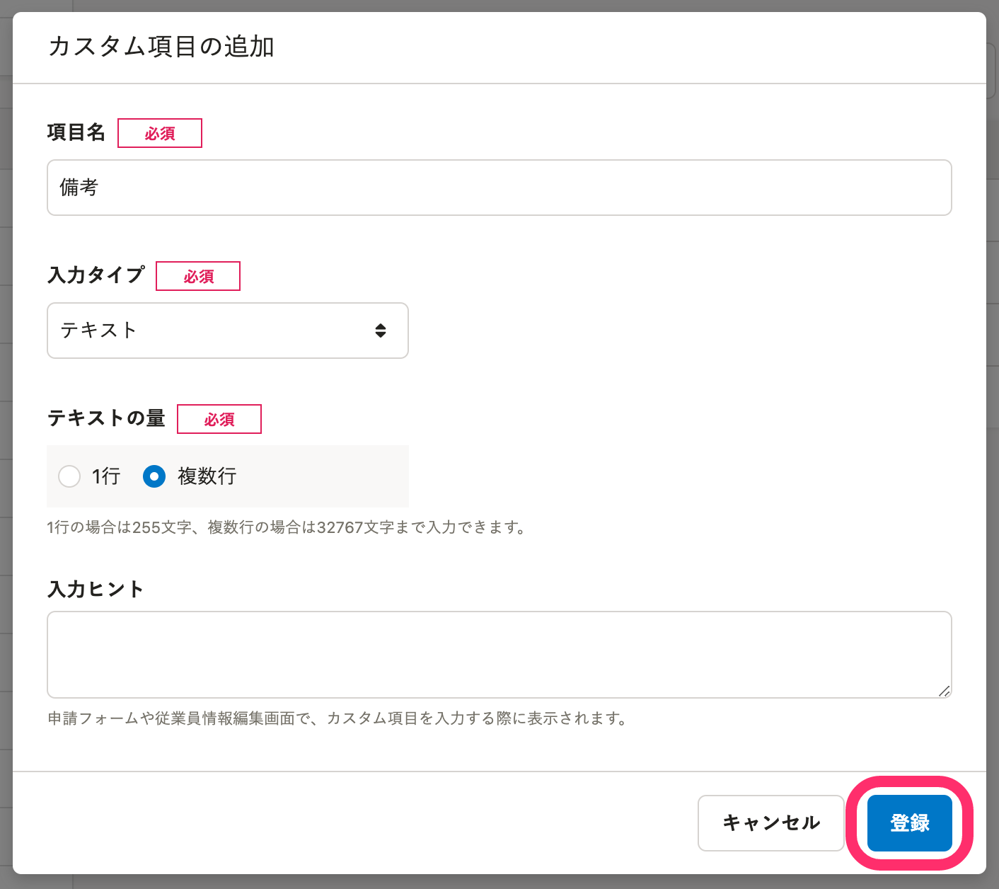
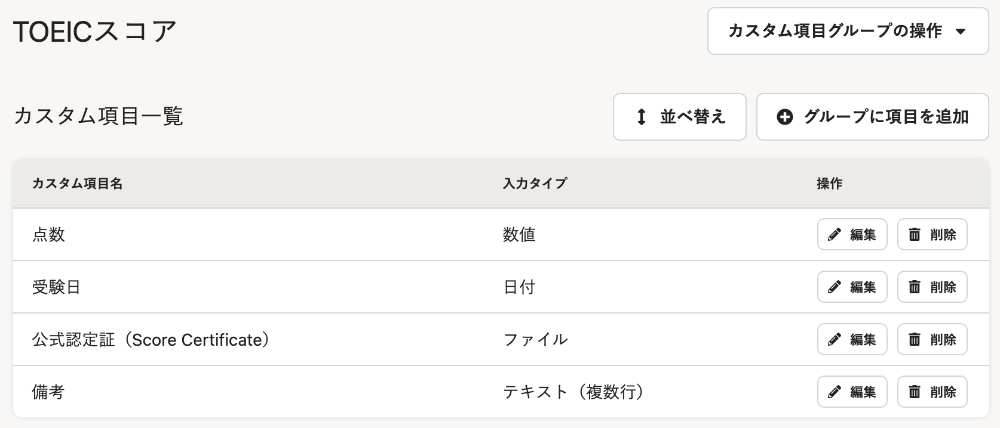
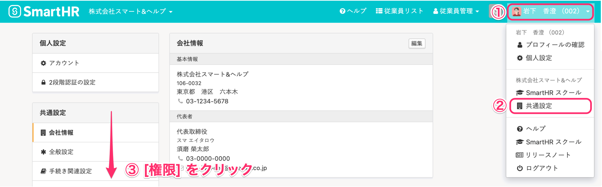
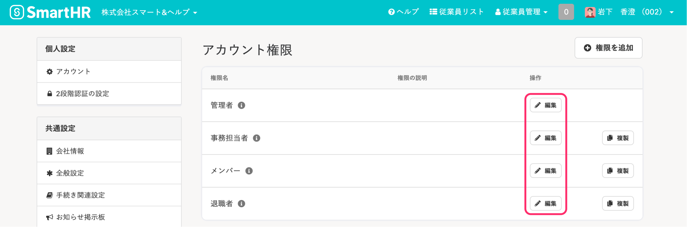
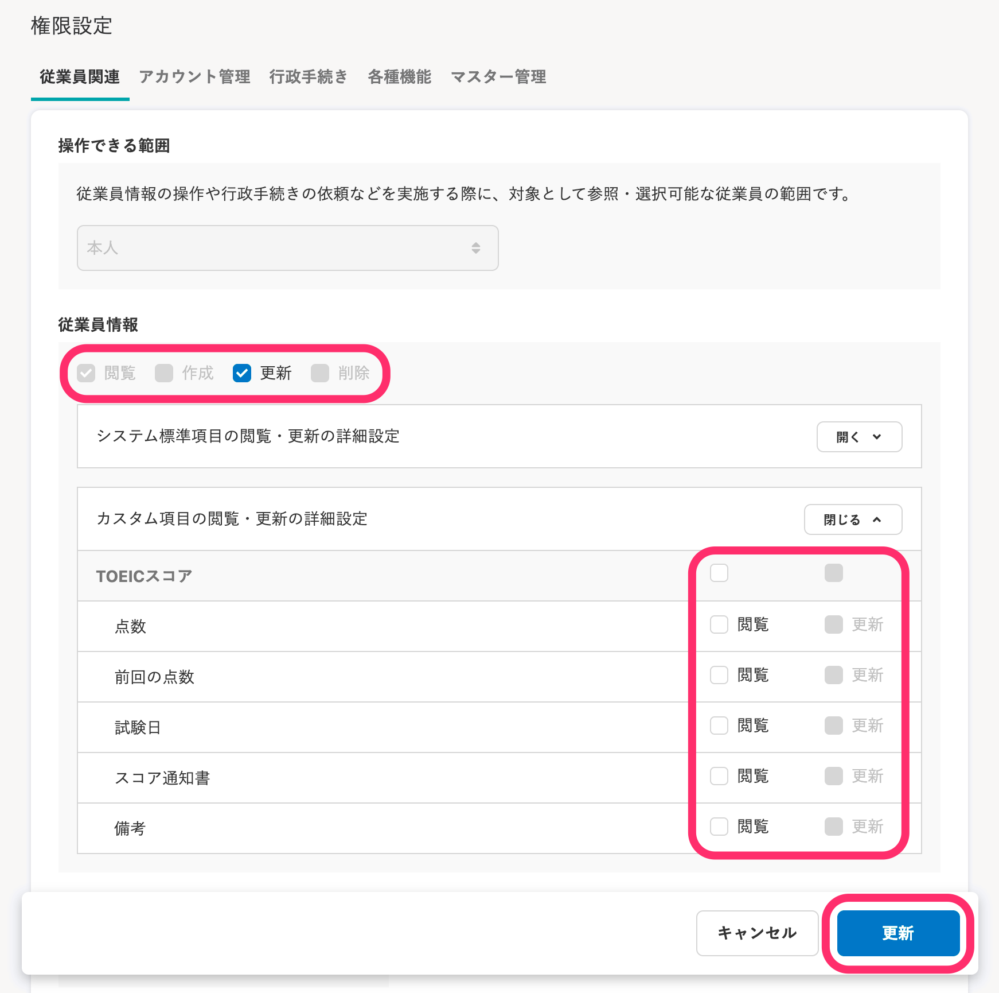
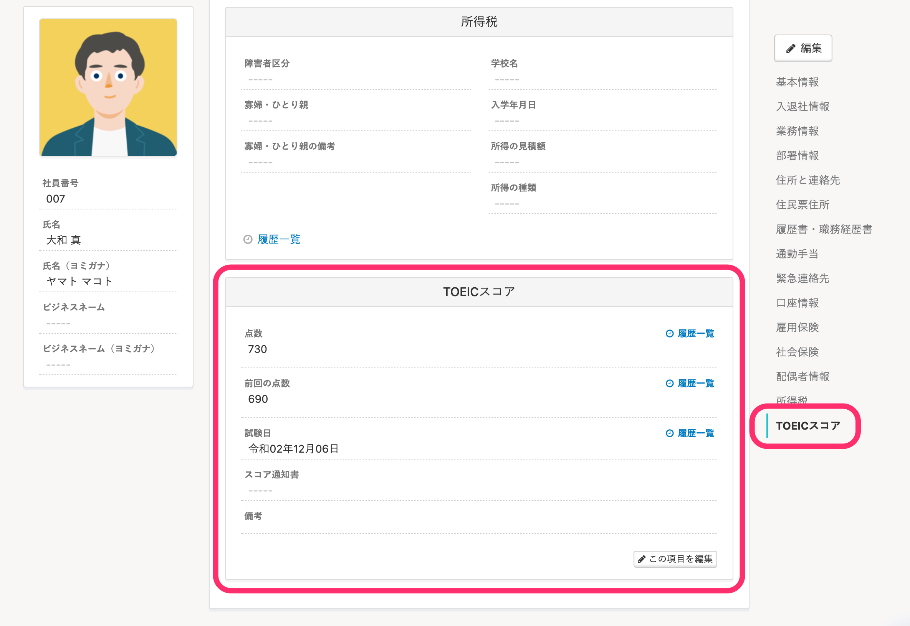
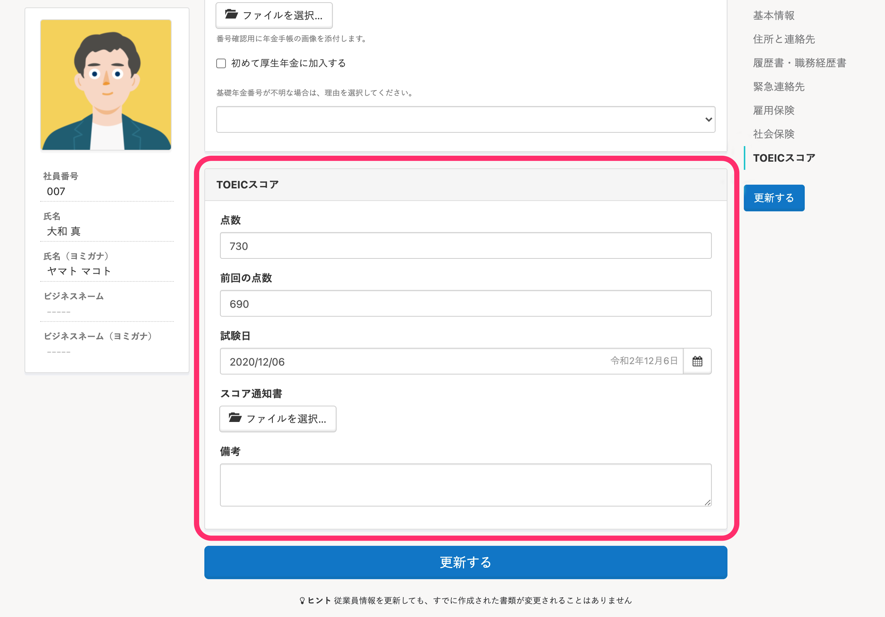

 **［従業員情報］** 画面にあらかじめ用意されている項目（システム標準従業員項目）以外に、必要な情報を管理するための項目（カスタム従業員項目）を追加できます。

追加した項目を従業員に閲覧・更新させたい場合は、権限を設定してください（初期設定では、管理者のみが閲覧・更新できる状態です）。

# ［カスタム従業員項目］を追加する

## 1\. ［アカウント名］>［共通設定］>［カスタム従業員項目］をクリック

画面右上の  **［アカウント名］>［共通設定］>［カスタム従業員項目］** をクリックすると、 **［カスタム従業員項目］** 画面が表示されます。

## 2\. ［+カスタム項目グループを追加］をクリック

 **［+カスタム**  **項目グループを追加］**  をクリックすると、 **［カスタム項目グループの追加］**  画面が表示されます。

## 3\. ［カスタム項目グループ名］を入力し、［登録］をクリック

追加したい項目のグループ名を入力して  **［登録］**  をクリックすると、カスタム項目グループが登録されます。

 **［カスタム項目グループ名］**  は、25文字まで登録できます。

## 4\. ［+グループに項目を追加］をクリック

 **［+グループに項目を追加］**  をクリックすると、 **［カスタム項目の追加］**  画面が表示されます。

 **［項目名］**  を入力し、 **［入力タイプ］**  をプルダウンメニューから選択して  **［登録］**  をクリックすると、カスタム項目が登録されます。

 **［項目名］**  は、25文字まで登録できます。

 **［入力タイプ］**  は、以下の5種類から選択します。

1.  テキスト
2.  日付
3.  数値
4.  ファイル
5.  ドロップダウンリスト

:::tips
登録した項目が  **［従業員情報］**  編集画面でどのように表示されるかは、下記のヘルプページでご確認ください。
[【一覧】［入力タイプ］ごとのカスタム従業員項目の表示](https://knowledge.smarthr.jp/hc/ja/articles/360026264613)
:::

## 5\. 追加した項目を確認する

追加した項目が **［カスタム項目一覧］**  に表示されます。

実際のユーザーさまの活用事例は、下記のヘルプページをご覧ください。

:::related
[カスタム従業員項目の活用例](https://knowledge.smarthr.jp/hc/ja/articles/360026264513)
:::

# ［カスタム従業員項目］の閲覧・更新権限を設定する

追加した項目を従業員に閲覧・更新させたい場合は、権限を設定してください。

## 1\. ［アカウント名］>［共通設定］>［権限］をクリック

画面右上の  **［アカウント名］>［共通設定］>［権限］** をクリックすると、 **［アカウント権限］**  画面が表示されます。

## 2\. アカウント権限の［編集］をクリック

設定を変更したい権限名をクリックすると、 **［アカウント権限の編集］**  画面が表示されます。

## 3\. 権限を設定し、［更新］をクリック

 **［権限設定］>［従業員関連］>［従業員情報］>［カスタム項目の閲覧・更新の詳細設定］**  で権限を設定し、 **［更新］** をクリックすると設定が保存されます。

従業員に見せたい項目は、 **［閲覧］**  にチェックを入れてください。

従業員に情報を入力させたい項目は、 **［更新］**  にチェックを入れてください。

# ［従業員情報］画面での表示

カスタム従業員項目の閲覧権限があると、 **［従業員情報］**  画面では下図のように表示されます。

## ［従業員情報］画面

## ［従業員情報］編集画面

:::alert
システム標準従業員項目の項目グループの中には、カスタム項目を追加できません。
また、システム標準従業員項目は削除できません。
:::
:::tips
適用日を指定して従業員情報を取り込む際、カスタム従業員項目の名称は適用日時点の名称を指定する必要があります。
たとえば2020/01/01時点では「資格」という名称で作成し、2021/01/01に名称を「資格情報」に変更したカスタム従業員項目がある場合、2020/07/01を指定して従業員情報を更新する際は「資格」という名称を指定する必要があります。
[適用日を指定して従業員情報を登録する](https://knowledge.smarthr.jp/hc/ja/articles/360026262253)
:::
