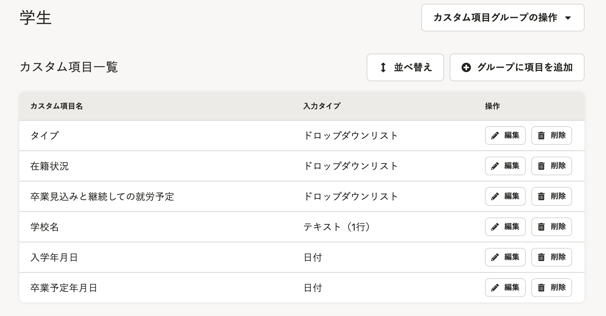
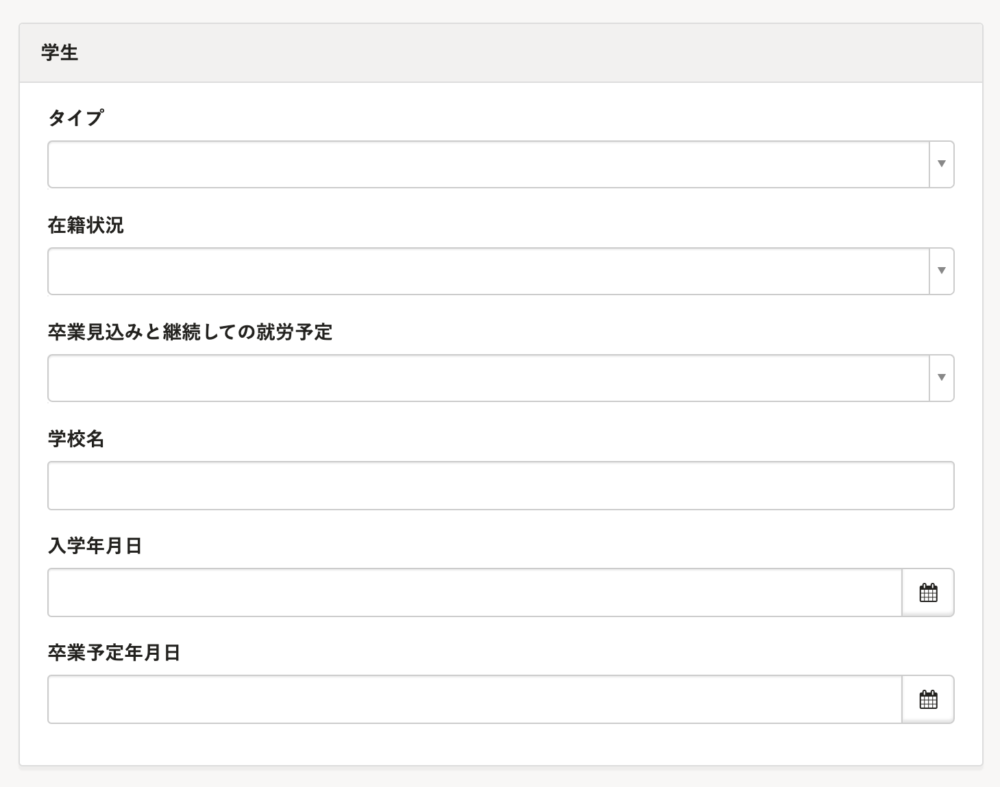
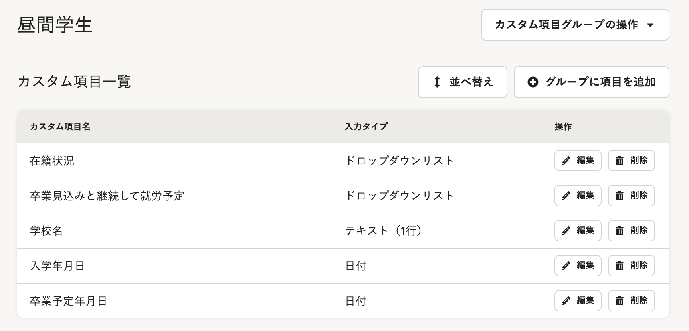
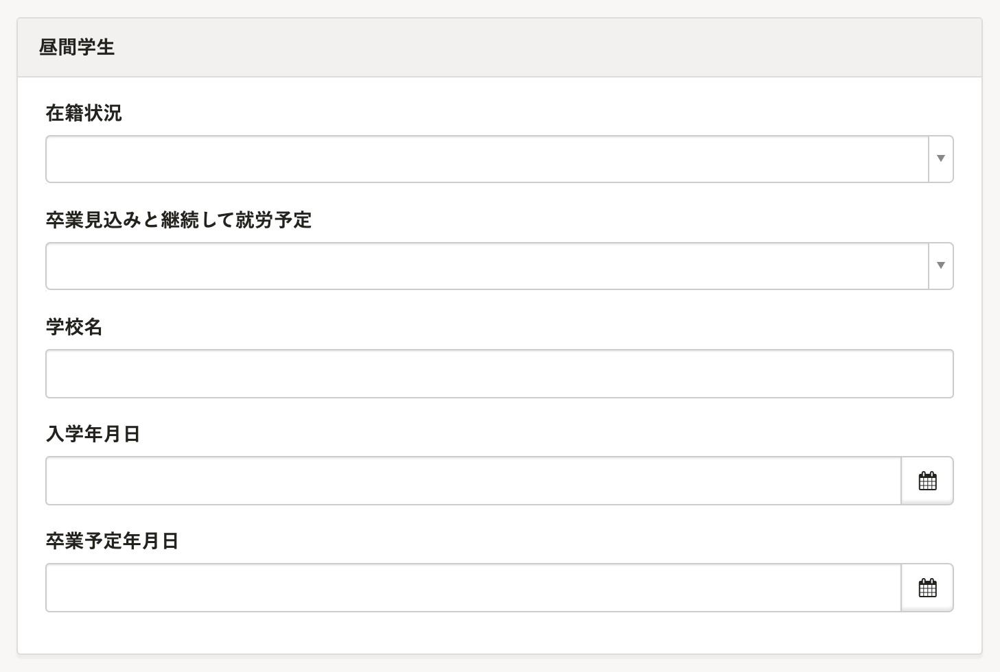
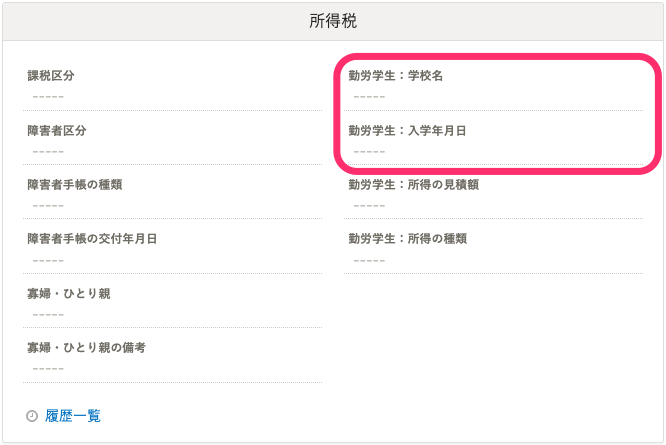

このページでは、従業員が学生の場合に、カスタム従業員項目を活用して情報を収集・管理する方法を紹介します。

所得税法上の「勤労学生」に該当するかどうかに関わらず、雇用保険の加入要件を確認する場合など、対象従業員の情報を把握したい場合などにご活用ください。

カスタム従業員項目を追加する詳しい方法は、下記のページをご覧ください。

[カスタム従業員項目を追加する](https://knowledge.smarthr.jp/hc/ja/articles/360026265513)

# カスタム従業員項目を設定する

学生従業員の学校情報や卒業予定年月日などの情報を把握・管理したい場合は、 **［学生］** という名前でカスタム項目グループを作成し、収集したい情報の項目を設定します。

**項目の設定****例**　※設定例ですので、項目はご調整ください。

- **タイプ（ドロップダウンリスト）**　全日制、定時制、通信制、夜間制　など
- **在籍状況（ドロップダウンリスト）**　在籍、休学　など
- **卒業見込みと継続しての就労予定（ドロップダウンリスト）**　あり、なし
- **学校名（テキスト）**　〇〇大学
- **入学年月日（日付）**　2019/04/01
-  **卒業予定年月日（日付）** ：2023/03/31

**カスタム従業員項目画面**

**従業員情報入力画面**

:::tips
### 対象従業員が全日制の昼間学生のみの場合
昼間学生のみを対象に情報を把握すればよい場合は、上記のカスタム項目グループ名を **［昼間学生］** とし、 **［タイプ］** の欄を削除すれば、昼間学生だけを管理することができます。

**従業員情報入力画面**

:::

## 従業員情報の［所得税］欄との使い分け

通常の設定では、「勤労学生」に関わる収集情報は従業員情報の **［所得税］** 欄にまとめられています。

上記のカスタム項目の活用例では、 **［勤労学生：学校名］［勤労学生：入学年月日］** が **［所得税］** 欄にもあるため重複しますが、1つの項目内で対象学生の情報が確認できるため便利です。

情報管理の重複を避けたい場合は、 **［勤労学生：学校名］［勤労学生：入学年月日］** は **［所得税］** 欄で管理し、カスタム項目では、 **［タイプ］［在籍状況］［卒業見込みと継続しての就労予定］［卒業予定年月日］** を設定してください。
