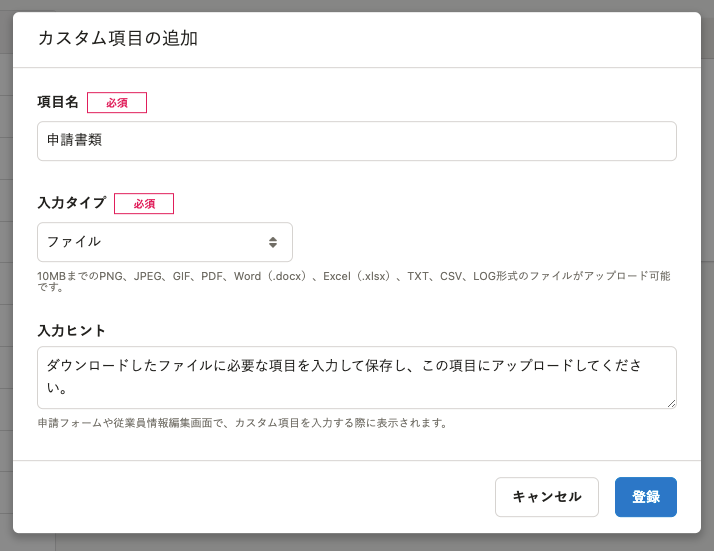
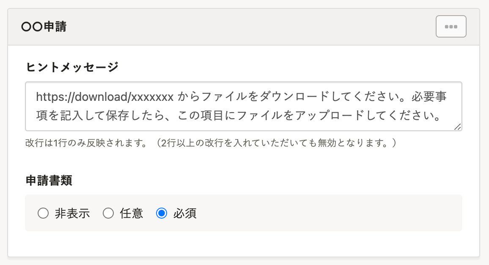
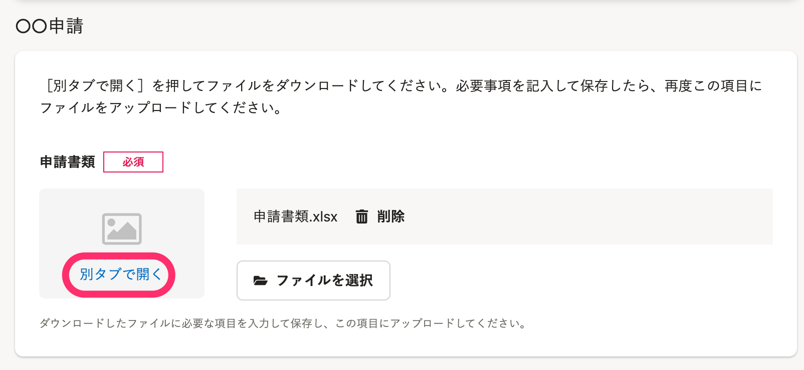
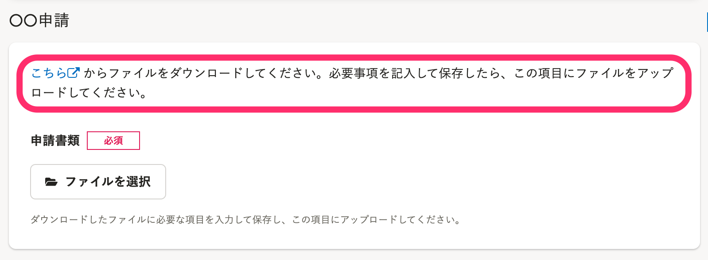

申請書などのファイルを従業員に配布し、ファイルの編集後に提出してもらうには、カスタム項目を利用します。

# 1\. カスタム項目を作成

ファイルの配付・回収用のカスタム項目を作成します。

-  **［入力タイプ］** ： **［ファイル］** を選択します。
-  **［入力ヒント］** ：ファイルに必要事項を入力して、項目にアップロードする旨を入力します。

:::related
[カスタム従業員項目を追加する](https://knowledge.smarthr.jp/hc/ja/articles/360026265513)
:::

# 2\. 配布するファイルを準備

従業員に記入を依頼するファイルを準備します。

ファイルの配布方法は、2通りあります。

## カスタム項目にファイルを添付して配付する

未入力のファイルを、手順1で作成したカスタム項目にあらかじめアップロードします。

従業員は、アップロードされたファイルをダウンロードして編集し、再度カスタム項目にアップロードして提出できます。

:::tips
¥0プラン、スモールプラン以外の場合は、ファイル一括アップロード機能が利用できます。
従業員を指定して、カスタム項目にファイルを一括でアップロードできます。
[ファイル一括アップロードの使い方](https://knowledge.smarthr.jp/hc/ja/articles/360039962514)
:::

## クラウドサービスなどにファイルをアップロードして配布する

Googleドライブなどのクラウドサービスにファイルをアップロードして、従業員がアクセスできるリンクを準備します。

従業員は、クラウドサービスからファイルをダウンロードして編集し、手順1で作成したカスタム項目にファイルをアップロードして提出できます。

# 3\. 招待フォームまたは申請フォームを作成

招待フォームまたは申請フォームを作成し、手順1で作成したカスタム項目を表示する設定にします。

下記のような **［ヒントメッセージ］** を設定すると、従業員が迷わずに操作できます。

- **カスタム項目にファイルを添付する場合のメッセージ例：
    **［別タブで開く］を押してファイルをダウンロードしてください。必要事項を記入して保存したら、再度この項目にファイルをアップロードしてください。
- **クラウドサービスなどにファイルをアップロードする場合のメッセージ例：
    **（クラウドサービスのURL）からファイルをダウンロードしてください。必要事項を記入して保存したら、この項目にファイルをアップロードしてください。

 **［ヒントメッセージ］** にリンクを記載する場合は、URLのあとに半角スペースを入力してください。

:::related
[従業員招待フォームを追加する](https://knowledge.smarthr.jp/hc/ja/articles/360026265233)
[申請フォームを管理する](https://knowledge.smarthr.jp/hc/ja/articles/360026262313)
:::

# 4\. 対象の従業員にフォームを送信する

作成したフォームを従業員に送信します。

従業員からはそれぞれ下記のように見えます。

## カスタム項目にファイルを添付して配布する

従業員は、 **［別タブで開く］** をクリックしてファイルをダウンロードできます。

ダウンロードしたファイルの名前は「proxy\_images」となります。

## クラウドサービスなどにファイルをアップロードして配布する

リンクは自動的に「こちら」という文字列に変換されます。

従業員は **［こちら］** をクリックしてクラウドサービスなどにアクセスして、ファイルをダウンロードできます。

