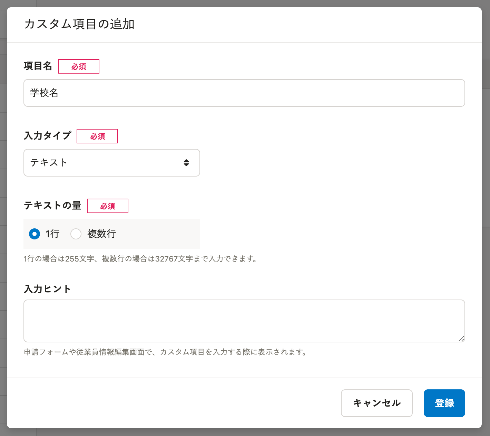
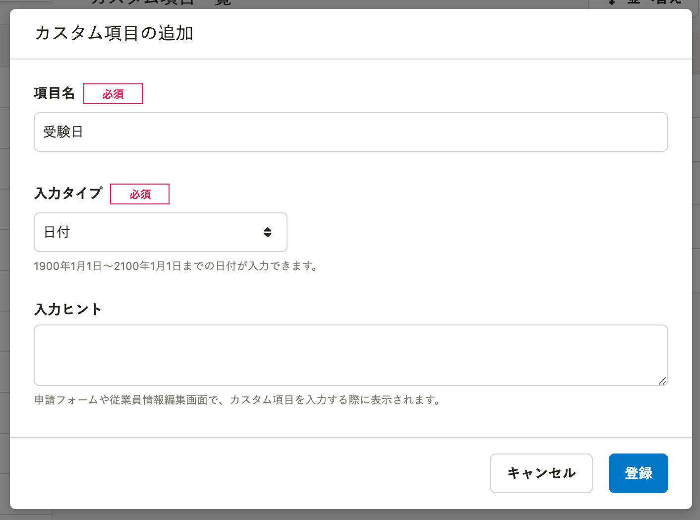
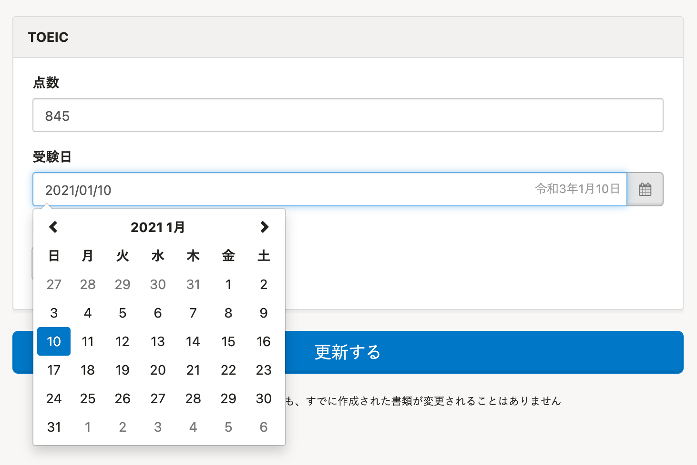
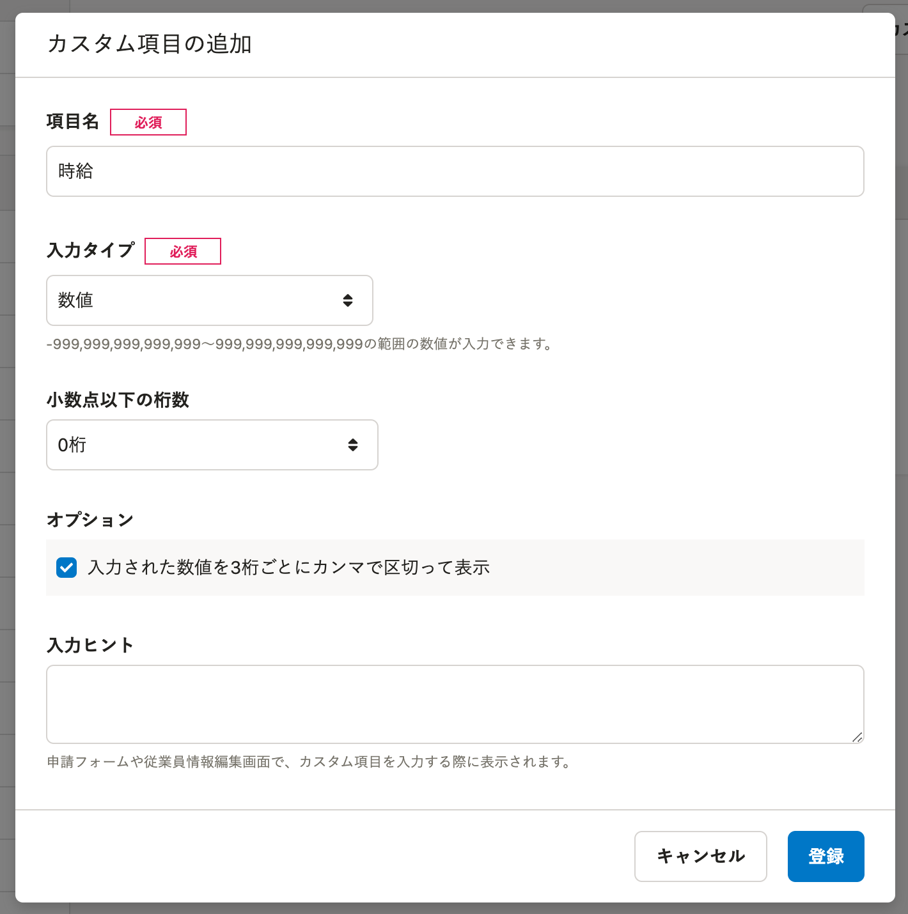
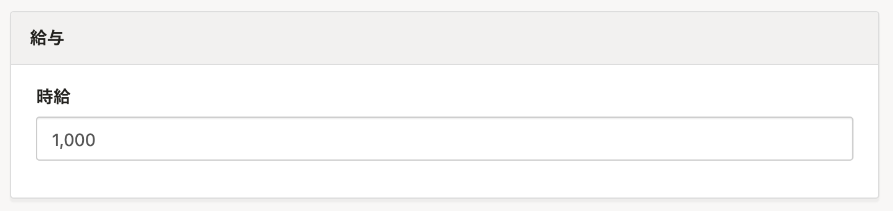
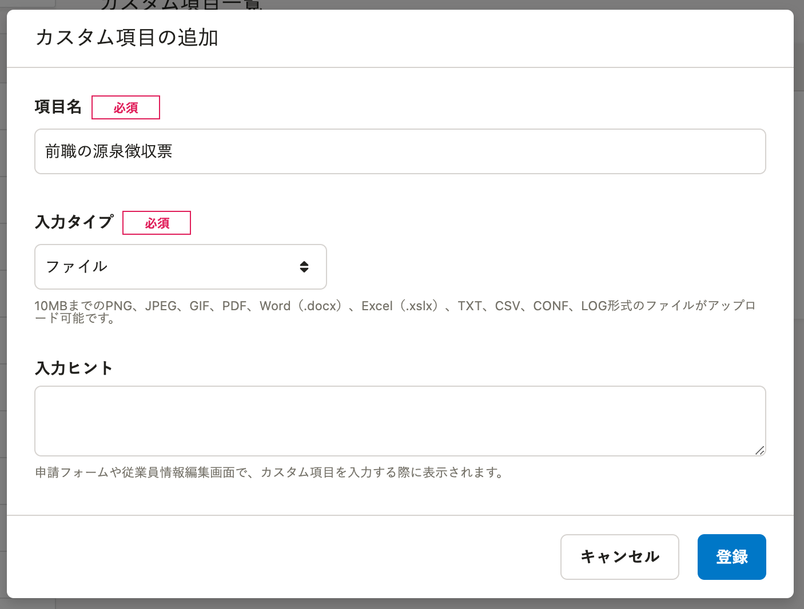
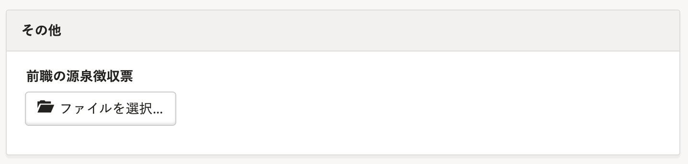
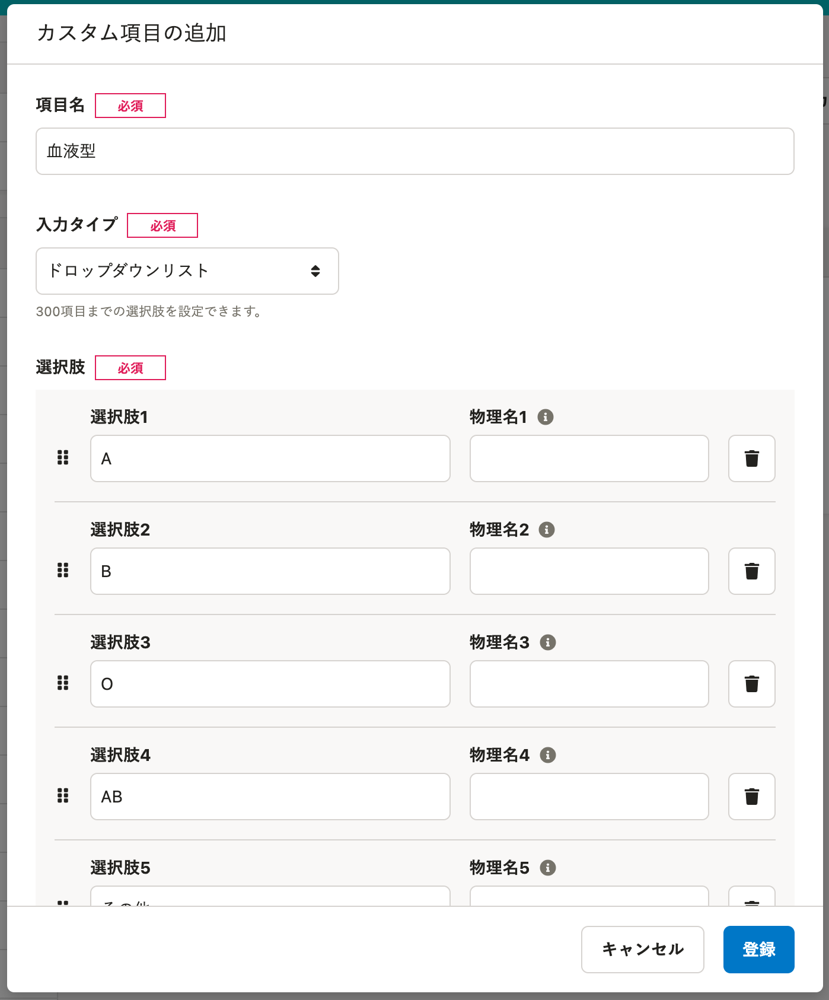
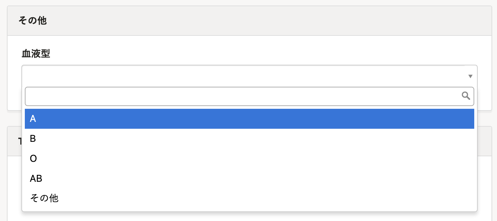

カスタム従業員項目が  **［従業員情報］** 編集画面でどのように表示されるか、 **［入力タイプ］**  ごとに説明します。

# テキスト

## ［カスタム項目の追加］画面

フォームに入力できる文字数は、 **［テキストの量］** の設定で「1行」または「複数行」を指定できます。

## ［従業員情報］編集画面

 **［テキストの量］** を「1行」に指定した場合、255文字まで入力できます。（改行不可）

「複数行」に指定した場合は、32,767文字まで入力できます。（改行可能）

# 日付

## ［カスタム項目の追加］画面

## ［従業員情報］編集画面

1900年1月1日 〜 2100年1月1日 までの日付が選択できます。

# 数値

## ［カスタム項目の追加］画面

## ［従業員情報］編集画面

\-999,999,999,999,999 〜 999,999,999,999,999 の範囲の数値が入力できます。

# ファイル

## ［カスタム項目の追加］画面

## ［従業員情報］編集画面

以下のファイルをアップロードできます。

- 形式：PDF、JPEG、GIF、TEXT、CSV、CONF、LOG、Docx、XLSX
- サイズ：GIF形式は1ファイル最大3MB。その他の形式は1ファイル最大10MB。

# ドロップダウンリスト

## ［カスタム項目の追加］画面

ドロップダウンリストとして表示させる項目を **［選択肢1］［選択肢2］……** に登録してください。

40文字、300項目まで登録可能です。

APIを使用してドロップダウンリストの項目を登録、更新する場合は、 **［物理名1］［物理名2］……** にも値を登録してください。

## ［従業員情報］編集画面

