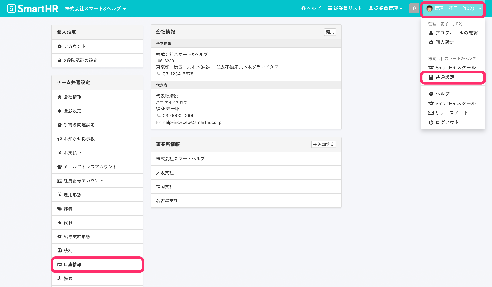
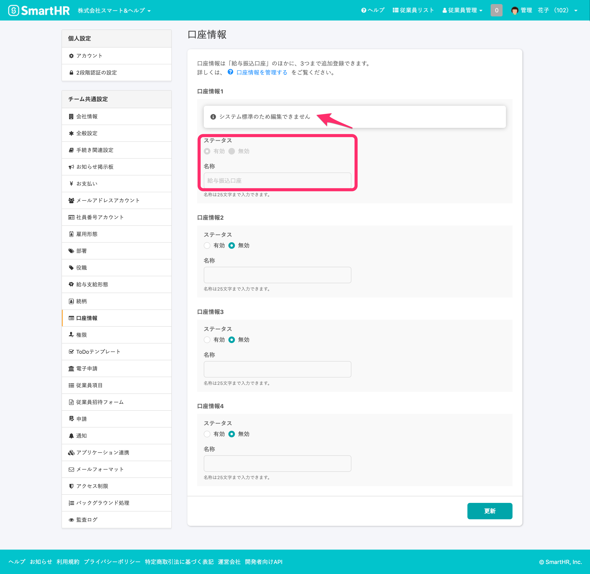
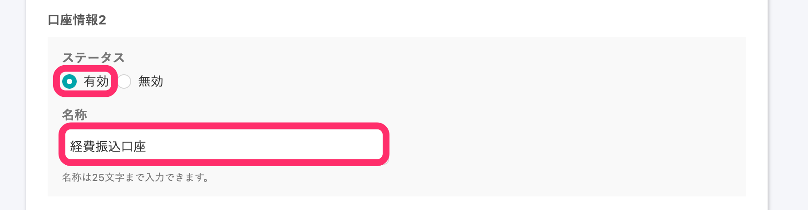
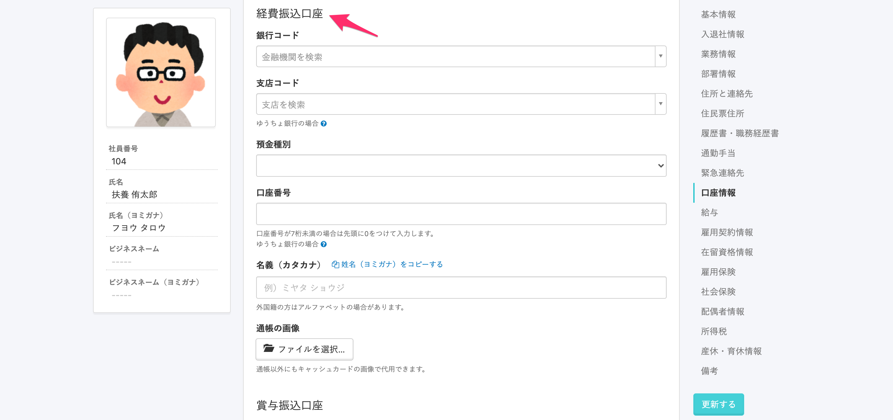
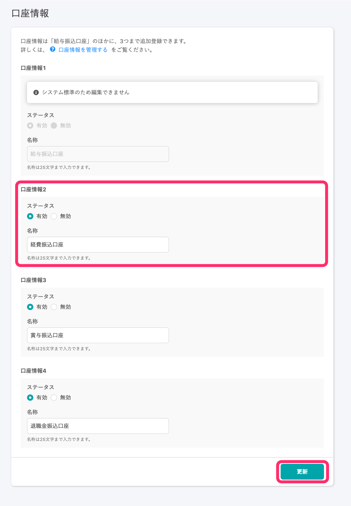
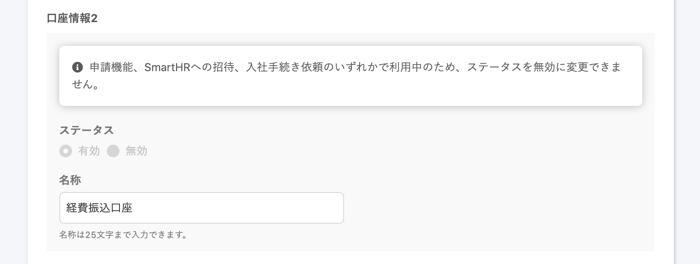

**従業員項目**の **\[口座情報\]** は、 **給与振込口座** に加えて複数の口座情報項目を登録、管理できます。

口座情報項目の設定は、**\[共通設定\]** の **\[口座設定\]** で管理します。

# \[口座情報\] の設定

## 画面右上のアカウント名 > \[共通設定\] > \[口座情報\] をクリック

画面右上の\[アカウント名▼\] をクリックして開くメニューから **\[共通設定\]** を選び、画面左のリストにある **\[口座情報\]** をクリックすると、 **\[口座情報\]** 管理画面へ移動します。

## あらかじめ登録済みの口座情報項目名

これまで従業員項目のシステム標準項目 **給与口座情報** として登録していたデータは、引き続き **\[給与振込口座\]** として保持します。

これに加えて、口座情報を3つまで登録し、項目名を設定できます。

# \[口座情報\] 項目を有効にする

2つ目以降の口座情報項目は、ステータスの **\[有効\]** ／ **\[無効\]** を切り替えて、利用できるようにします。

## 1\. \[口座情報\] の \[ステータス\] を有効にする

**\[口座情報\]** 管理画面で、 **口座情報2** 以降の項目の **\[ステータス\]** の **\[有効\]** をクリックし、**\[名称\]** を入力します。名称に使用できる文字数は25文字以内です。

**\[名称\]** は従業員情報の項目名として利用されます。

従業員情報の一括登録／一括更新に使用するテンプレートファイルの項目名も、ここで入力した名称が適用されます。

## 2\. 内容を確認し、 \[更新\] をクリック

設定内容を確認し、 **\[更新\]** をクリックします。

# \[口座情報\] 項目を編集する

## \[口座情報\] の \[ステータス\] を無効にする

**\[口座情報\]** 管理画面で、従業員情報で非表示にしたい口座情報項目の **\[ステータス\]** の **\[無効\]** をクリックし、**\[更新\]** をクリックします。

:::tips
口座情報項目の **\[無効\]** とは、 従業員情報の項目として非表示扱いすることを意味します。
従業員情報として画面上から非表示になるため、利用ができなくなるだけで、登録済みの従業員情報のデータは削除されず、保持されます。
:::
:::alert
### 利用中の招待フォーム、申請フォームがある場合は無効にできません
管理者から依頼中、もしくは提出中の従業員招待フォーム、申請フォームで口座情報項目が使われている場合、項目の無効化はできません。
フォームを承認または取り消し、項目を利用しているフォームの編集をして項目を非表示にしてから、ステータスを更新してください。

:::

## \[口座情報\] の \[名称\] を変更する

**\[口座情報\]** 管理画面で、 名称を変更したい項目の **\[名称\]** を入力し、 **\[更新\]** をクリックします。

名称変更は、口座情報項目が利用中でも変更できます。

変更すると、従業員情報、従業員招待フォーム、申請フォーム、従業員の一括登録／一括更新用テンプレートファイルにも変更が反映されます。
