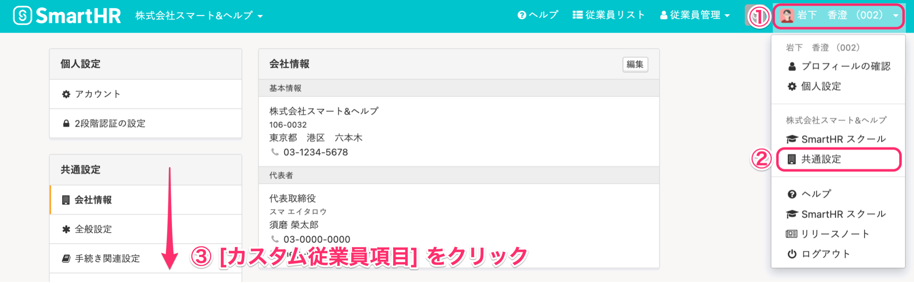

追加したカスタム従業員項目に、入力してほしい内容を説明する **［入力ヒント］** を設定できます。

このページでは、カスタム従業員項目に **［入力ヒント］** を設定する方法を説明します。

# ［入力ヒント］の見え方

 **［入力ヒント］** は、従業員情報を編集する際に、入力項目の下に表示されます。

記入例や注意点などを表示し、管理者の意図に沿った内容の入力を促せます。

**従業員招待フォーム** にヒントを設定する方法は、以下のヘルプページをご覧ください。

:::related
[招待フォームで入力方法の案内を設定する](https://knowledge.smarthr.jp/hc/ja/articles/1500000179481)
:::

# ［入力ヒント］の設定手順

## 1\. 画面右上のアカウント名 >［共通設定］>［カスタム従業員項目］をクリック

画面右上の **［アカウント名］>［共通設定］>［カスタム従業員項目］** をクリックすると、 **［カスタム従業員項目］** 画面が表示されます。

## 2\. ［詳細］をクリック

設定したいカスタム項目グループの **［詳細］** をクリックすると、 **［カスタム項目一覧］** が表示されます。

## 3\. ［編集］をクリック

 **［編集］** をクリックすると、 **［カスタム項目の編集］** 画面が表示されます。

## 4\. ［入力ヒント］を入力し、［更新］をクリック

 **［入力ヒント］** に任意のメッセージを入力し、  **［更新］** をクリックすると内容が保存されます。

 **［入力ヒント］** は、500文字まで登録できます。

リンクを表示させたい場合は、 **［入力ヒント］** にURLを入力し、URLの後に半角スペースを入れてください。

入力したURLは、自動的に 「こちら」 と表記されます。

従業員情報編集ページでは、作成した項目が下図のように表示されます。

