このページでは、実際のユーザーさまのカスタム従業員項目の活用例をご紹介します。

カスタム従業員項目の追加方法は、[カスタム従業員項目を追加する](https://knowledge.smarthr.jp/hc/ja/articles/360026265513)をご覧ください。

# 管理者側で管理し、従業員は閲覧不可にするケース

従業員には見せず他の管理者とは共有したい情報を、カスタム従業員項目として追加できます。

## 例：人事評価の管理

人事評価用のカスタム従業員項目を追加し、従業員からは閲覧できないように権限設定することで、各従業員の人事評価を、管理者のみ閲覧・更新が可能な状態で管理できます。

### カスタム従業員項目

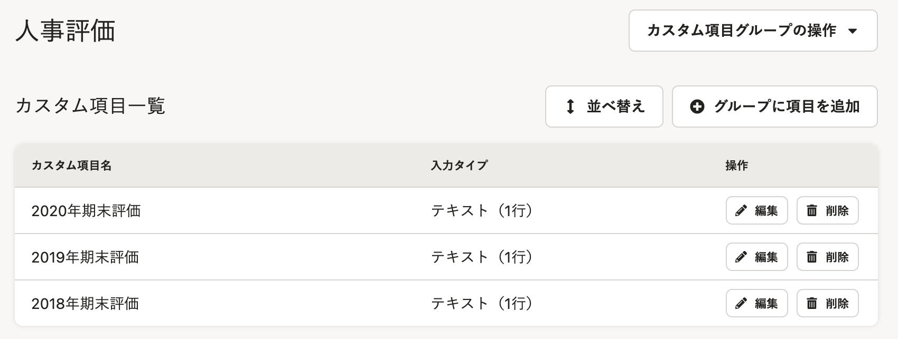

### メンバーの権限設定

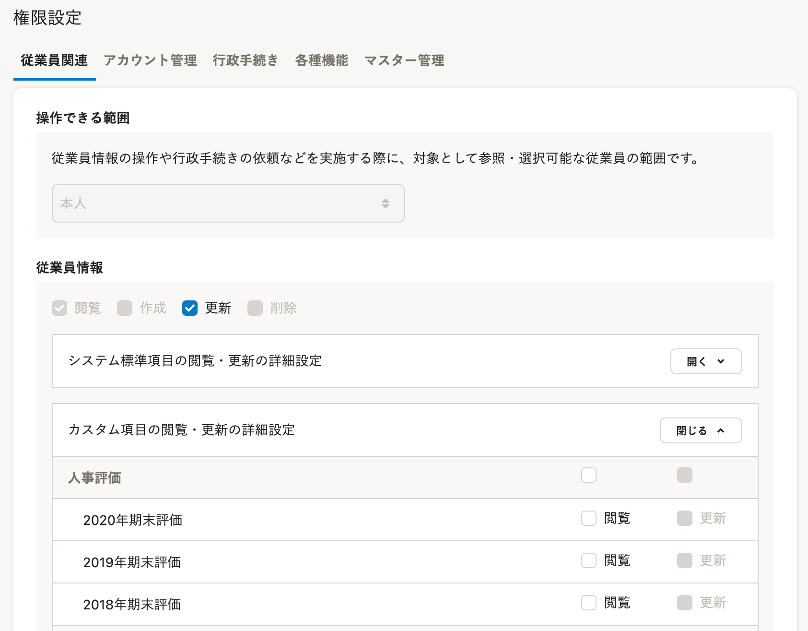

### 管理者権限での \[従業員情報\] 画面の表示

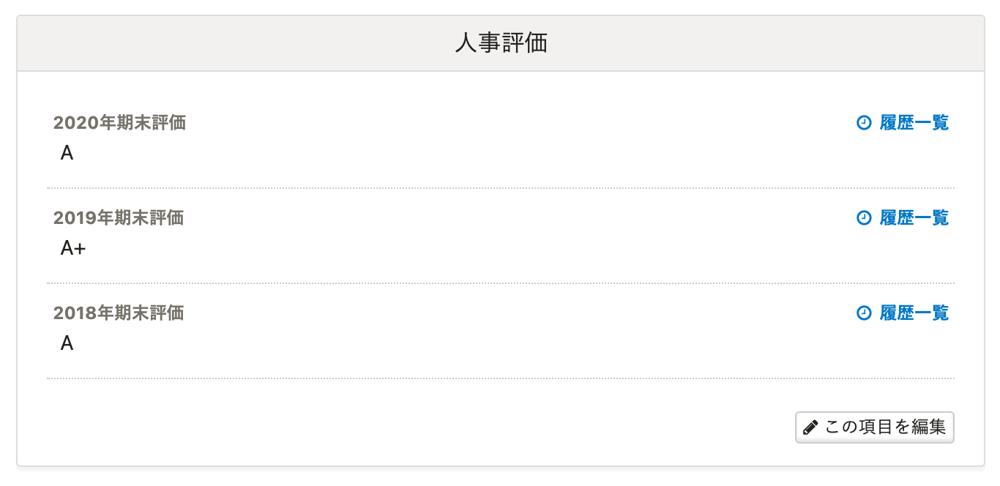

### メンバー権限での \[従業員情報\] 画面の表示

非表示

## 例：入社準備タスクの管理

入社準備タスク用のカスタム従業員項目を追加し、従業員からは閲覧できないように権限設定することで、複数の管理者同士での進捗共有に活用いただけます。

各タスクのステータスをあらかじめドロップダウンリストに登録しておくと便利です。

### カスタム従業員項目

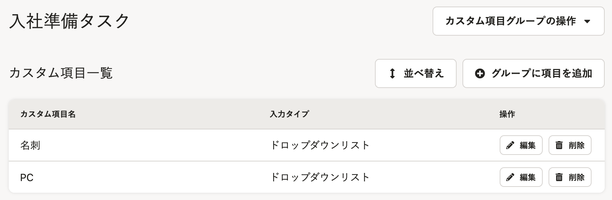

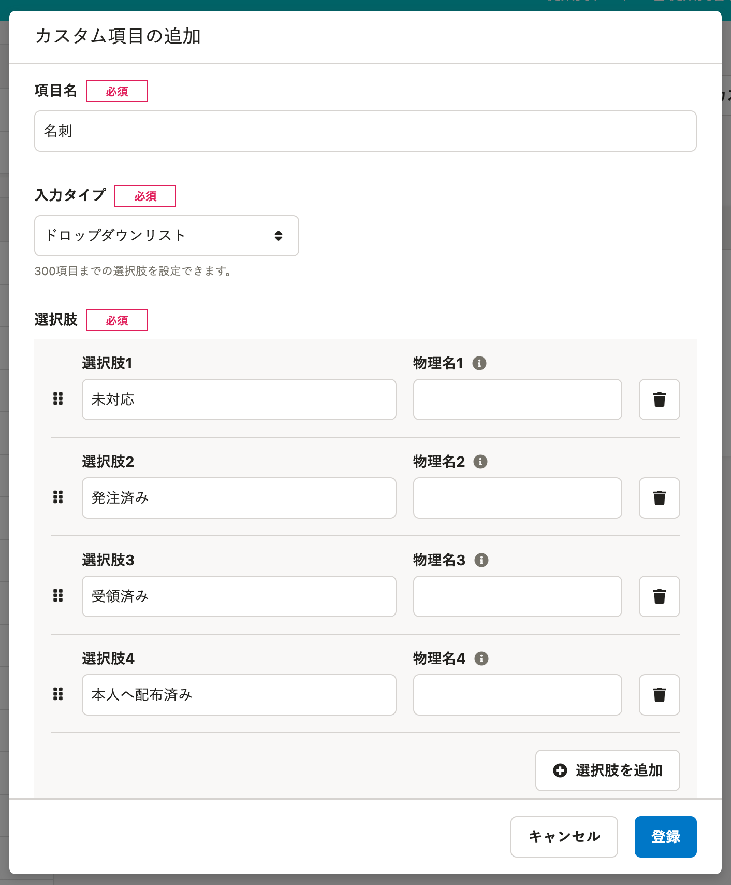

### メンバーの権限設定

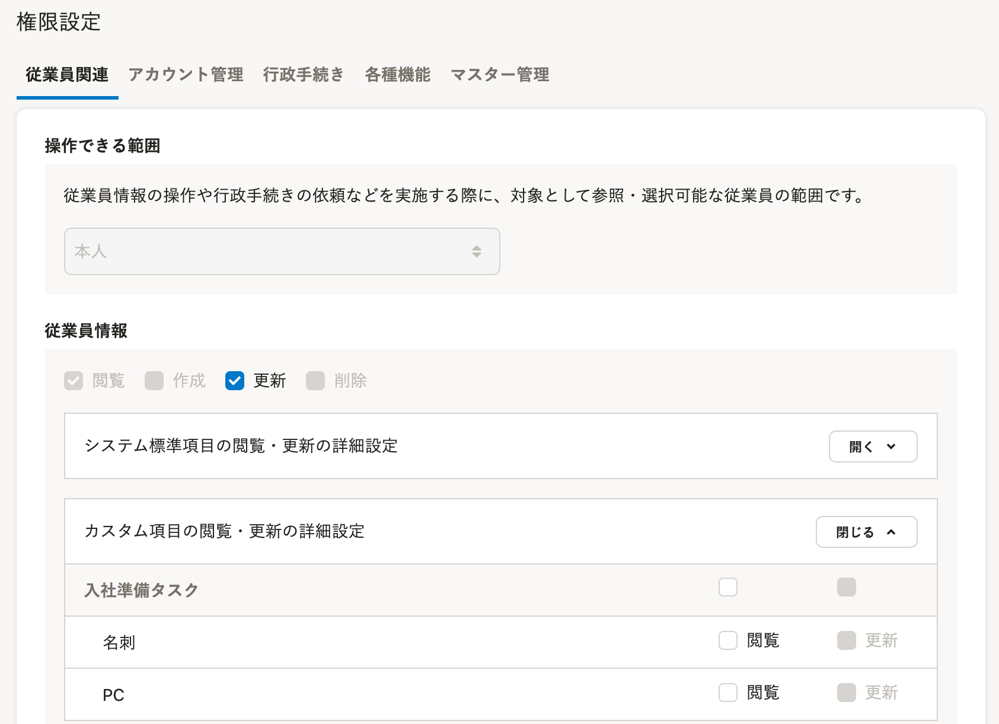

### 管理者権限での \[従業員情報\] 画面の表示

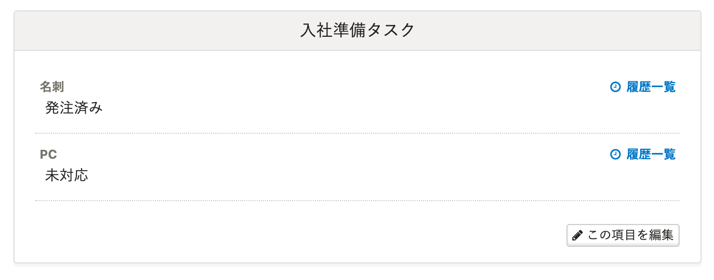

### メンバー権限での \[従業員情報\] 画面の表示

非表示

# 管理者側で管理し、従業員は閲覧のみにするケース

管理者が管理し、従業員に閲覧だけさせたい情報を、カスタム従業員項目として追加できます。

:::tips
カスタム従業員項目は、一括更新も可能です。
従業員数が多い場合などは、下記ページを参考に一括更新をしてください。
[複数の従業員情報・家族情報を一括で更新する](https://knowledge.smarthr.jp/hc/ja/articles/360026265333)
:::

## 例：有給日数の管理

### カスタム従業員項目

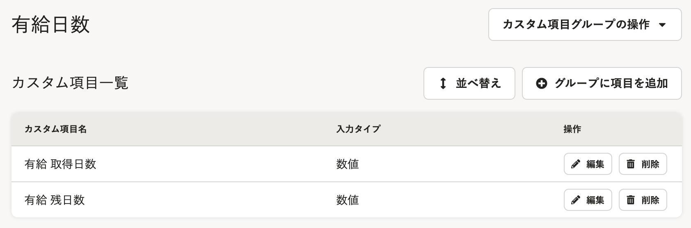

### メンバーの権限設定

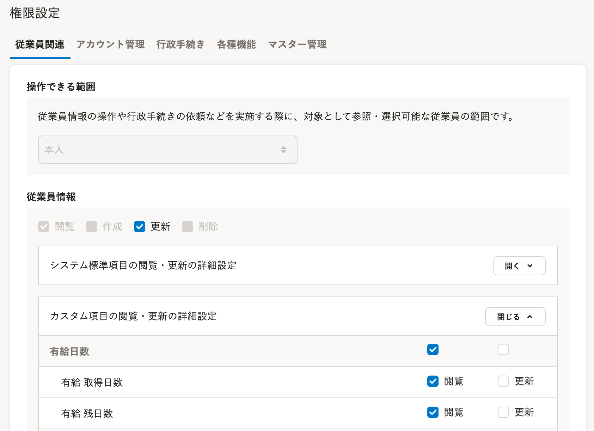

### 管理者権限での \[従業員情報\] 画面の表示

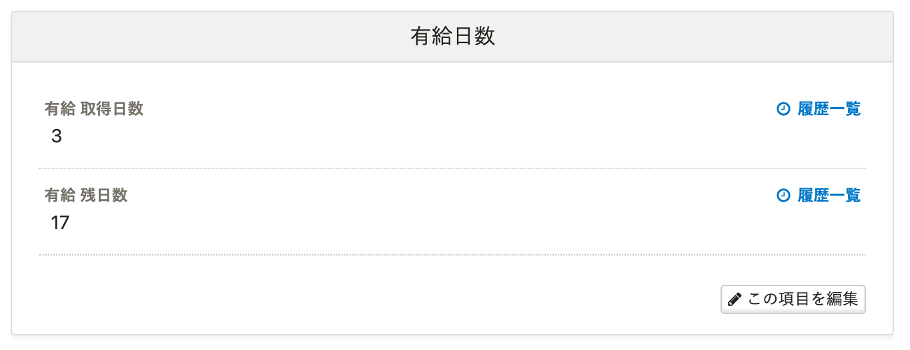

### メンバー権限での \[従業員情報\] 画面の表示

**\[この項目を編集\]** ボタンがありません。

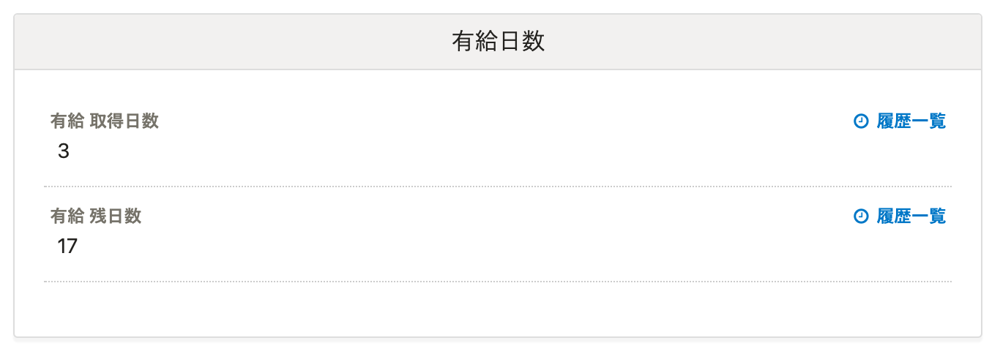

## 例：就業規則の管理

就業規則のURLを登録したり、PDFなどのファイルをSmartHR上に登録したりできます。

### カスタム従業員項目

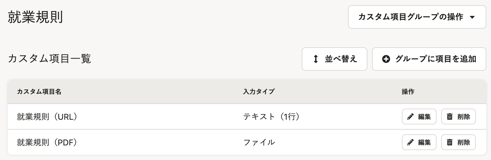

:::tips
従業員情報内では、HTMLタグの利用はできず、また、URLが自動的にリンクになる機能もありません。
従業員さまには、URLをコピーしてブラウザのアドレスバーへペーストして開いていただくよう、お伝えください。
:::

### メンバーの権限設定

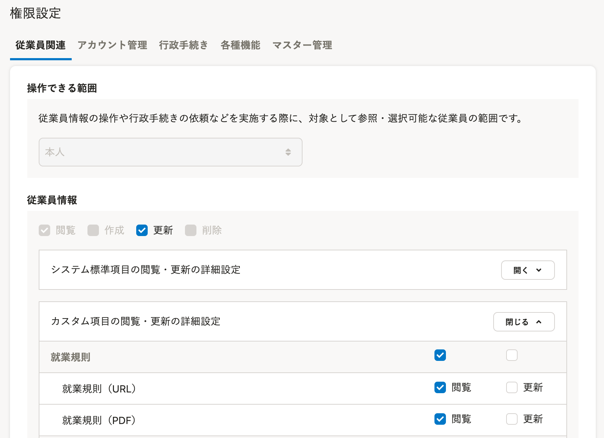

### 管理者権限での \[従業員情報\] 画面の表示

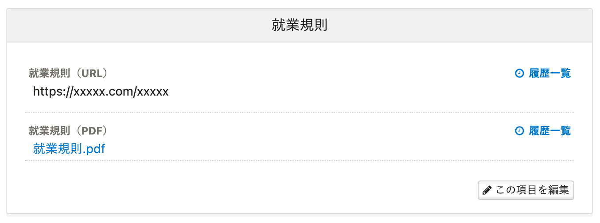

### メンバー権限での \[従業員情報\] 画面の表示

**\[この項目を編集\]** ボタンがありません。

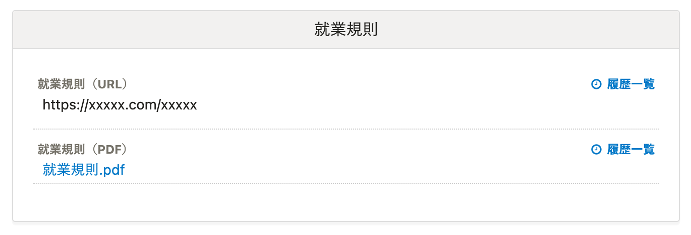

# 管理者・従業員ともに閲覧・登録できるようにするケース

従業員本人に情報を入力・更新させたい項目を、カスタム従業員項目として追加できます。

従業員招待フォームのカスタマイズと併せてのご利用もオススメです。

:::tips
更新権限を付与した場合、従業員は **\[プロフィールの確認\]** から何度でもデータを更新できます。
:::

## 例：TOEICのスコア登録

### カスタム従業員項目

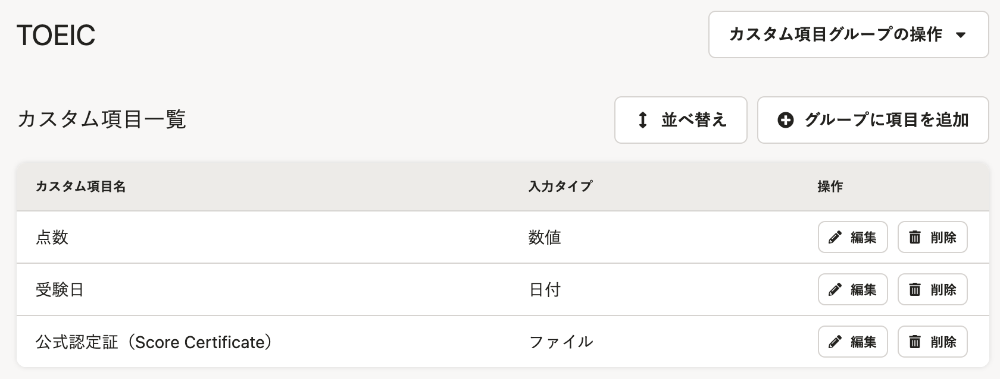

### メンバーの権限設定

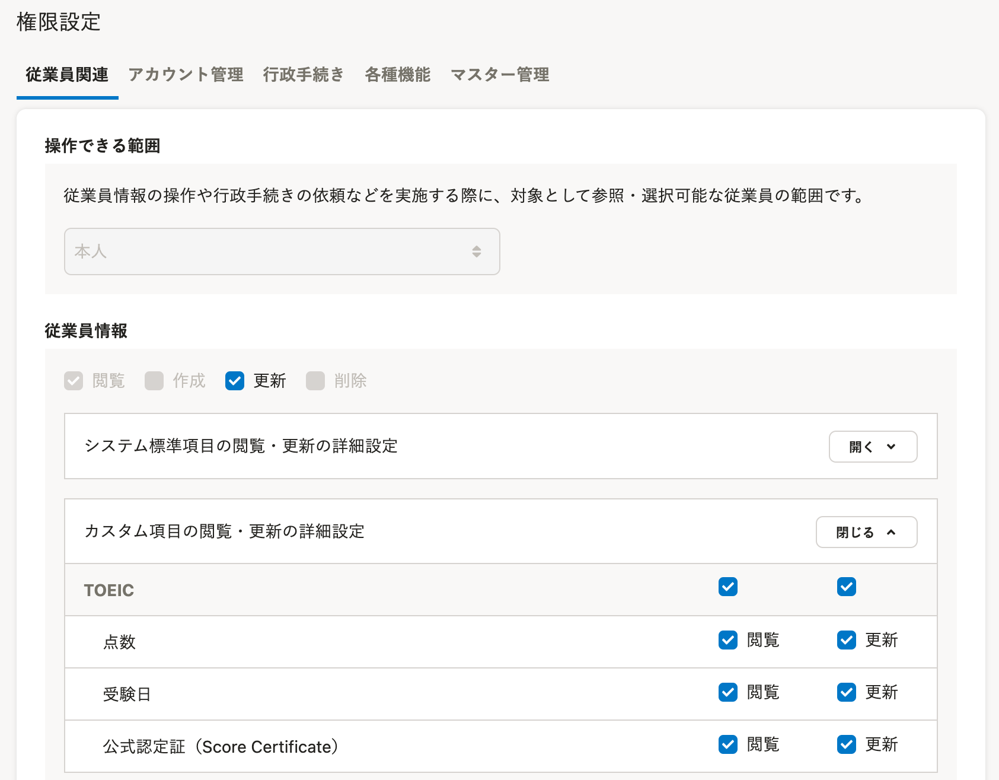

### 管理者権限での \[従業員情報\] 画面の表示

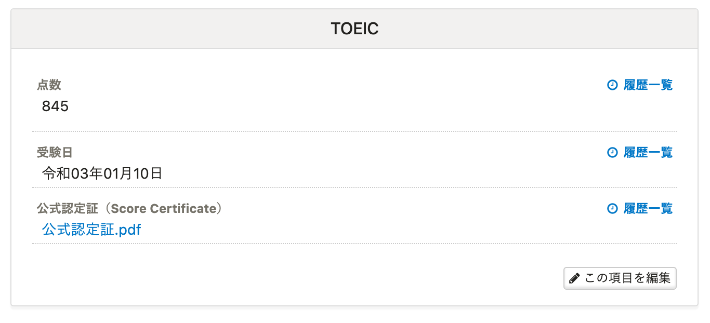

### メンバー権限での \[従業員情報\] 画面の表示

## 例：学生従業員の学校情報

従業員が学生の場合の、学校情報や卒業予定年月日などの情報を収集・管理ができます

詳細は、下記のヘルプページをご覧ください。

[従業員が学生の場合の収集情報の管理（カスタム従業員項目の活用例）](https://knowledge.smarthr.jp/hc/ja/articles/4404827430809)
