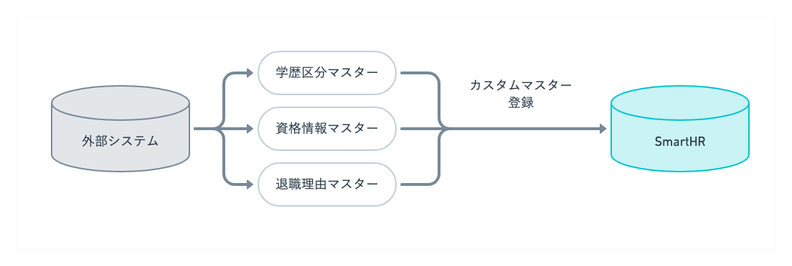
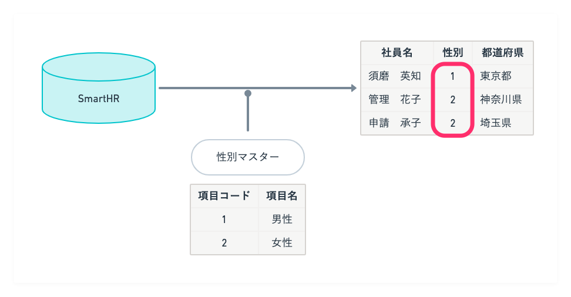

マスターデータとは、SmartHRの従業員情報で利用するデータのことです。

画面右上の **［アカウント名▼］** をクリックして開くメニューから **［共通設定］** を選び、画面左のリストにある **［マスターデータ］** をクリックすると、 **［マスターデータ］** 画面が表示されます。

マスターデータには、システム標準マスターとカスタムマスターがあります。

# システム標準マスター

システム標準マスターとは、SmartHRにあらかじめ登録されている**雇用形態、給与支給形態、部署、役職、続柄**のデータです。

システム標準マスターは削除できません。

詳しい操作手順については、下記ヘルプページを参照してください。

:::related
- [雇用形態のマスターデータを管理する](https://knowledge.smarthr.jp/hc/ja/articles/360026105714)
- [給与支給形態のマスターデータを管理する](https://knowledge.smarthr.jp/hc/ja/articles/360053198754)
- [部署のマスターデータを管理する](https://knowledge.smarthr.jp/hc/ja/articles/360036111074)
- [役職のマスターデータを管理する](https://knowledge.smarthr.jp/hc/ja/articles/360053195014)
- [続柄のマスターデータを管理する](https://knowledge.smarthr.jp/hc/ja/articles/360026104434)
:::

# カスタムマスター

カスタムマスターとは、必要に応じてSmartHRに登録できるマスターデータです。

スタンダードプラン以上をご契約の場合に利用できます。

たとえば、学歴区分や資格情報など、SmartHR以外のシステムで管理していたデータをSmartHRにカスタムマスターとして登録して管理できます。

詳しい操作手順については、[カスタムマスター（β版）を管理する](https://knowledge.smarthr.jp/hc/ja/articles/4408888193305)を参照してください。

## カスタム従業員項目との違いと使い分け

カスタムマスターを登録しても、カスタム従業員項目には自動で反映されません。今後、開発を検討していきます。

カスタムマスターの内容をカスタム従業員項目として管理したい場合は、カスタム従業員項目として別途追加する必要があります。

### SmartHRの従業員情報として管理する場合は、カスタム従業員項目

SmartHRにあらかじめ用意されているシステム標準項目になく、従業員情報として管理したい任意の項目がある場合は、カスタム従業員項目を使います。

詳しくは、[カスタム従業員項目を追加する](https://knowledge.smarthr.jp/hc/ja/articles/360026265513)を参照してください。

### 外部システムと連携したい場合は、カスタムマスター

SmartHR以外のシステムと連携したい場合に、カスタムマスターを使います。

カスタムマスターを登録しておくと、SmartHRのデータを外部システムに入力しやすいコードに変換した形式で出力できるようになります。

たとえば、SmartHRのデータを外部システムに取り込む際に「男性」を「1」、「女性」を「2」に置き換える必要があったとします。

この際、「男性」を「1」、「女性」を「2」に置き換えることを定義した「性別マスター」をカスタムマスターとしてあらかじめ登録しておくと、SmartHRのカスタムダウンロードフォーマットで従業員情報をダウンロードしたときに「男性」が「1」、「女性」が「2」に置き換えられます。

:::alert
カスタム項目を外部システムに取り込みやすいコードに変換して従業員情報をダウンロードしたい場合は、カスタムマスターの **［項目名］** とカスタム項目のドロップダウンリストの内容を合わせる操作が必要になります。
詳しくは、[カスタム項目をコードに変換して、従業員情報をダウンロードするには？](https://knowledge.smarthr.jp/hc/ja/articles/4410660698649)を参照してください。
:::
