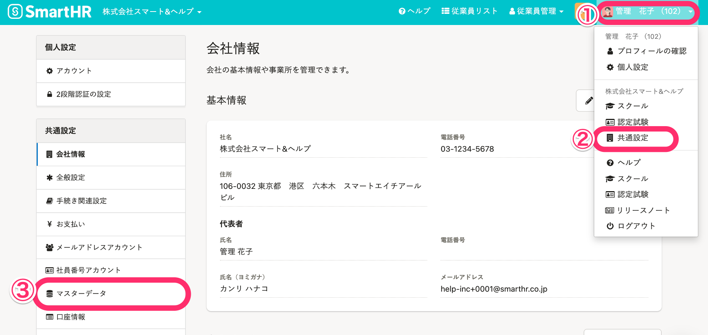
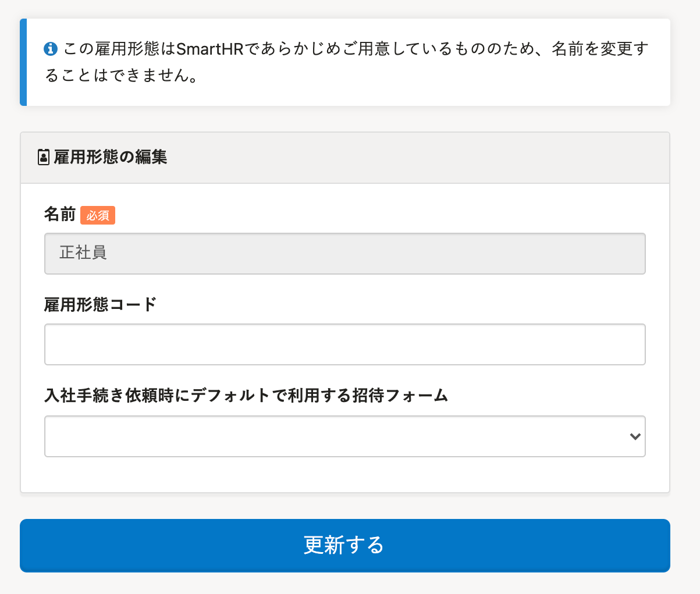

従業員情報の **［業務情報］>［雇用形態］** でプルダウンメニューの選択肢に表示する雇用形態をマスターデータとして登録、管理できます。

# ［雇用形態］の設定

## 画面右上のアカウント名 >［共通設定］>［雇用形態］をクリック

画面右上の **［アカウント名▼］** をクリックして開くメニューから **［共通設定］** を選び、画面左のリストにある **［マスターデータ］** をクリックすると、 **［マスターデータ］** 画面が表示されます

一覧の **［雇用形態］** をクリックすると、 **［雇用形態］** マスター管理画面へ移動します。

## あらかじめ登録されている雇用形態

システム標準としてあらかじめ登録済みの雇用形態があります。

| 雇用形態名 | 役員 |
| --- | --- |
| 正社員 |
| 契約社員 |
| 派遣社員 |
| アルバイト・パート |
| 業務委託 |
| その他 |

:::alert
- **システム標準の雇用形態であっても、従業員情報に利用していない雇用形態はマスターから削除できます**。ただし、一度削除すると**復元できません**。
    削除後に必要になった場合は、同じ名前で再登録をしてください。（システム標準の雇用形態ではなくなります）。

- **システム標準の雇用形態は名前を編集できません**。

:::

# ［雇用形態］を登録する

## 1\. ［ + 雇用形態を追加］をクリック

 **［雇用形態］** マスター管理画面で、  **［+ 雇用形態を追加］** をクリックすると、 **［雇用形態の登録］** 画面に移動します。

## 2\. 雇用形態を入力し、［登録する］をクリック

名前を入力し、 **［登録する］** をクリックします。

任意で、 **［雇用形態コード］** 、 **［入社手続き依頼時にデフォルトで利用する招待フォーム］** も設定できます。

追加登録した雇用形態は、編集・更新できます。

:::related
[従業員招待フォームのカスタマイズ](https://knowledge.smarthr.jp/hc/ja/articles/360026265233)
:::

## 3\. 一覧に追加されたことを確認する

 **［雇用形態］** マスター管理画面に移動するので、追加されたことを確認します。

# ［雇用形態］を削除する

:::alert
従業員情報に利用中の雇用形態は削除できません。
:::

## 1\. ［削除］をクリック

 **［雇用形態］** マスター管理画面にて、削除したい雇用形態の **［削除］** をクリックします。

## 2\. 削除確認画面の［削除］をクリック

 **［雇用形態削除しますか？］** という確認画面が表示されるので、 **［削除］** をクリックします。

## 3\. 削除を確認する

 **［雇用形態］** マスター管理画面が表示されるので、削除されたことを確認します。
