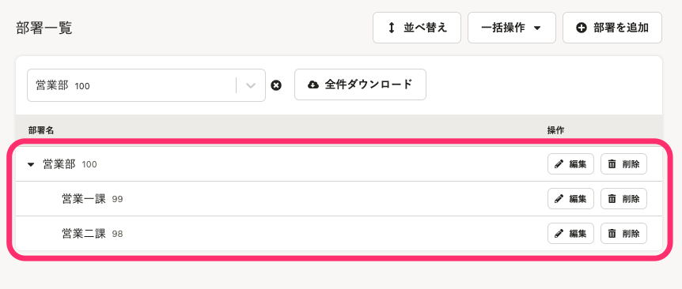
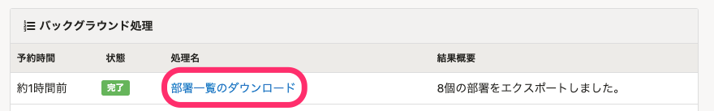

 **［部署］** 画面では、部署を登録、管理できます。

ここで登録した部署は、従業員情報の **［部署情報］>［部署］** でプルダウンメニューの選択肢に表示されます。

部署は  **「管理部 > 人事グループ > 採用チーム」**  のように階層化して管理できます。

# 部署の設定

## 画面右上のアカウント名 >［共通設定］>［マスターデータ］>［部署］をクリック

画面右上の **［アカウント名▼］** をクリックして開くメニューから **［共通設定］** を選び、画面左のリストにある **［マスターデータ］** \> **［部署］** をクリックすると、 **［部署］** 画面が表示されます。

# 部署を追加する

## 1\. ［部署を追加］をクリック

 **［部署］** 画面で、 **［+部署を追加］** をクリックすると、 **［部署の追加］** ダイアログが表示されます。

## 2\. 部署名を入力し［登録］をクリック

部署名を入力し、 **［登録］** をクリックします。部署名には「 **/** 」を使用できません。

- 任意で **［部署コード］** も設定できます。部署コードは、文字数や使用可能な文字の種類に制限はありません。
- 登録済みの部署の配下に部署を追加する場合は、 **［上位部署］** を選択します。部署名の一部を入力すると、選択肢が絞り込まれます。部署は10階層まで登録できます。

:::tips
### 部署コードとは
部署コードは、部署名を一括更新する際に必要となります。
組織改編などで部署名を頻繁に変更する場合は、あらかじめ登録しておくと便利です。
部署コードを利用した従業員情報のインポートには対応していません。
:::

## 3\. 一覧に追加されたことを確認する

 **［部署］** 画面が表示されるので、部署が追加されたことを確認します。

# 部署を編集・削除する

## 部署の編集は、［編集］をクリック

 **［部署］** 画面で、 **［編集］** をクリックすると、 **［部署の編集］** ダイアログが表示されます。

部署名、部署コード、上位部署を上書きし、 **［更新］** をクリックします。

## 部署の削除は、［削除］をクリック

 **［部署］** 画面で、 **［削除］** をクリックすると、［部署を削除しますか？］のダイアログが表示されます。

 **［削除］** をクリックすると、部署がマスターから削除されます。

:::alert
上位部署を削除すると、配下に含まれる下位部署も一緒に削除されます。
削除した部署が従業員の部署情報として登録されていた場合、削除したタイミングで従業員情報からも削除されます。

:::

# 部署を並べ替える

:::tips
部署を絞り込んでいる場合は、表示中の部署のみを並べ替えられます。
:::

## 1\. ［並べ替え］をクリック

 **［部署］** 画面で **［並べ替え］** をクリックすると、並べ替え画面が表示されます。

## 2\. 部署をドラッグアンドドロップして並べ替える

画面上で並べ替えたい部署をドラッグアンドドロップするか、 **［↑］［↓］** をクリックして、入れ替えます。

上位の階層を動かすと、配下の部署を含んだまま、グループごと移動します。

部署の階層も変更できます。

下の例では、「開発部」の配下だった「調査部」を「開発部」と同階層に移動しています。

## 3\. ［完了］をクリックして、並べ替えを確定

 **［完了］** をクリックすると、画面上の順番で並べ替えが確定します。

# 部署の履歴を閲覧する

部署一覧画面で部署名をクリックすると、部署の履歴を閲覧できます。

2022年3月15日現在、部署の履歴は「閲覧」のみ対応しています。

部署の履歴の「追加」や「削除」の機能は開発中です（リリース時期未定）。

# 部署を一括追加する

CSVファイルを使うと、部署の一括追加ができます。

**一括追加には、部署コードの登録が必須**になります。

## 1\. CSVファイルをダウンロードする

 **［部署］** 画面で、 **［一括操作］** から **［部署を一括追加（CSV）］** を選択すると、 **［部署の一括追加（CSVファイルの取り込み）］** ダイアログが表示されます。

 **［1.ファイルの準備］** の **［サンプルファイルをダウンロード］** をクリックして、サンプルのCSVファイルを入手します。

## 2\. CSVファイルを編集する

[Q. 部署マスターの一括追加・一括更新の際のCSVファイルの書き方は？](https://knowledge.smarthr.jp/hc/ja/articles/900005246306)を参考に、CSVファイルを編集します。

:::alert
- 部署コードを必ず入力してください。部署コードの入力がない行は取り込まれません。
- 登録済みの部署コードは指定できません。指定した場合は、エラーとなり取り込まれません。
:::

## 3\. CSVファイルを取り込む

 **［部署の一括追加（CSVファイルの取り込み）］** ダイアログで、 **［2.ファイルの選択］** の **［ファイルを選択］** をクリックして、編集済みのCSVファイルを取り込みます。

 **［一括登録］** をクリックすると、バックグラウンド処理が開始されます。

バックグラウンド処理が終わると、部署が登録されます。

# 部署を一括更新する

一括追加と同じように、CSVファイルを使って、部署の一括更新が可能です。

ただし、部署の順番は更新できません。部署の順番を変更したい場合は、 **［並べ替え］** で並べ替えてください。

## 1\. CSVファイルをダウンロードする

 **［部署］** 画面で、  **［一括操作］** から **［部署を一括更新（CSV）］** を選択すると、 **［部署の一括更新（CSVファイルの取り込み）］** ダイアログが表示されます。

 **［1.ファイルの準備］** の **［CSVファイルをダウンロード］** をクリックして、現時点で登録されている部署一覧のCSVファイルを入手します。

## 2\. CSVファイルを編集する

[Q. 部署マスターの一括追加・一括更新の際のCSVファイルの書き方は？](https://knowledge.smarthr.jp/hc/ja/articles/900005246306)を参考に、CSVファイルを編集します。

:::alert
- 部署コードを必ず入力してください。部署コードがない行は取り込まれません。
- 部署コードは一括更新できません。部署の一覧から個別に編集してください。
- 部署コードが一致する部署情報を更新します。
- 部署の表示順は変更できません。部署の表示順を変更する場合は、［ **並べ替え］** で並べ替えてください
:::

## 3\. CSVファイルを取り込む

 **［部署の一括更新（CSVファイルの取り込み）］** ダイアログで、 **［2.ファイルの選択］** の  **［ファイルを選択］** をクリックして、編集済みのCSVファイルを取り込みます。

 **［一括更新］** をクリックすると、バックグラウンド処理が開始されます。

バックグラウンド処理が終わると、部署マスターが更新されます。

# 表示する部署を絞り込む

部署を絞り込んだり階層を閉じたりすることで、部署数が多い場合も並べ替えや編集がしやすくなります。

## 部署を絞り込む

［部署名、部署コードで絞り込み］で部署名を選択すると、選択した部署と配下の部署のみが表示されます。

## 部署の階層を開く／閉じる

部署名の左の **［＋］［−］** をクリックすると、部署の階層を開閉できます。

# 部署の一覧をダウンロードする

## 1\. ［全件ダウンロード］をクリック

部署が登録されている状態で **［部署］** 画面を開くと、 **［全件ダウンロード］** が表示されます。

 **［全件ダウンロード］** をクリックすると、ダウンロードの準備が開始されます。

## 2\. ［バックグラウンド処理］にあるCSVファイルをダウンロード

[バックグラウンド処理後にデータをダウンロードする](https://knowledge.smarthr.jp/hc/ja/articles/360026105494)を参考に、 **［バックグラウンド処理］** 画面からCSVファイルをダウンロードします。

