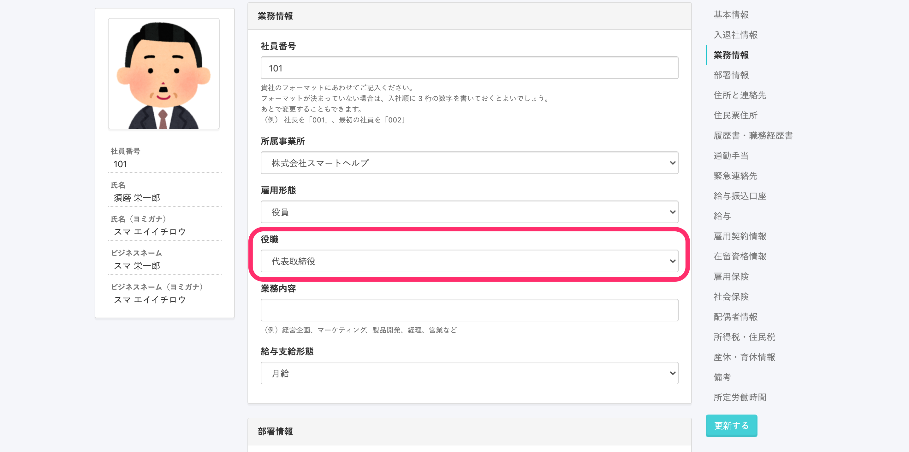
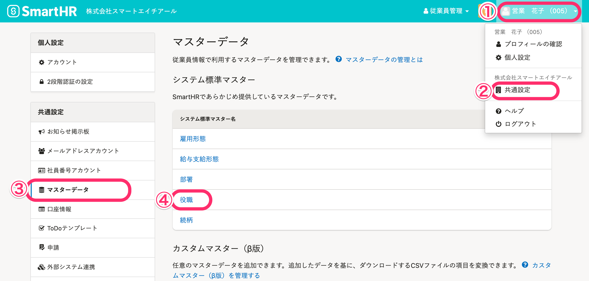
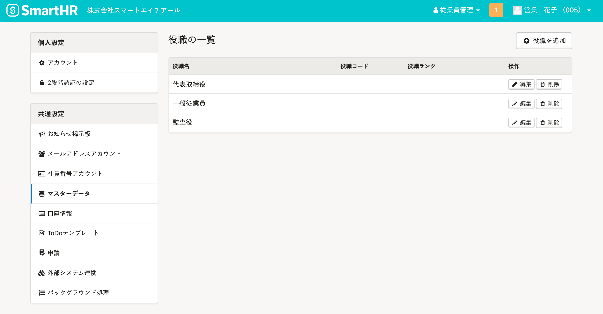
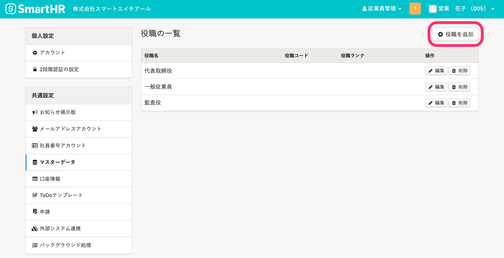
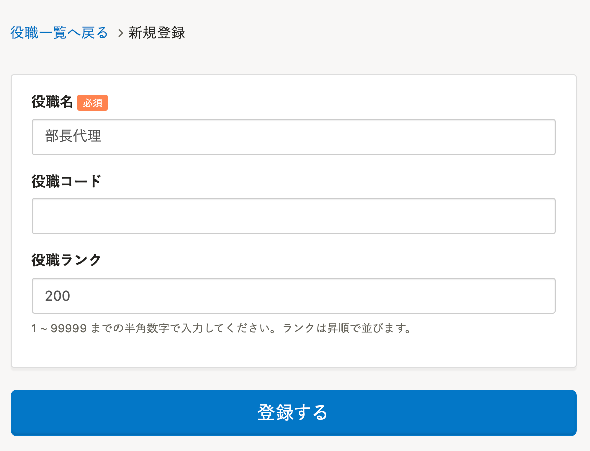
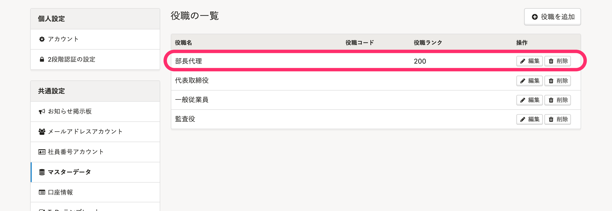
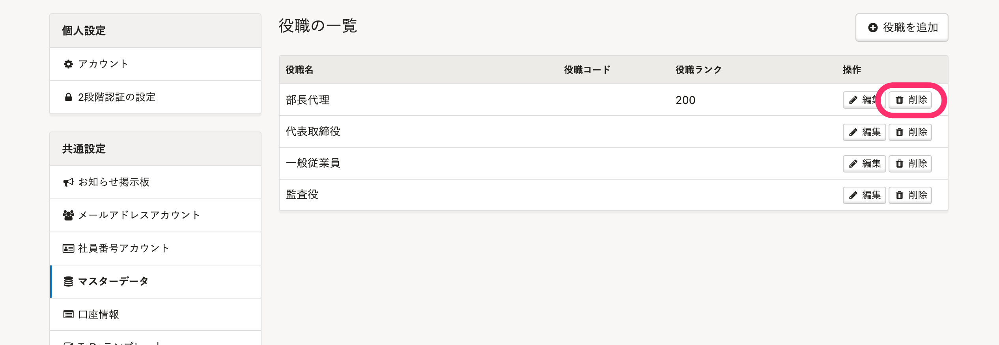
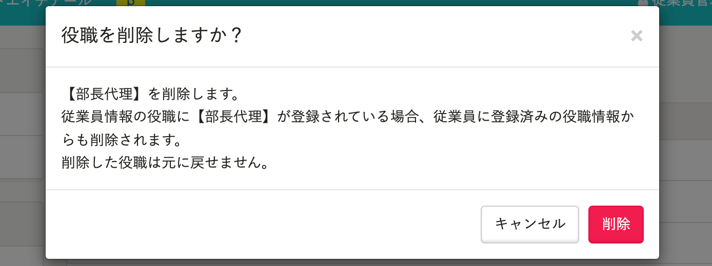

従業員情報の **［業務情報］>［役職］** でプルダウンメニューの選択肢に表示する役職を登録、管理できます。

# ［役職］の設定

## 画面右上のアカウント名 >［共通設定］>［役職］をクリック

画面右上の **［アカウント名▼］** \> **［共通設定］** を選び、画面左のリストにある **［マスターデータ］>［役職］** をクリックすると、 **［役職の一覧］** が表示されます。

# ［役職］を登録する

## 1\. ［役職を追加］をクリック

 **［役職の一覧］** の右にある  **［＋役職を追加］** をクリックすると、役職の［ **新規登録］** 画面が表示されます。

## 2\. 役職名を入力し、［登録する］をクリック

役職名を入力し、 **［登録する］** をクリックします。

任意で、 **［役職コード］** 、並び順を調整する数値として利用する **［役職ランク］** も設定できます。

1 ~ 99999 までの半角数字を入力しておくと、役職名を昇順で並べられます。

## 3\. 一覧に追加されたことを確認する

 **［役職の一覧］** に移動するので、追加されたことを確認します。

追加登録した役職は、一覧画面から編集できます。

# ［役職］を削除する

## 1\. 削除したい役職の［削除］ボタンをクリック

 **［役職の一覧］** にて、削除したい役職の右端にある **［削除］** をクリックします。

## 2\. 削除確認画面の［削除］をクリック

 **［役職を削除しますか？］** という確認画面が表示されるので、 **［削除］** をクリックします。

:::alert
従業員情報で利用されている役職もマスターデータから削除可能です。
マスターデータから役職が削除されると、この役職が従業員に紐付いていた場合でも、従業員情報の役職欄から削除されます。
:::

## 3\. 削除を確認する

 **［役職の一覧］** が表示されるので、削除されたことを確認します。
