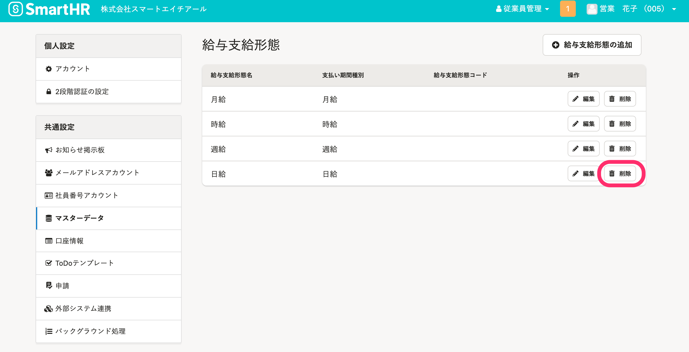

従業員情報の **［業務情報］>［給与支給形態］** でプルダウンメニューの選択肢に表示する給与支給形態をマスターデータとして登録、管理できます。

# ［給与支給形態］の設定

## 画面右上のアカウント名 >［共通設定］>［マスターデータ］>［給与支給形態］をクリック

画面右上の **［アカウント名▼］** \> **［共通設定］** を選び、画面左のリストにある **［マスターデータ］>**  **［給与支給形態］** をクリックすると、 **［給与支給形態］** マスター管理画面が表示されます。

# ［給与支給形態］を登録する

## 1.［給与支給形態の追加］をクリック

 **［給与支給形態］** マスター一覧画面で、 **［給与支給形態の追加］** をクリックすると、 **［給与支給形態の登録］** 画面に移動します。

## 2\. 給与支給形態を入力し、［登録する］をクリック

 **［給与支給形態名］** を入力して **［支払期間種別］** を選択したら、 **［登録する］** をクリックします。

任意で **［給与支給形態コード］** を設定できます。

一覧にある給与支給形態は、あとで編集・更新できます。

## 3\. 一覧に追加されたことを確認する

 **［給与支給形態］** マスター一覧画面に移動するので、追加されたことを確認します。

# ［給与支給形態］を削除する

## 1\. 削除したい給与支給形態をクリック

 **［給与支給形態］** マスター一覧画面にて、削除したい給与支給形態の右にある **［削除］** をクリックします。

## 2\. 削除確認画面の［削除］をクリック

 **［給与支給形態を削除しますか？］** という確認画面が表示されるので、 **［削除］** をクリックします。

## 3\. 削除を確認する

 **［給与支給形態］** マスター管理画面が表示されるので、削除されたことを確認します。
