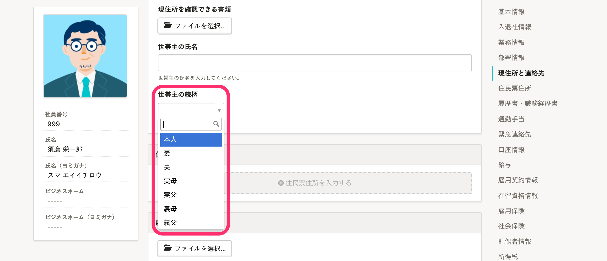
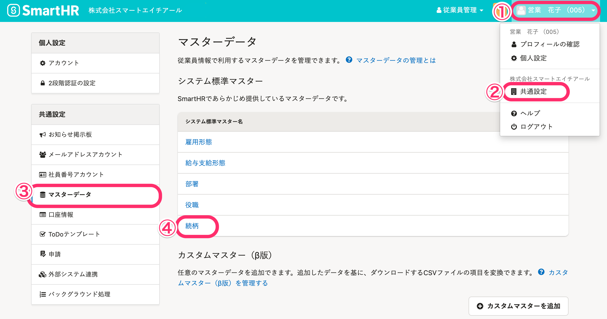
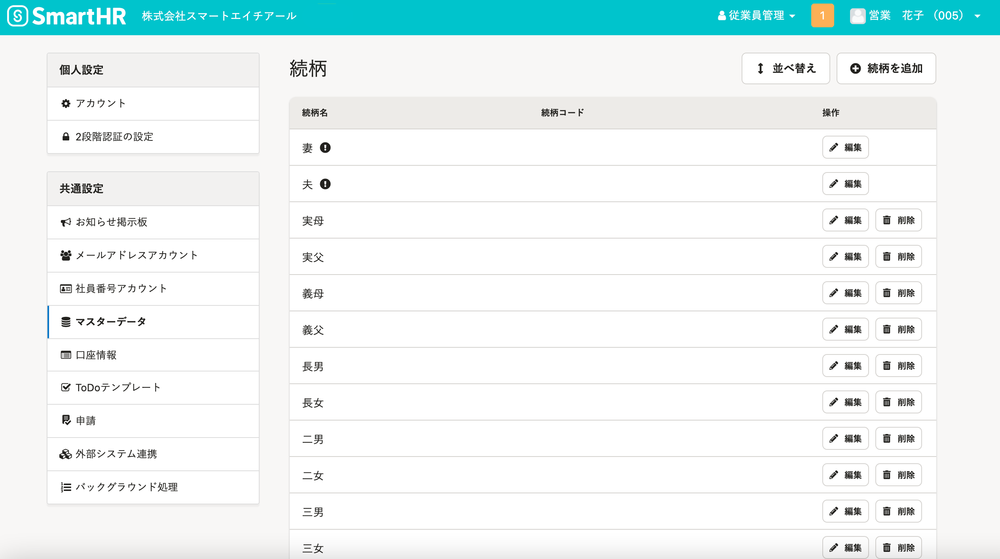
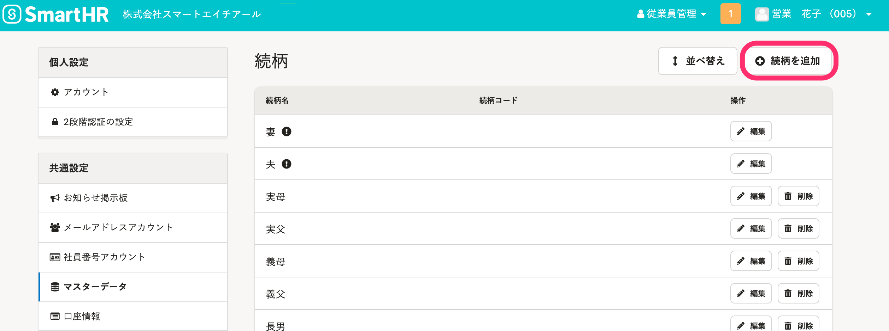
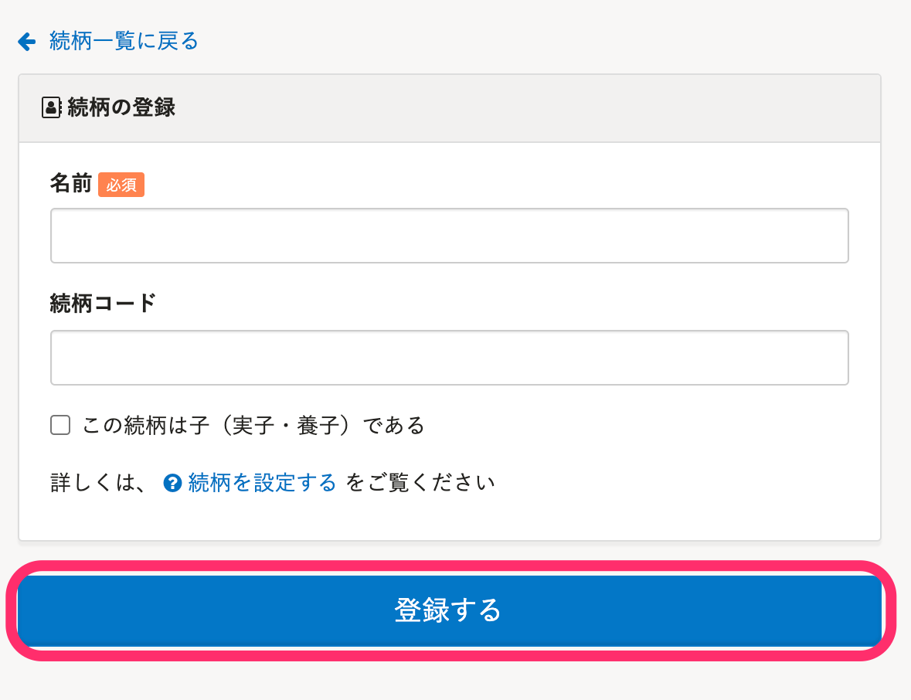
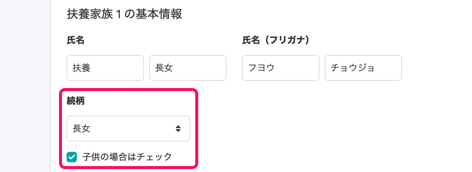
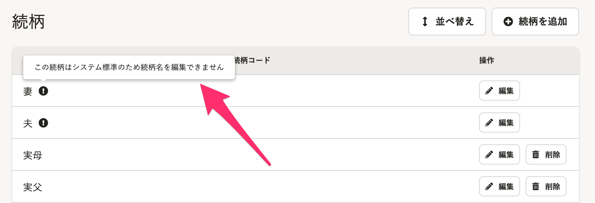
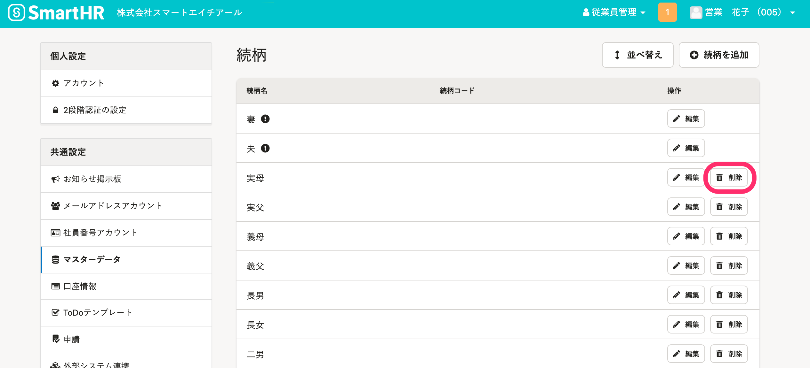
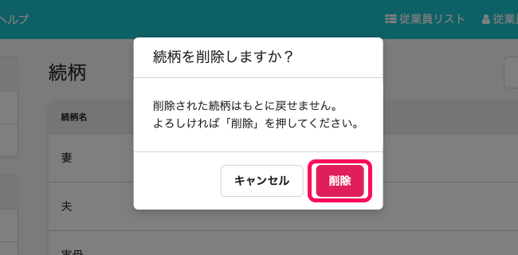
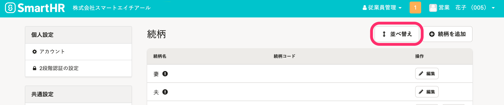

従業員情報を入力する際に、プルダウンメニューの選択肢に表示する続柄をマスターデータとして登録、管理できます。

# 続柄マスターを入力時に利用できる画面

- **従業員情報の入力・編集画面**の **［現住所と連絡先］** 項目と **［住民票住所］** 項目で設定する［世帯主の続柄］
- **家族情報の追加・編集画面**の［続柄］
- **申請フォーム入力画面**の **［家族情報］** 項目で設定する［続柄］

# 続柄マスターを確認する

## 画面右上のアカウント名 >［共通設定］>［マスターデータ］>［続柄］をクリック

画面右上の **［アカウント名▼］** \> **［共通設定］** を選び、画面左のリストにある **［マスターデータ］>**  **［続柄］** をクリックすると、 **［続柄］** マスター画面が表示されます。

## あらかじめ登録されている続柄

一般的に扶養家族とする続柄は、あらかじめ続柄マスターに登録済みです。

［妻］、［夫］、［実母］、［実父］、［義母］、［義父］
［長男］、［長女］、［二男］、［二女］、［三男］、［三女］、［四男］、［四女］、［五男］、［五女］
［兄］、［姉］、［弟］、［妹］
［祖父］、［祖母］、［孫息子］、［孫娘］
［叔父］、［叔母］、［甥］、［姪］

# 続柄を登録する

## 1.「+ 続柄を追加」をクリック

 **［続柄］** マスター画面で、 **「 + 続柄を追加」** をクリックして、 **［続柄の登録］** 画面を表示します。

## 2\. 名前を入力し、「登録する」をクリック

続柄マスターに登録する名前を入力し、［ **登録する］** をクリックします。

任意で **［続柄コード］** を設定できます。

:::tips
### 続柄を［子］として設定する
 **［この続柄は子である］** にチェックを入れて続柄を登録・更新すると、年末調整の手続き時にその続柄で登録された家族を子供として扱います。

あらかじめマスターに登録済みの以下の続柄には、はじめから **［この続柄は子である］** のチェックボックスにチェックが入っています。
［長男］、［長女］、［二男］、［二女］、［三男］、［三女］、［四男］、［四女］、［五男］、［五女］
:::

# 続柄を削除する

:::alert
続柄名のうち、 **［妻］** 、 **［夫］** は、編集、削除できません。
従業員情報に利用中の続柄は削除できません。

:::

## 1.「削除」をクリック

 **［続柄］** マスター管理画面で、削除したい続柄の行にある **「削除」** をクリックします。

## 2\. 削除確認画面で「削除」をクリック

 **［続柄を削除しますか？］** という確認画面が表示されるので、 **「削除」** をクリックします。

# 続柄のプルダウンに表示される順番を変更する

続柄マスターを使った入力画面のプルダウンに表示される選択肢の並び順を変更できます。

## 1\. 続柄マスター画面にある 「並び替え」をクリック

続柄マスター画面右上にある **［並び替え］** をクリックすると、**続柄の並び替え** 画面に切り替わります。

## 2\. ドラッグアンドドロップして 「完了」をクリック

並べ替えたい項目の行をドラッグアンドドロップして、順番を移動します。

任意の順番に並べ替えたら、 **「完了」** をクリックします。

