 **［マスターデータ］** 画面で、カスタムマスターを登録、管理できます。

カスタムマスターの概要は、[マスターデータの管理とは](https://knowledge.smarthr.jp/hc/ja/articles/4408180124953)を参照してください。

# マスターデータ画面を表示する

画面右上の **［アカウント名▼］** をクリックして開くメニューから **［共通設定］** を選び、画面左のリストにある **［マスターデータ］** をクリックすると、 **［マスターデータ］** 画面が表示されます。

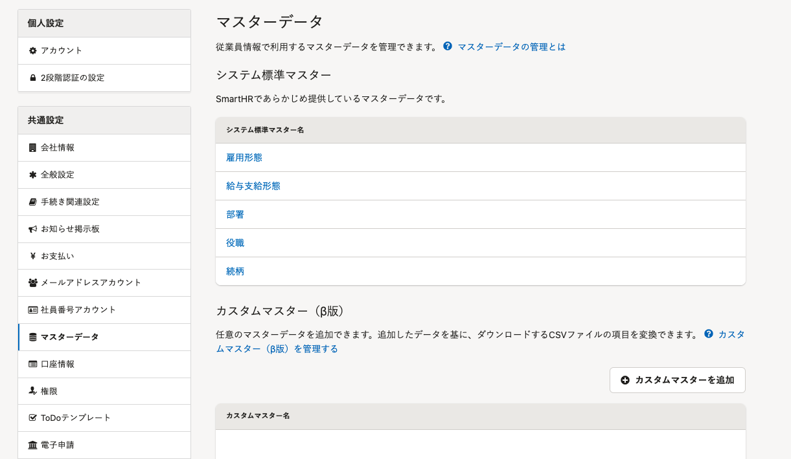

# カスタムマスターを追加する

## 1\. ［+カスタムマスターを追加］をクリック

 **［マスターデータ］** 画面で、 **［+カスタムマスターを追加］** をクリックすると、 **［カスタムマスターの追加］** ダイアログが表示されます。

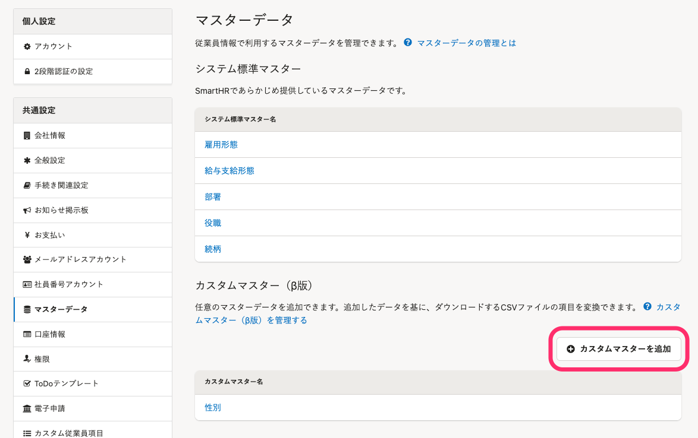

## 2\. カスタムマスター名を入力し［登録］をクリック

 **［登録］** をクリックすると、登録したカスタムマスターのページに遷移します。

:::alert
システム標準マスター名と重複する名前のカスタムマスターは登録できません。
:::

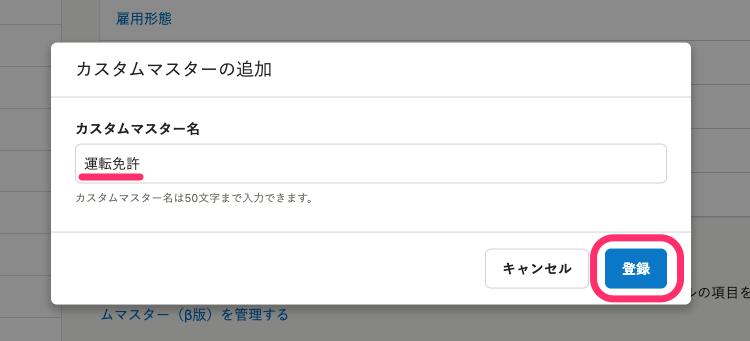

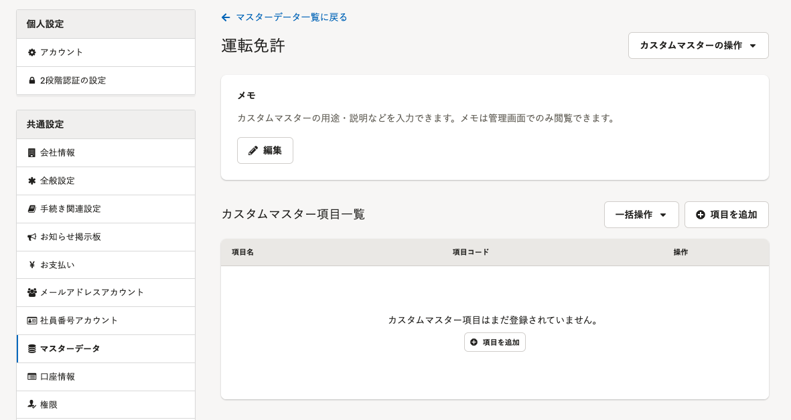

カスタムマスターは作成日の古いものから順に表示されます。

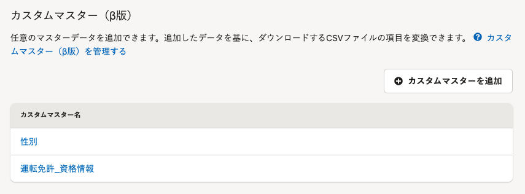

# カスタムマスターに管理者用のメモを追加する

## 1\. カスタムマスター名のリンクをクリック

 **［マスターデータ］** 画面で、カスタムマスターのリンクをクリックすると、カスタムマスターの詳細ページに遷移します。

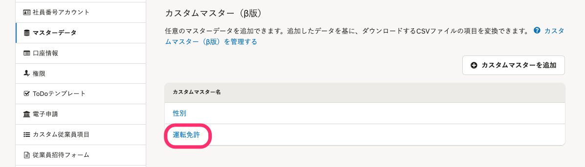

## 2\. 表示された［メモ］の［編集］ボタンをクリック

 **［メモ］** の **［編集］** ボタンをクリックすると、 **［メモの編集］** 画面が開きます。

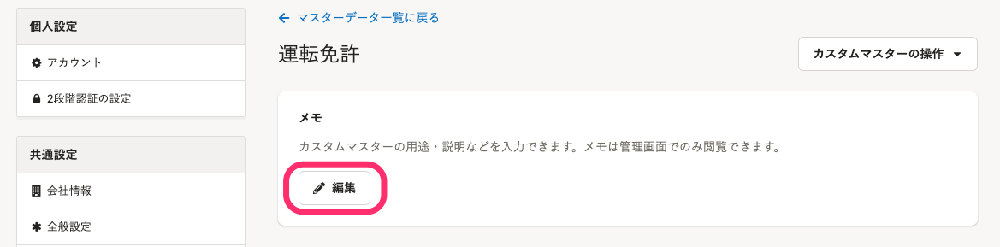

## 3\. ［メモの編集］画面で、メモを入力

メモを入力したら、 **［更新］** ボタンをクリックします。

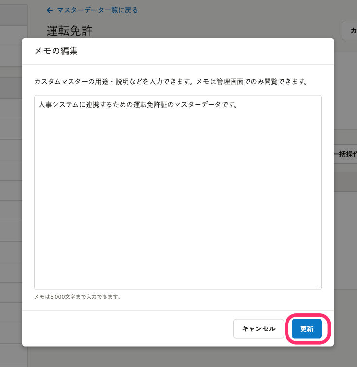

カスタムマスターの **［メモ］** に入力した内容が表示されます。

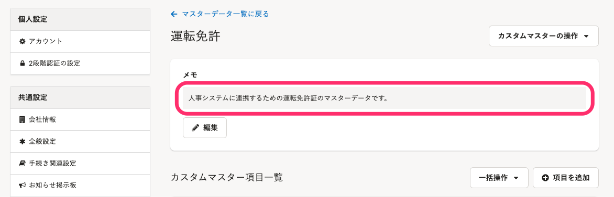

# カスタムマスター項目を追加する

## 1\. カスタムマスター項目一覧の右上にある **［+項目を追加］** をクリック

 **［+項目を追加］** をクリックすると、 **［カスタムマスター項目の追加］** ダイアログが表示されます。

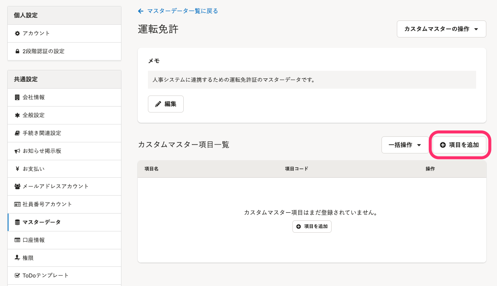

## 2\. 項目名を入力し［登録］をクリック

項目名、必要に応じて項目コードを入力し、 **［登録］** をクリックします。

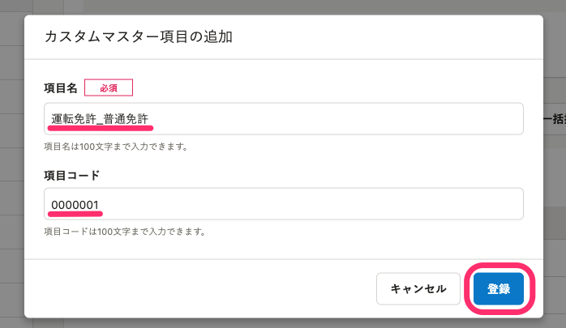

:::alert
カスタム項目を外部システムに取り込みやすいコードに変換して、従業員情報をダウンロードしたい場合、 **［項目名］** と **［項目コード］** の両方を入力して登録してください。
なお、 **［項目名］** はカスタム項目のドロップダウンリストと同じ内容を登録してください。内容が異なっている場合、コードに変換できません。
詳しくは、[カスタム項目をコードに変換して、従業員情報をダウンロードするには？](https://knowledge.smarthr.jp/hc/ja/articles/4410660698649)を参照してください。
:::

## 3\. 一覧に追加されたことを確認

カスタムマスター項目一覧に登録した項目が追加されたことを確認します。

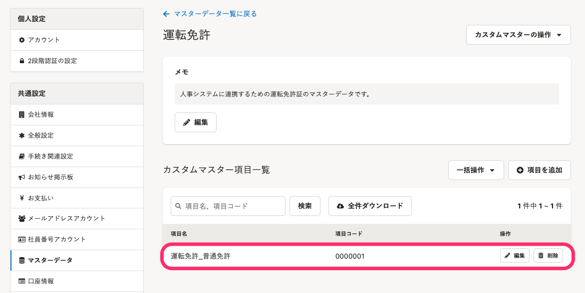

# カスタムマスター項目を一括追加・更新する

## 1\. カスタムマスター名のリンクをクリック

カスタムマスター名のリンクをクリックすると、カスタムマスターの詳細画面が表示されます。

## 2\. カスタムマスター項目一覧の右上にある［一括操作］から［項目の一括追加・更新（CSV）］をクリック

カスタムマスターの詳細画面>カスタムマスター項目一覧の右上にある **［一括操作］** から **［項目の一括追加・更新（CSV）］** をクリックすると、 **［カスタムマスター項目の一括追加・更新（CSVファイルの取り込み）］** ダイアログが表示されます。

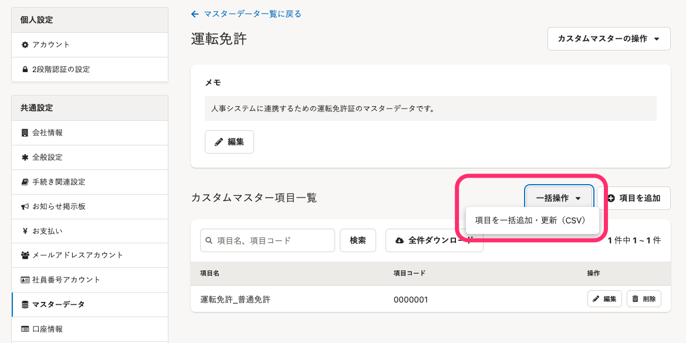

## 3\. カスタムマスター項目一覧のCSVファイルをダウンロード

 **［1. ファイルの準備］** の **［CSVファイルをダウンロード］** をクリックすると、バックグラウンド処理が開始されます。

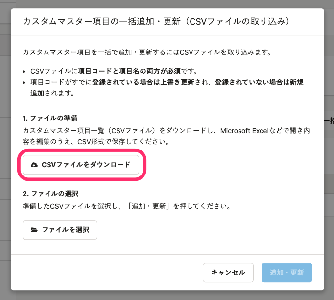

バックグラウンド処理の結果は、 **［共通設定］** \> **［バックグラウンド処理］** から確認できます。

処理が完了したら、CSVファイルをダウンロードします。

Microsoft Excelなどで開き、内容を編集のうえ、CSV形式で保存してください。

:::alert
カスタム項目を外部システムに取り込みやすいコードに変換して、従業員情報をダウンロードしたい場合、 **［項目名］** と **［項目コード］** の両方を入力して登録してください。
なお、 **［項目名］** はカスタム項目のドロップダウンリストと同じ内容を登録してください。内容が異なっている場合、コードに変換できません。
詳しくは、[カスタム項目をコードに変換して、従業員情報をダウンロードするには？](https://knowledge.smarthr.jp/hc/ja/articles/4410660698649)を参照してください。
:::

## 4\. 編集したCSVファイルを選択

 **［ファイルの選択］** をクリックし、準備したCSVファイルを選択して **［追加・更新］** をクリックすると、バックグラウンド処理が開始されます。

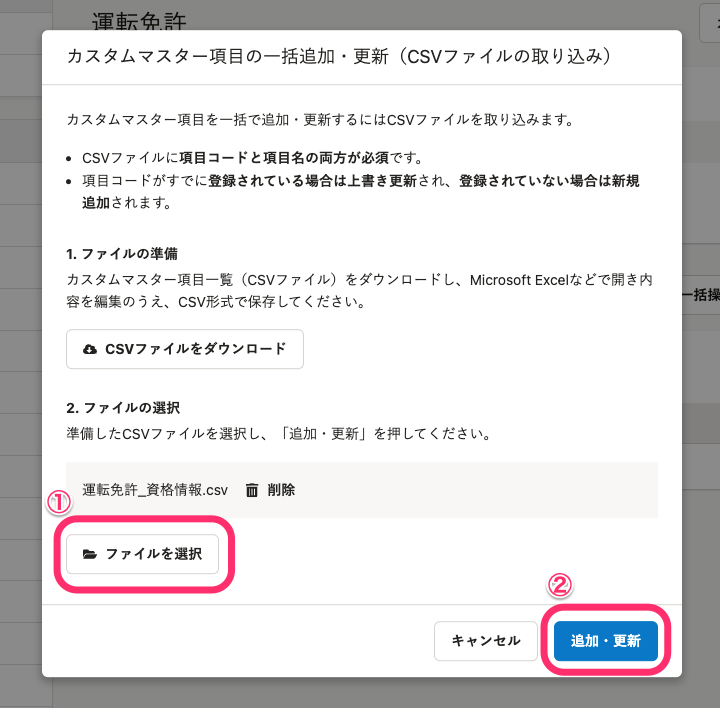

バックグラウンド処理の結果は、 **［共通設定］** \> **［バックグラウンド処理］** から確認できます。

## 5\. カスタムマスター項目が追加・更新されたことを確認

カスタムマスター項目一覧で、対象のカスタムマスター項目が追加・更新されていることを確認します。

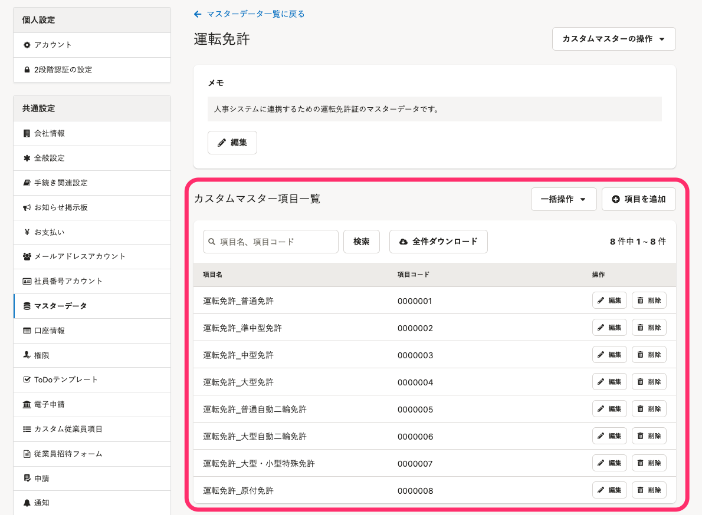

# カスタムマスター名を編集する

## 1\. カスタムマスター名のリンクをクリック

 **［マスターデータ］** 画面で、カスタムマスターのリンクをクリックすると、カスタムマスターの詳細ページに遷移します。

## 2\. ［カスタムマスターの操作］から［カスタムマスター名の編集］をクリック

カスタムマスターの詳細ページの右上にある **［カスタムマスターの操作］** から、 **［カスタムマスター名の編集］** をクリックすると、 **［カスタムマスター名の編集］** ダイアログが表示されます。

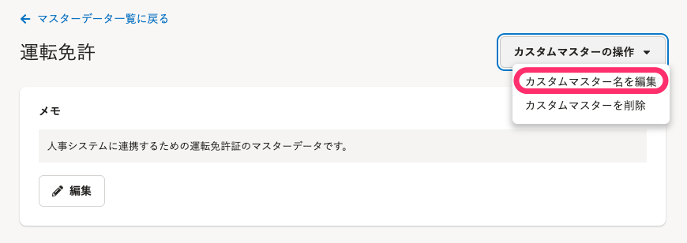

カスタムマスター名を編集し、 **［更新］** をクリックします。

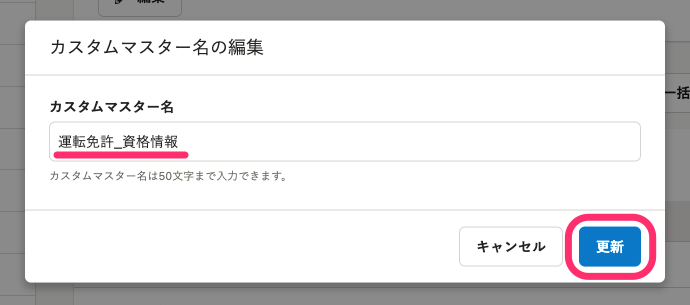

## 3\. カスタムマスター名が更新されたことを確認

カスタムマスターの詳細画面で、カスタムマスター名が更新されたことを確認します。

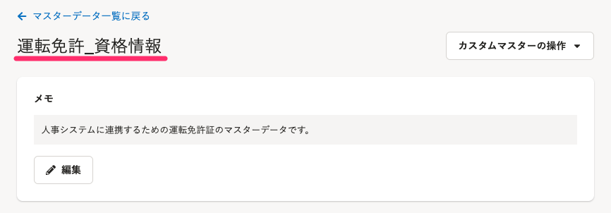

# カスタムマスター項目を編集・削除する

## 1\. カスタムマスター名のリンクをクリック

カスタムマスター名のリンクをクリックすると、カスタムマスター項目一覧が表示されます。

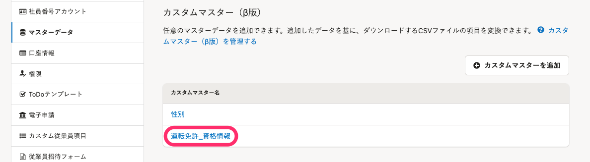

## 2\. 項目を編集したい場合は［編集］、削除したい場合は［削除］をクリック

 **［編集］** をクリックすると、 **［カスタムマスター項目の編集］** ダイアログが表示されます。

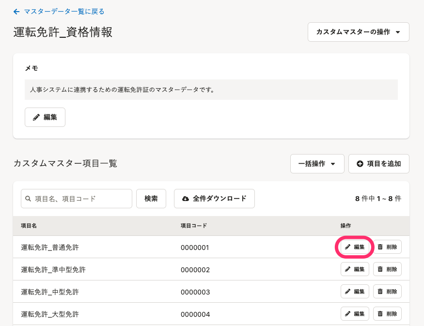

必要に応じて、項目名、項目コードを編集し、 **［更新］** をクリックします。

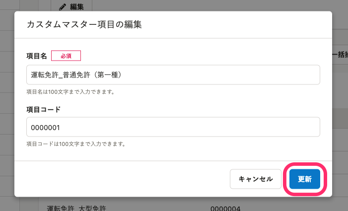

 **［削除］** をクリックすると、 **［カスタムマスター項目の削除］** ダイアログが表示されます。

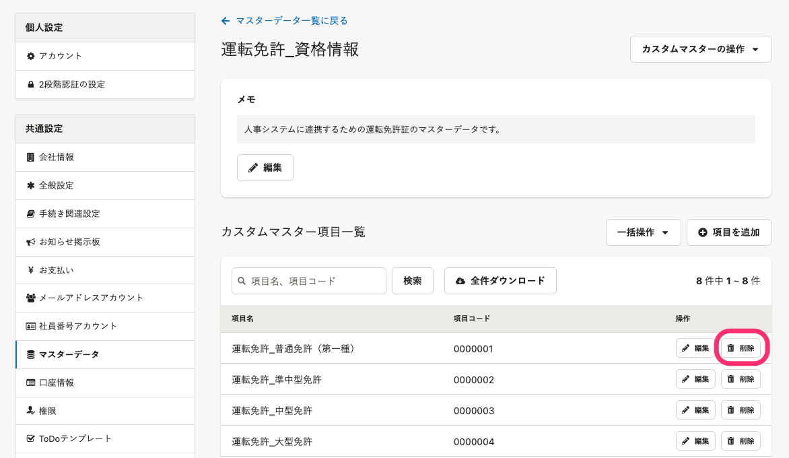

削除する対象のカスタムマスター項目を確認し、 **［削除］** をクリックします。

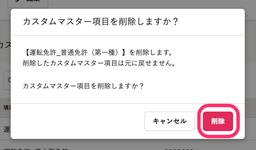

# カスタムマスター項目の一覧をダウンロードする

## 1\. カスタムマスター名のリンクをクリック

カスタムマスター名のリンクをクリックすると、カスタムマスターの詳細画面が表示されます。

## 2\. カスタムマスター項目一覧の上部にある［全件ダウンロード］をクリック

 **［全件ダウンロード］** をクリックすると、バックグラウンド処理が開始されます。

バックグラウンド処理の結果は、 **［共通設定］** \> **［バックグラウンド処理］** から確認できます。

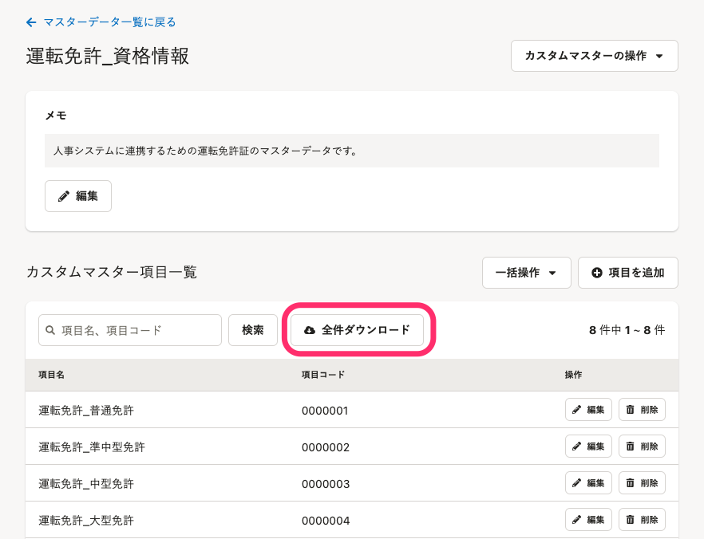

# カスタムマスター項目を絞り込む

## 1\. カスタムマスター名のリンクをクリック

カスタムマスター名のリンクをクリックすると、カスタムマスターの詳細画面が表示されます。

## 2\. 検索フォームに項目名、項目コードを入力

カスタムマスター項目一覧の検索フォームに項目名や項目コードを入力して **［検索］** をクリックすると、カスタムマスター項目を絞り込めます。

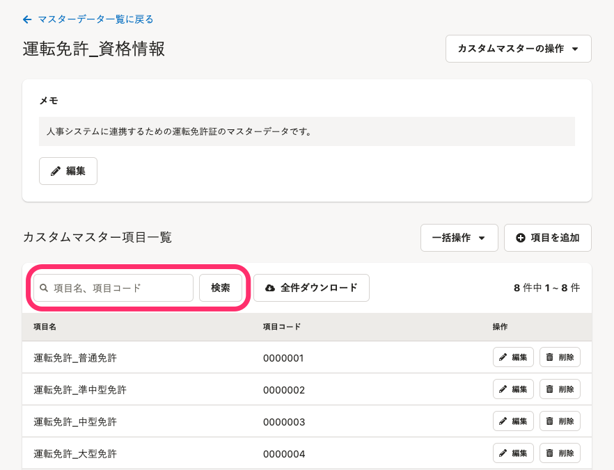

:::alert
絞り込んだカスタムマスター項目のダウンロードはできません。 **［全件ダウンロード］** をクリックすると、カスタムマスター項目を絞り込んだ状態でも、すべてのカスタムマスター項目がダウンロードされます。
:::

# カスタムマスターを削除する

## 1\. カスタムマスター名のリンクをクリック

カスタムマスター名のリンクをクリックすると、カスタムマスターの詳細画面が表示されます。

## 2\. ［カスタムマスターの操作］>［カスタムマスターを削除］をクリック

カスタムマスターの詳細画面の右上にある **［カスタムマスターの操作］** から **［カスタムマスターを削除］** をクリックすると、 **［カスタムマスターの削除］** ダイアログが表示されます。

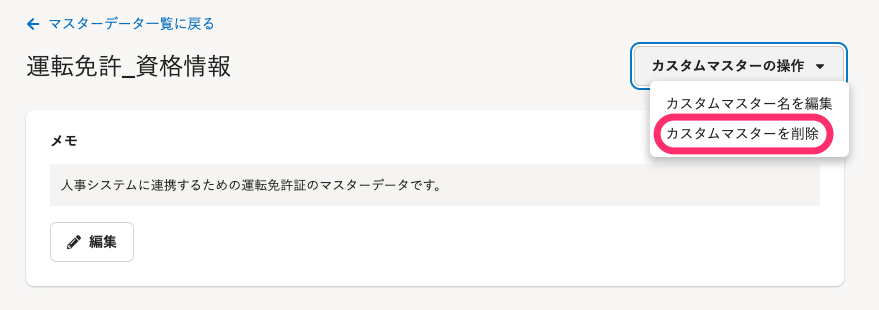

削除する対象のカスタムマスター項目を確認し、 **［削除］** をクリックします。

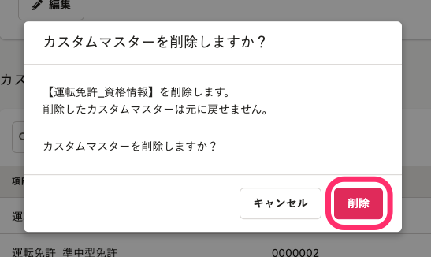
